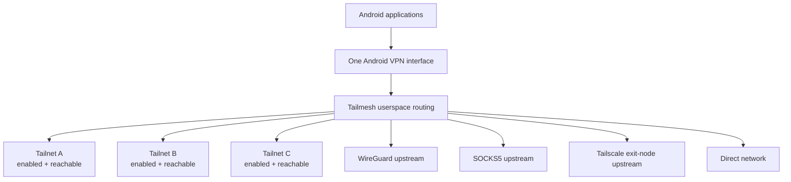
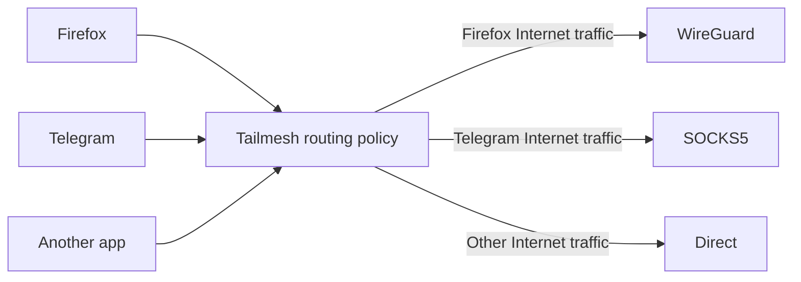
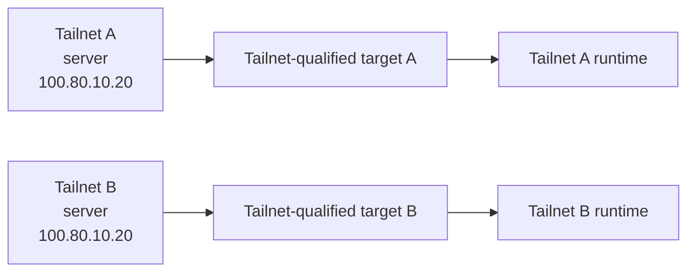
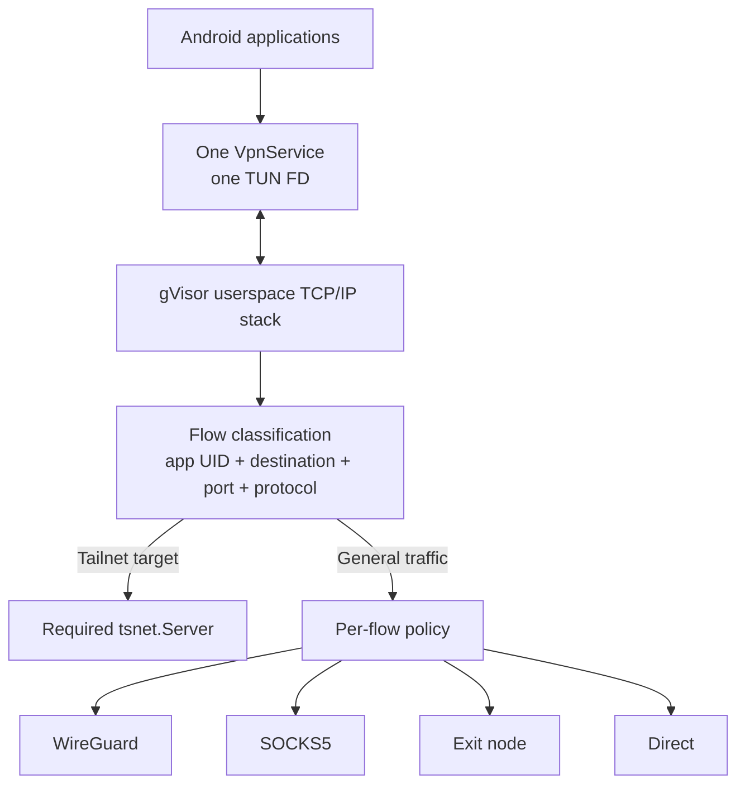

## 1. Tailmesh

Tailmesh is primarily an Android client for using **multiple independent Tailscale networks at the same time through Android's single VPN interface** — even when those networks reuse the same IP addresses or hostnames.

Two Tailnets can both contain `100.80.10.20`, or both have a host named `server`, and both remain reachable concurrently. Tailmesh preserves which private network each destination belongs to instead of forcing the user to disconnect from one network to reach the other.

Normal Internet traffic is separate from that private-network reachability. Different applications can independently use WireGuard, SOCKS5, a Tailscale exit node, or the device's direct network path while all enabled Tailnets remain reachable.



Tailmesh is **not switching the whole device between VPNs**. Several private Tailscale networks can stay active together, while the egress path for ordinary traffic is chosen independently.

## 2. Per-application routing

General traffic can be routed per application and per flow.



That does **not** remove private-network access. The same application can still reach peers in every enabled Tailnet:

```text
Firefox
  +-- Tailnet A peer  -> Tailnet A
  +-- Tailnet B peer  -> Tailnet B
  +-- Tailnet C peer  -> Tailnet C
  `-- Internet        -> WireGuard

Telegram
  +-- Tailnet A peer  -> Tailnet A
  +-- Tailnet B peer  -> Tailnet B
  `-- Internet        -> SOCKS5

Another app
  `-- Internet        -> direct
```

Routing policy can match the originating Android app/UID, destination, port, and protocol, then route through a selected upstream, route directly, or block the flow.

## 3. Overlapping Tailnets stay distinct

Independent Tailnets can legitimately reuse the same native addresses and hostnames:



Native IP alone is therefore not enough to identify the intended destination. Tailmesh gives peers Tailnet-qualified synthetic identities so the destination carries both **which peer?** and **through which Tailnet?** The peer's current native Tailscale address is then used as a locator when the connection is opened.

Unknown synthetic destinations fail closed rather than being guessed into another network.

## 4. Tailnets and upstreams are separate

Tailnets are private networks that remain reachable while enabled.

Upstreams are paths used to carry other traffic. Current upstream types include:

- WireGuard
- SOCKS5
- Tailscale exit-node based egress
- direct device networking

Upstreams can also be chained, allowing one transport to be reached through another.

This separation is what lets Tailmesh keep several Tailnets available while independently deciding how each application's ordinary traffic should leave the device.

## 5. How it works

Android gives a VPN application one `VpnService` / TUN file descriptor. Tailmesh uses that single FD as the ingress to a gVisor userspace TCP/IP stack, then multiplexes TCP/UDP flows across the required private-network runtime or selected general-traffic upstream.



TCP and UDP flows are terminated in userspace and re-originated through the selected path. Upstream sockets are protected from the Android VPN so their own transport traffic does not recursively re-enter the TUN.

The Android application and Go/Gomobile engine implement the multi-network datapath, with a separately maintained patched Tailscale core providing the Tailscale integration required by the client.

Detailed engineering documentation starts at [`docs/multi_tailnet_proxy_app/README.md`](docs/multi_tailnet_proxy_app/README.md).

## 6. Project origin

Tailmesh is derived from the BSD-3-Clause [Tailscale Android client](https://github.com/tailscale/tailscale-android) and builds against a separately maintained patched checkout of the BSD-3-Clause [`tailscale.com` core](https://github.com/tailscale/tailscale).

**Tailmesh is not affiliated with, sponsored by, or endorsed by Tailscale Inc.** Tailscale is a trademark of Tailscale Inc. WireGuard is a registered trademark of Jason A. Donenfeld.
