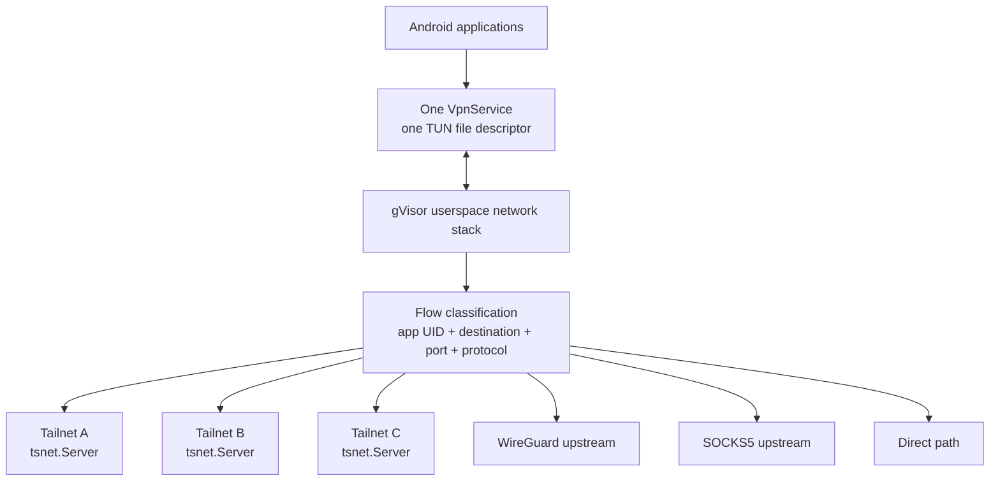
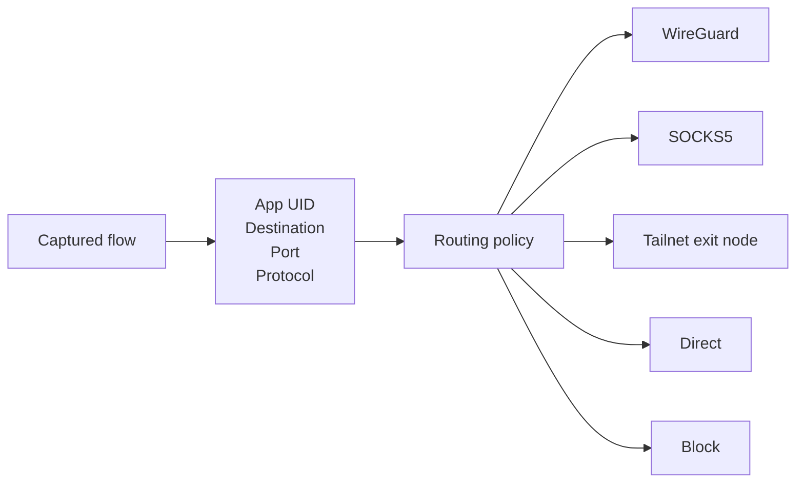
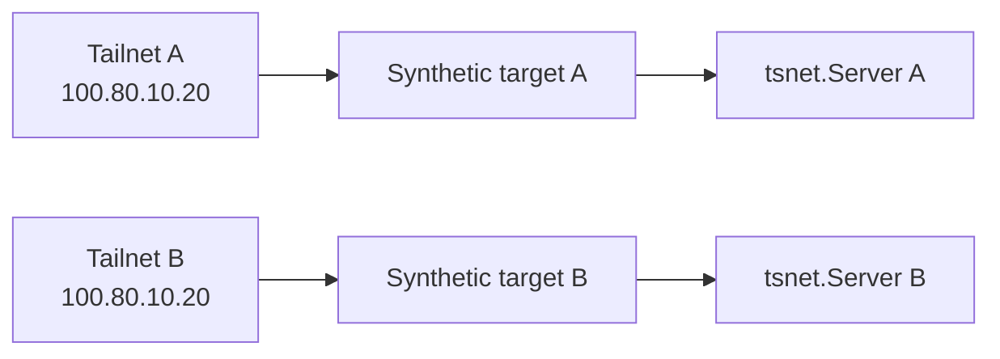

## 1. Tailmesh

Tailmesh is an independent Android networking client built around one constraint:

**Android gives a VPN application one `VpnService` / TUN file descriptor, while a useful networking client may need several independent tunnel and proxy upstreams active at the same time.**

Tailmesh keeps that single Android VPN interface and moves the multiplicity behind it. Traffic entering the TUN is terminated in a gVisor userspace network stack, classified as individual TCP/UDP flows, and then re-originated through the appropriate upstream.



This means the application is not switching the whole Android VPN between tunnels.

Multiple Tailnets can remain connected and reachable concurrently, while ordinary application traffic can independently use another configured upstream.

For example:

```text
Firefox
  +-- work.tailnet peer  -> Tailnet A
  +-- home.tailnet peer  -> Tailnet B
  `-- general Internet   -> WireGuard upstream

Telegram
  +-- work.tailnet peer  -> Tailnet A
  `-- general Internet   -> SOCKS5 upstream

Another app
  `-- general Internet   -> direct
```

The Tailnet routes are destination-specific and remain available regardless of the selected general-traffic upstream.

## 2. Multi-upstream routing

Tailmesh treats an upstream as a dialable path rather than assuming the VPN has one global tunnel.

Current upstream types include:

- independent Tailnet runtimes backed by `tsnet.Server`
- userspace WireGuard tunnels
- SOCKS5 proxies
- the device's direct network path
- Tailnet exit-node based upstreams

Upstreams can also be chained, allowing one transport to be reached through another.

For ordinary Internet and LAN traffic, routing can be selected per application and per flow.

The policy engine can match:

```text
originating Android app / UID
destination address
destination port
protocol
```

and choose:

```text
route through upstream X
route directly
block
```

Conceptually:



The important distinction is that this policy does **not** replace Tailnet connectivity.

A flow addressed to a known Tailnet target is routed through the corresponding Tailnet runtime. A flow to the general Internet can separately be routed according to application policy.

## 3. Multiple Tailnets behind one TUN

Keeping several Tailnets connected simultaneously introduces another problem: their address spaces are independent.

Two Tailnets can legitimately contain:

```text
Tailnet A
  server -> 100.80.10.20

Tailnet B
  server -> 100.80.10.20
```

The native IP alone therefore cannot identify which network the application intended.

Tailmesh assigns Tailnet-qualified synthetic identities to peers. The synthetic destination identifies both the peer and the required Tailnet runtime.



The synthetic address is a routing identity, not the peer's actual Tailscale address.

The engine resolves that stable identity to the peer's current native Tailscale locator when establishing the connection.

This lets several otherwise-colliding Tailnet namespaces coexist behind the same Android TUN.

## 4. Datapath

At a high level:

```text
Android application
        |
        v
single VpnService TUN FD
        |
        v
gVisor userspace TCP/IP stack
        |
        +--> Tailnet destination
        |       |
        |       `--> required tsnet.Server
        |
        `--> ordinary traffic
                |
                v
          per-flow policy
                |
        +-------+-------+---------+
        |       |       |         |
        v       v       v         v
       WG     SOCKS5  exit node  direct
```

TCP and UDP flows are terminated in userspace and re-originated through the selected upstream. Upstream sockets are protected from the Android VPN so their own transport traffic does not recursively re-enter the TUN.

The Android application, Go/Gomobile networking engine, and patched Tailscale core together implement this datapath.

The detailed architecture and implementation documentation starts at [`docs/multi_tailnet_proxy_app/README.md`](docs/multi_tailnet_proxy_app/README.md).
