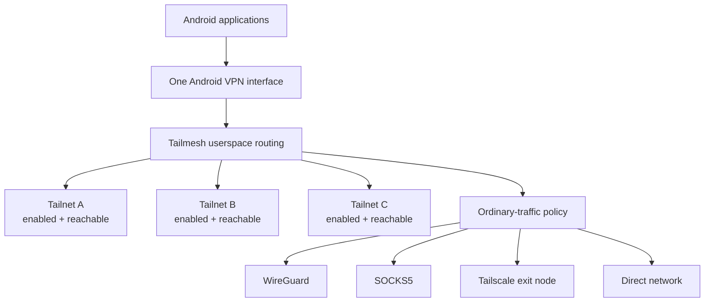
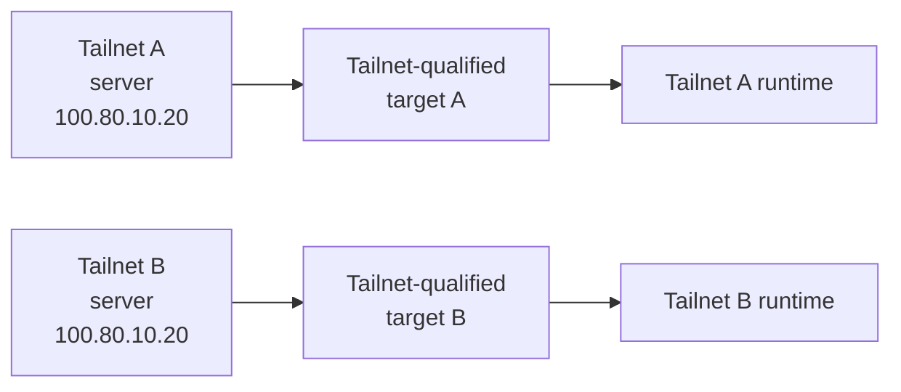
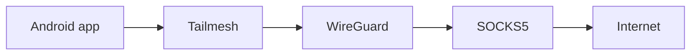
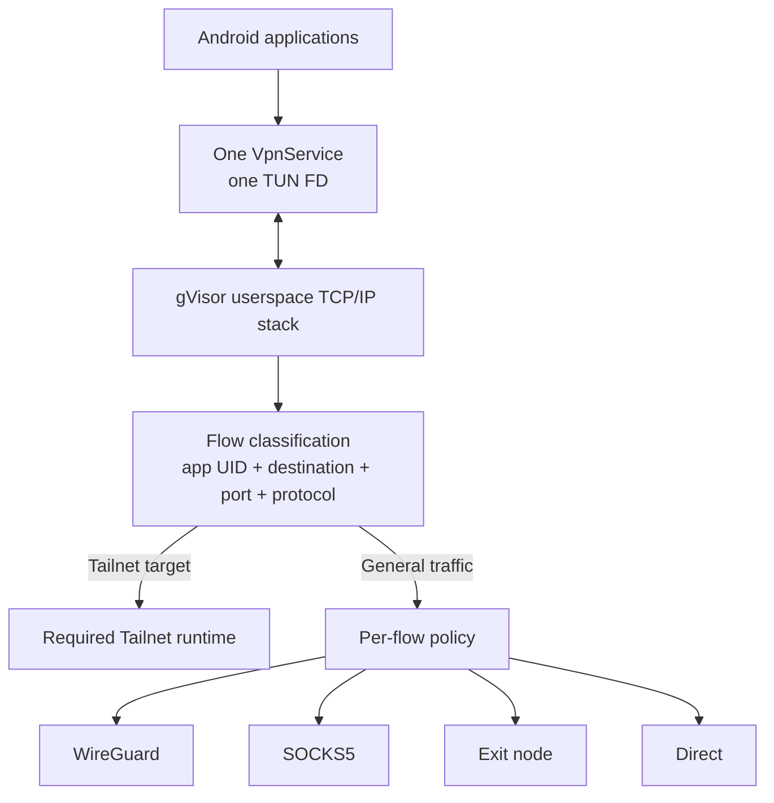

# Tailmesh

**Multiple private networks behind one Android VPN interface.**

Tailmesh is a working Android network multiplexer for using multiple independent Tailscale networks at the same time through Android's single VPN interface — including networks that reuse the same IP addresses or hostnames.

Two Tailnets can both contain `100.80.10.20`, or both have a host named `server`, and both remain reachable concurrently. Tailmesh keeps destination identity tied to its Tailnet instead of treating the native IP as globally unique.

Normal Internet traffic is a separate routing decision. Different applications can independently use WireGuard, SOCKS5, a Tailscale exit node, the device's direct network path, or chained upstreams while all enabled Tailnets remain reachable.

The implementation runs on physical Android devices and is used by multiple users. TCP, UDP, DNS, per-app routing, packet capture, and runtime diagnostics are exercised against the live dataplane.



Tailmesh is **not switching the whole phone between VPNs** and it is not merging several Tailnets into one address space. Several independent private-network runtimes remain usable together behind one Android TUN.

## Why this exists

Android normally gives an application one VPN ownership point.

That is straightforward when the whole device is meant to use one VPN. It becomes restrictive when the device needs to remain connected to several independent private networks at once, particularly when those networks were never designed to share an address space.

Tailmesh turns the single `VpnService` interface into a userspace routing layer where:

- several independent Tailnets remain active and reachable simultaneously;
- overlapping peer IPs and duplicate hostnames remain distinguishable;
- private Tailnet reachability is separate from ordinary Internet egress;
- different applications can use different egress transports;
- DNS can be routed independently from application data;
- routing decisions can be inspected from inside the dataplane.

## Several Tailnets stay reachable at once

Choosing an upstream for ordinary application traffic does not replace or hide the enabled Tailnets.

An application can reach peers in Tailnet A, Tailnet B, and Tailnet C while its unrelated Internet traffic goes through WireGuard. Another application can use SOCKS5 for Internet traffic and still reach those same private networks.

```text
Firefox
  +-- Tailnet A peer  -> Tailnet A
  +-- Tailnet B peer  -> Tailnet B
  +-- Tailnet C peer  -> Tailnet C
  `-- Internet        -> WireGuard

Telegram
  +-- Tailnet A peer  -> Tailnet A
  +-- Tailnet B peer  -> Tailnet B
  `-- Internet        -> SOCKS5

Another app
  `-- Internet        -> direct
```

This is the central distinction in the design:

```text
private-network destination
        -> which Tailnet owns this target?

ordinary application traffic
        -> what policy should carry this flow?
```

Those are separate questions.

## Overlapping networks are first-class

Independent Tailnets can legitimately reuse addresses and hostnames.

```text
Tailnet A                         Tailnet B
---------                         ---------
server                            server
100.80.10.20                      100.80.10.20
```

The address `100.80.10.20` alone cannot tell Tailmesh which peer the application means.

Tailmesh therefore separates **target identity** from the peer's current **network locator**.



Each target receives deterministic synthetic IPv4/IPv6 identities that preserve both the peer identity and the Tailnet namespace that owns it. The peer's current native Tailscale address is used only as the locator when Tailmesh opens the connection through the required runtime.

That gives the dataplane several useful properties:

- two peers with the same native Tailscale IP can remain separately reachable;
- duplicate hostnames can be qualified by Tailnet instead of being guessed;
- a peer's synthetic identity can remain stable while its native locator changes;
- unknown or stale synthetic destinations fail closed rather than falling through to an unrelated network;
- literal real Tailscale addresses are still supported, with cross-Tailnet ambiguity surfaced explicitly.

Tailscale VIP Services use the same target model.

## Per-application and per-flow routing

General traffic can take a different path for each application.

Routing policy can match:

- Android application / UID;
- destination prefix;
- destination port;
- TCP or UDP.

A matching rule can **route**, **direct**, or **block** the flow.

Synthetic Tailnet destinations remain identity-bound to the Tailnet that owns them. A generic policy rule cannot silently redirect a Tailnet-qualified target into another private network.

Tailmesh can also capture ordinary IPv4/IPv6 traffic for full-device policy routing. Broad capture is opt-in. By default, unbound applications use the direct path and LAN traffic stays direct so local printers, NAS devices, development services, and similar resources are not unexpectedly pushed through a remote tunnel.

Carrier sockets used by direct and tunnel upstreams are protected from Android's VPN so they do not recursively re-enter the same TUN.

## Upstreams are separate from Tailnet reachability

Tailmesh presents different transports through one upstream model instead of baking transport-specific routing logic into the flow router.

### Tailscale networks

Each enabled Tailnet has its own independent embedded `tsnet.Server` runtime with its own peers, netmap, DERP state, and private-network reachability.

### WireGuard

Tailmesh can run a userspace WireGuard client in-process using its own gVisor netstack.

It accepts normal client configuration and `wg-quick`-style `.conf` imports, including named peer endpoints that are resolved before the tunnel is brought up.

### SOCKS5

The in-process SOCKS5 client supports TCP `CONNECT`, UDP `ASSOCIATE`, IPv4, IPv6, domain destinations, optional username/password authentication, and remote hostname resolution through the proxy.

That also makes software exposing a local SOCKS5 listener usable as a Tailmesh transport without embedding its entire dependency tree.

### Tailscale exit nodes

An already-running Tailnet can use an exit node, or a dedicated exit-node upstream can be created so different applications can independently select different Tailscale egress paths without changing private Tailnet reachability.

### Direct

The built-in direct upstream leaves through the physical Android underlay using VPN-protected sockets. Network selection is address-family-aware so an IPv6 dial is not blindly pinned to an Android network without usable IPv6 reachability.

## Upstreams can be chained

An upstream can itself be reached through another upstream.



The reverse shape is also possible: a proxy can be reached through a tunnel, or a tunnel through a proxy.

Chains are resolved dynamically. Missing or unavailable parents fail closed instead of silently escaping through the direct network. Cycles are rejected during configuration and guarded again during dial resolution.

## DNS is part of the routing model

Tailmesh runs a local synthetic DNS service for VPN-eligible applications.

It handles:

- synthetic `A` and `AAAA` answers for Tailnet-qualified targets;
- qualified names for duplicate hosts across Tailnets;
- rejection of ambiguous short names instead of arbitrary Tailnet selection;
- DNS over UDP and TCP;
- UDP truncation/error retry over TCP;
- ordinary DNS forwarding through a selected upstream;
- per-app DNS routing;
- DNS paths that intentionally differ from the application's data path.

For example:

```text
Firefox data -> WireGuard
Firefox DNS  -> SOCKS5

Browser data -> WireGuard
Browser DNS  -> Direct
```

DNS is therefore not treated as an afterthought to the routing policy.

## How the dataplane works

Android exposes one `VpnService` / TUN file descriptor. Tailmesh makes that the ingress to a userspace router.



The gVisor stack terminates application-side TCP/UDP flows, Tailmesh identifies the target and originating application, and the connection is re-originated through the required Tailnet runtime or selected general-traffic upstream.

The synthetic address is therefore a **stable routing identity**, not a packet-level NAT translation.

The userspace path handles TCP and UDP forwarding, synthetic DNS over UDP/TCP, peer identity translation, real-IP conflict handling, policy evaluation, and upstream selection.

## Diagnostics are part of the dataplane

Tailmesh includes diagnostics around the userspace network path rather than treating the VPN as a black box.

Runtime visibility includes:

- TUN RX/TX packets and bytes;
- per-upstream dial attempts, failures, latency, bytes, and TCP/UDP flow counts;
- per-app bytes, flow counts, and last-used upstream;
- DNS query/failure counters and searchable query logs;
- direct/DERP path observations and DERP regions;
- exit-node state changes;
- Android network-source changes such as Wi-Fi, cellular, and Ethernet;
- process CPU, heap, GC, and goroutine history;
- all-traffic or selected-app packet capture;
- PCAPNG output with per-packet application-name attribution;
- bounded CPU profiling, heap profiles, goroutine dumps, and Android method tracing.

Heavy profiling and detailed query logging are opt-in. The normal telemetry path keeps expensive work away from the packet hot path where possible.

## Hardening work happens in the hot paths

Once the core architecture worked, a large part of the engineering moved from feature construction into resource behavior and failure modes.

Recent work has included:

- lifecycle cleanup for gVisor stacks and registered upstreams;
- race detection and lock-boundary fixes;
- reducing per-packet allocation and lock contention;
- buffer reuse in SOCKS5 and WireGuard paths;
- removing unnecessary status work from frequent polling paths;
- bounding UDP association lifetime and cleanup;
- avoiding VPN recursion through protected carrier sockets;
- Android underlay selection for broken or absent IPv6 paths;
- packet capture and profiling used to investigate live failures rather than relying only on logs.

The repository keeps implementation, test, Android-integration, and physical-device evidence separate instead of treating a successful build as proof of packet-path correctness.

See [`docs/multi_tailnet_proxy_app/validation_and_gaps.md`](docs/multi_tailnet_proxy_app/validation_and_gaps.md) for the running validation and limitations ledger.

## Engineering documentation

The documentation under [`docs/multi_tailnet_proxy_app/`](docs/multi_tailnet_proxy_app/) goes substantially deeper than this README:

- [`architecture.md`](docs/multi_tailnet_proxy_app/architecture.md) — whole-system model, identity/locator separation, Tailnet lifecycle, state ownership, and cross-layer architecture diagrams.
- [`data_path_and_dns.md`](docs/multi_tailnet_proxy_app/data_path_and_dns.md) — end-to-end TCP/UDP/DNS paths, overlap cases, stale-target behavior, and packet-flow sequences across Android, gVisor, `tsnet`, and the underlay.
- [`upstreams_and_policy.md`](docs/multi_tailnet_proxy_app/upstreams_and_policy.md) — provider abstraction, policy evaluation, app attribution, WireGuard/SOCKS5 behavior, broad capture, DNS routing, and upstream chaining.
- [`backend_internals.md`](docs/multi_tailnet_proxy_app/backend_internals.md) — Go engine state, target snapshots, collision handling, lifecycle serialization, concurrency, and Gomobile boundaries.
- [`android_profiles_and_ui.md`](docs/multi_tailnet_proxy_app/android_profiles_and_ui.md) — Android profile persistence, encrypted bootstrap credentials, runtime reconstruction, service ownership, and UI/control-plane state.
- [`observability.md`](docs/multi_tailnet_proxy_app/observability.md) — dataplane instrumentation, metrics, path events, bounded history, diagnostics, and advanced profiling.
- [`validation_and_gaps.md`](docs/multi_tailnet_proxy_app/validation_and_gaps.md) — implementation evidence, test/device evidence, known limitations, and remaining hardening work.

## Project origin

Tailmesh is derived from the BSD-3-Clause [Tailscale Android client](https://github.com/tailscale/tailscale-android) and builds against a separately maintained patched checkout of the BSD-3-Clause [`tailscale.com` core](https://github.com/tailscale/tailscale).

The patched core used by Tailmesh is maintained separately at [`franticplant/tailscale`](https://github.com/franticplant/tailscale).

**Tailmesh is not affiliated with, sponsored by, or endorsed by Tailscale Inc.** Tailscale is a trademark of Tailscale Inc. WireGuard is a registered trademark of Jason A. Donenfeld.
