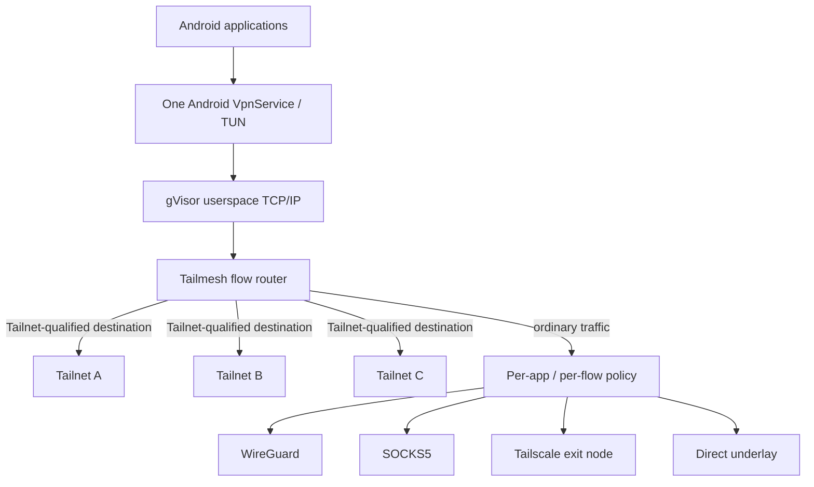
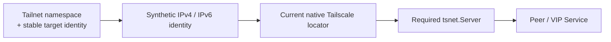
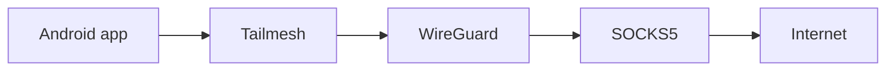
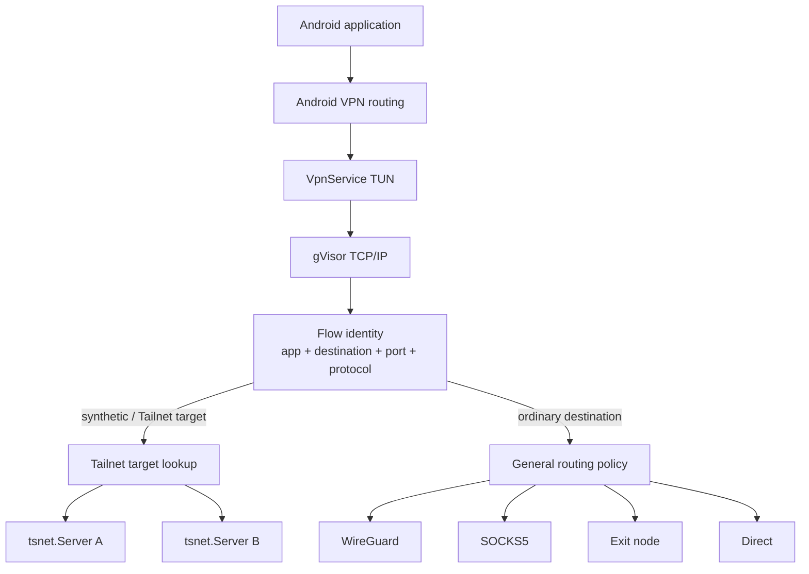

# Tailmesh

Tailmesh turns Android's single VPN interface into a **userspace network router**.

It keeps multiple independent Tailscale networks reachable at the same time — including Tailnets that reuse the same IP addresses or hostnames — while independently routing ordinary application traffic through Tailscale, WireGuard, SOCKS5, Tailscale exit nodes, direct networking, or chained combinations of those transports.

In practical terms, one Android device can:

- stay connected to several independent Tailnets simultaneously;
- reach colliding peers such as `Tailnet A / 100.80.10.20` and `Tailnet B / 100.80.10.20` independently;
- keep duplicate hostnames distinct across Tailnets;
- route different applications through different Internet egress paths;
- route an application's DNS separately from its data path;
- opt into full-device IPv4/IPv6 capture while keeping LAN traffic direct by default;
- use WireGuard, SOCKS5, Tailscale exit nodes, direct networking, and chained upstreams together;
- inspect the dataplane with per-app/per-upstream metrics, DNS tracing, profiling, and app-attributed PCAPNG capture.



Tailmesh is **not switching the whole device between VPNs** and it is not merging Tailnets into one address space. The multiplicity exists behind one Android TUN as independent network runtimes.

## 1. Multiple Tailnets, including overlapping networks

A native Tailscale address is unique inside one Tailnet. It is not globally unique once several independent Tailnets coexist behind the same Android VPN.

For example:

```text
Tailnet A                         Tailnet B
---------                         ---------
work-nas                          home-nas
100.80.10.20                      100.80.10.20
```

`100.80.10.20` alone cannot identify which peer the application means.

Tailmesh therefore separates **identity** from **locator**:



The synthetic address identifies the Tailnet-qualified target. The peer's current native Tailscale IP is only the locator used when Tailmesh opens the connection through the required runtime.

This gives Tailmesh several useful properties:

- deterministic synthetic IPv6 identities;
- a synthetic IPv4 compatibility namespace for IPv4-only clients;
- stable target identity even when a peer's current native address changes;
- independently reachable peers even when Tailnets reuse the same native IP;
- collision-safe synthetic routing that fails closed instead of guessing a network;
- collision-aware short-name DNS;
- continued support for real Tailscale addresses where applications or protocols carry literal addresses;
- discovery and routing of Tailscale VIP Services through the same target model.

When multiple connected Tailnets claim the same real Tailscale address, Tailmesh records the crossover and surfaces the conflict rather than pretending the address is globally unique.

## 2. Per-app routing and full-device capture

Private Tailnet reachability and ordinary Internet egress are separate decisions.

An application can reach peers in every enabled Tailnet while its unrelated traffic uses a completely different transport:

```text
Firefox
  +-- Tailnet A peer  -> Tailnet A
  +-- Tailnet B peer  -> Tailnet B
  +-- Tailnet C peer  -> Tailnet C
  `-- Internet        -> WireGuard

Telegram
  +-- Tailnet A peer  -> Tailnet A
  +-- Tailnet B peer  -> Tailnet B
  `-- Internet        -> SOCKS5

Another app
  `-- Internet        -> direct
```

Routing policy can match:

- Android application / UID;
- destination prefix;
- destination port;
- TCP or UDP.

A matching rule can **route**, **direct**, or **block** the flow. Synthetic Tailnet destinations remain identity-bound to the Tailnet that owns them; generic policy cannot silently redirect one Tailnet's synthetic peer into another network.

Tailmesh also supports **broad capture**. It is off by default; when enabled, Android adds default IPv4 and IPv6 routes to the Tailmesh VPN so ordinary Internet traffic can be policy-routed too.

Broad capture is paired with conservative defaults:

- unbound applications use the direct path unless another default is configured;
- **Keep LAN traffic direct** is enabled by default so local printers, NAS devices, development services, and similar local destinations do not unexpectedly follow a remote tunnel;
- direct/tunnel carrier sockets are protected from the Android VPN so they cannot recursively re-enter the TUN.

## 3. Pluggable upstreams

Tailmesh presents different network transports through one upstream model. The flow router does not need transport-specific routing logic for every provider.

Current upstreams include:

### Tailnets

Each enabled Tailnet has its own independent `tsnet.Server` runtime and remains available for Tailnet-qualified destinations.

### Direct

The built-in direct provider leaves through the physical Android underlay using VPN-protected sockets. Underlay selection is address-family-aware so an IPv6 dial is not blindly pinned to a network without usable IPv6 reachability.

### SOCKS5

The in-process SOCKS5 client supports:

- TCP `CONNECT`;
- UDP `ASSOCIATE`;
- IPv4, IPv6, and domain destinations;
- optional username/password authentication;
- remote hostname resolution through the proxy.

This also provides a generic integration point for software that exposes a local SOCKS5 listener.

### WireGuard

Tailmesh can run a userspace WireGuard client in-process using its own gVisor netstack.

It supports normal client configuration as well as importing `wg-quick`-style `.conf` files, including named peer endpoints that are resolved before the tunnel is brought up.

### Tailscale exit nodes

Exit-node routing is available in two forms:

- select an exit node on an already-running Tailnet;
- create a dedicated exit-node upstream that can participate in default or per-app routing independently of the Tailnet's private-network reachability.

This makes multiple independently selectable Tailscale egress paths possible in Multi-Tailnet mode.

## 4. Upstream chaining

An upstream can itself be reached through another upstream.



The reverse shape is also possible: a proxy may be reached through a tunnel, or a tunnel through a proxy.

Chains are resolved dynamically. A missing or unavailable parent fails closed instead of silently escaping through the device's direct network. Cycles are rejected during configuration and guarded again during dial resolution.

## 5. DNS is part of the routing policy

Tailmesh runs a local synthetic DNS service for VPN-eligible applications.

It provides:

- synthetic `A` and `AAAA` answers for Tailnet-qualified targets;
- qualified synthetic names for duplicate hostnames across Tailnets;
- ambiguity rejection for colliding short names rather than arbitrary Tailnet selection;
- DNS over UDP and TCP;
- UDP truncation/error retry over TCP;
- forwarding of ordinary DNS through a selected upstream;
- per-app DNS routing;
- a DNS path that may intentionally differ from the application's data path;
- a separate default DNS route for applications without an explicit binding.

For example:

```text
Firefox data -> WireGuard
Firefox DNS  -> SOCKS5

Browser data -> WireGuard
Browser DNS  -> Direct
```

This lets routing policy express more than conventional split tunnelling: data and name resolution are independently steerable.

## 6. Diagnostics and packet inspection

Tailmesh includes diagnostics designed around the actual userspace dataplane rather than treating the VPN as a black box.

Always-on and historical telemetry includes:

- TUN RX/TX packets and bytes;
- process CPU, heap, GC, and goroutine counts;
- per-upstream dial attempts, failures, latency, bytes, and TCP/UDP flow counts;
- per-app bytes, TCP/UDP flow counts, and last-used upstream;
- DNS query/failure counters;
- direct/DERP path observations and DERP regions;
- exit-node state changes;
- Android network-source changes such as Wi-Fi, cellular, and Ethernet;
- bounded historical samples/events stored locally for the Diagnostics UI.

The app also provides:

- searchable, timestamped DNS query logs with route/outcome information;
- all-traffic or selected-app packet capture;
- PCAPNG output with per-packet application-name attribution for Wireshark-style inspection;
- bounded CPU profiling;
- heap profiles;
- goroutine dumps;
- Android method tracing;
- live CPU, traffic, and goroutine charts.

The normal telemetry path keeps heavy work off the packet hot path; advanced profiling and detailed query logging are opt-in.

## 7. Architecture

Android exposes one `VpnService` / TUN file descriptor. Tailmesh attaches that FD to a gVisor userspace TCP/IP stack, reconstructs TCP/UDP flows, determines the target identity and originating application, and then re-originates the connection through the required Tailnet or selected upstream.



TCP and UDP are terminated on the application side and re-originated through the selected path. The synthetic address is therefore best understood as a **stable routing identity**, not as a packet-level NAT translation.

### Deeper architecture and diagrams

The engineering documentation under [`docs/multi_tailnet_proxy_app/`](docs/multi_tailnet_proxy_app/) goes substantially deeper than this README and contains sequence, flow, and lifecycle diagrams for the individual planes:

- [`architecture.md`](docs/multi_tailnet_proxy_app/architecture.md) — whole-system model, identity/locator separation, Tailnet lifecycle, state ownership, and cross-layer architecture diagrams.
- [`data_path_and_dns.md`](docs/multi_tailnet_proxy_app/data_path_and_dns.md) — end-to-end TCP/UDP/DNS packet paths, overlap cases, stale-target behavior, and sequence diagrams following traffic across Android, gVisor, `tsnet`, and the underlay.
- [`upstreams_and_policy.md`](docs/multi_tailnet_proxy_app/upstreams_and_policy.md) — provider abstraction, policy evaluation, per-app attribution, WireGuard/SOCKS5 behavior, DNS routing, broad capture, and upstream chaining.
- [`backend_internals.md`](docs/multi_tailnet_proxy_app/backend_internals.md) — Go engine state, target snapshots, collision handling, lifecycle serialization, concurrency, and Gomobile boundaries.
- [`android_profiles_and_ui.md`](docs/multi_tailnet_proxy_app/android_profiles_and_ui.md) — Android profile persistence, encrypted bootstrap credentials, runtime reconstruction, service ownership, and UI/control-plane state.
- [`observability.md`](docs/multi_tailnet_proxy_app/observability.md) — dataplane instrumentation, per-app/per-upstream metrics, path events, bounded history, Diagnostics UI, and advanced profiling.
- [`validation_and_gaps.md`](docs/multi_tailnet_proxy_app/validation_and_gaps.md) — detailed implementation/device evidence and the running engineering validation ledger.

## 8. Project origin

Tailmesh is derived from the BSD-3-Clause [Tailscale Android client](https://github.com/tailscale/tailscale-android) and builds against a separately maintained patched checkout of the BSD-3-Clause [`tailscale.com` core](https://github.com/tailscale/tailscale).

The patched core used by Tailmesh is maintained separately at [`franticplant/tailscale`](https://github.com/franticplant/tailscale).

**Tailmesh is not affiliated with, sponsored by, or endorsed by Tailscale Inc.** Tailscale is a trademark of Tailscale Inc. WireGuard is a registered trademark of Jason A. Donenfeld.
