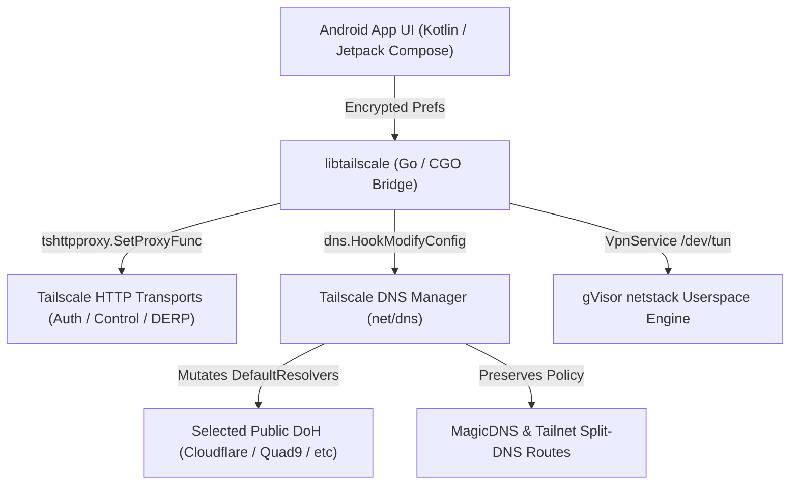

# Custom Tailscale Documentation

Welcome to the central documentation portal for **Custom Tailscale & Custom Tailscale Android**.

This repository provides an in-depth, production-grade technical guide for the customized, upstream-caught-up forks of **Tailscale Core** and **Tailscale Android**.

---

## 🏛️ System High-Level Architecture



---

## 🌟 Feature Overview & Capabilities Matrix

| Feature | Description | Stock Tailscale | Custom Tailscale |
| --- | --- | --- | --- |
| **Manual Control HTTP Proxy** | Route control-plane, auth, DERP, and telemetry traffic through custom HTTP/HTTPS proxies. | ❌ Unsupported | ✅ Fully Implemented |
| **Public DoH Resolver Selection** | Replace fallback DNS with custom DoH endpoints without leaking or breaking MagicDNS. | ❌ Unsupported | ✅ Fully Implemented |
| **Route-Aware DoH Dialing** | Choose whether DoH HTTPS requests dial over Tailscale routes or default device interface. | ❌ Unsupported | ✅ Fully Implemented |
| **Android 11 to 17 (API 36)** | Full forward compatibility with `compileSdkVersion 36` and Android 17 APIs. | ⚠️ API 34/35 | ✅ API 36 (Android 17) |
| **16 KB Page Alignment** | Native CGO binaries (`libgojni.so`) compiled with `max-page-size=16384` for modern ARM64 chips. | ⚠️ Standard 4 KB | ✅ 16 KB Aligned |
| **Filtered Logcat Tracing** | Opt-in diagnostic tags (`ANDROID_HTTPPROXY`, `ANDROID_DNS_USAGE`) for live path monitoring. | ⚠️ Mixed Logs | ✅ Gated & Filtered |
| **Local Proxy Listener (SOCKS5h/HTTP)** | Expose local loopback (`127.0.0.1:port`) / LAN (`0.0.0.0:port`) proxy for non-VPN applications. | ❌ Unsupported | ✅ Fully Implemented |

---

## 📚 Categorized Documentation Directory

```text
custom-tailscale-docs/
├── architecture/
│   ├── 01-overview-and-aar-guide.md       # AAR internal structure, gomobile pipeline, & JNI bindings
│   ├── 02-architecture-blueprint.md       # Component architecture diagrams & DNS core seams
│   └── 03-end-to-end-deep-dive.md         # Packet-level walkthrough from process init to netstack
├── features/
│   ├── 01-custom-patches-and-controls.md  # HTTP Proxy & DoH patch technical specifications
│   ├── 02-default-vs-custom-client.md    # Feature matrix & comparison vs stock Tailscale
│   └── 03-android-private-dns-guide.md    # GrapheneOS / AOSP netd Private DNS interaction analysis
├── building/
│   ├── 01-build-compatibility-manual.md   # Android 11–17 API 36, 16 KB page alignment, & toolchain
│   └── 02-developer-building-guide.md     # Step-by-step compilation commands for AAR & APK
└── debugging/
    └── 01-usage-and-debugging-manual.md   # UI usage guide, logcat keyword filters, & leak testing
```

### 1. Architecture & Design (`/architecture/`)
- 🏗️ [**01: Overview & AAR Deep Dive**](architecture/01-overview-and-aar-guide.md): What an AAR is, internal file layout (`classes.jar`, `jni/<arch>/libgojni.so`), `gomobile bind` build pipeline, and AGP DEX merging.
- 📐 [**02: Architecture Blueprint**](architecture/02-architecture-blueprint.md): System interactions, `dns.HookModifyConfig` core seams, and local proxy listener specifications.
- 🔬 [**03: End-to-End Deep Dive**](architecture/03-end-to-end-deep-dive.md): Packet-level walkthrough explaining every layer from process init down to netstack reassembly, CGO JNI, DoH hooks, and proxy tunnels.

### 2. Custom Features & Network Controls (`/features/`)
- ⚙️ [**01: Custom Patches & Controls**](features/01-custom-patches-and-controls.md): Technical implementation of Manual HTTP Proxy (`tshttpproxy`), Public DoH selection (`dns.HookModifyConfig`), and route-aware DoH dialing.
- 📖 [**02: Default vs. Custom Client**](features/02-default-vs-custom-client.md): Architectural comparison showing stock Tailscale vs. our custom client enhancements.
- 🛡️ [**03: Android Private DNS Guide**](features/03-android-private-dns-guide.md): OS source tree analysis (AOSP/GrapheneOS `DnsManager` & `netd`), Off vs. Opportunistic vs. Strict DoT modes, and MagicDNS compatibility.

### 3. Building & Compatibility (`/building/`)
- 🛠️ [**01: Build & Compatibility Manual**](building/01-build-compatibility-manual.md): Toolchain requirements (JDK 17, Go 1.26.6+, NDK 26), Android 11–17 API 36 support, and 16 KB ELF alignment.
- 📘 [**02: Developer Building Guide**](building/02-developer-building-guide.md): Step-by-step guide to setup tools, compile `libtailscale.aar`, and assemble/sign APKs.

### 4. Debugging & Operations (`/debugging/`)
- 🔍 [**01: Usage & Debugging Manual**](debugging/01-usage-and-debugging-manual.md): UI configuration instructions, logcat keyword filters (`ANDROID_HTTPPROXY`, `ANDROID_DNS_USAGE`), leak testing methods, and exit node interaction rules.

---

## 📂 Repository Layout

```text
ts_app_work/
├── tailscale/                (Patched Tailscale Go Core - upstream/main)
├── tailscale-android/        (Patched Android App - upstream/main)
└── custom-tailscale-docs/    (This Central Documentation Repository)
```
