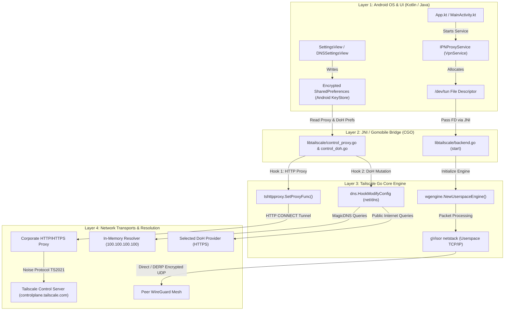
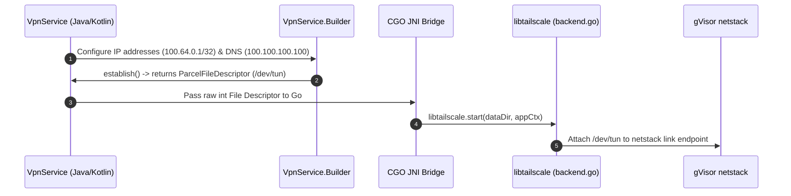
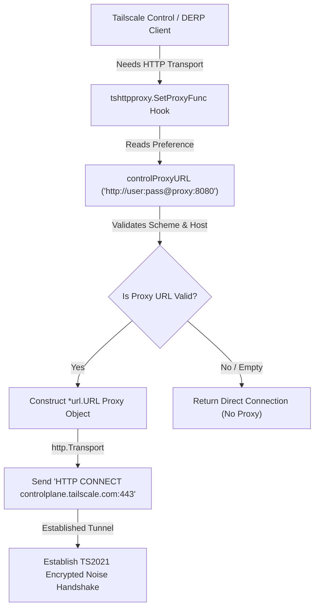
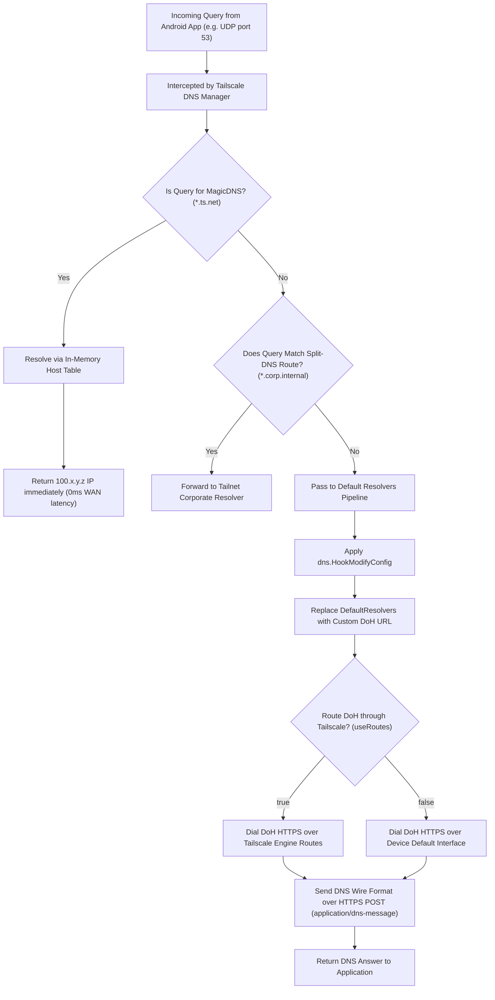
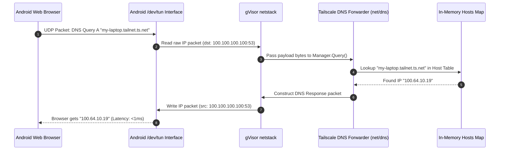
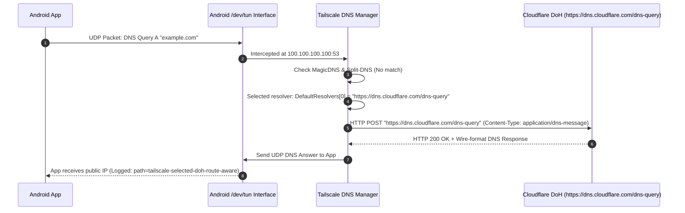
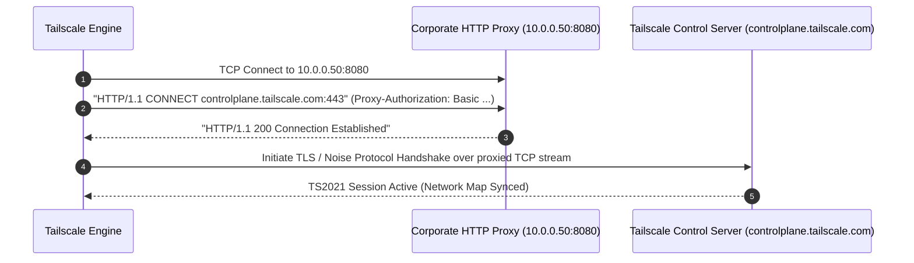
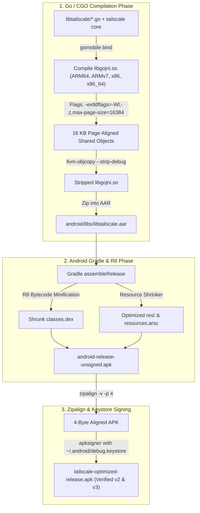

# Comprehensive End-to-End Architecture & Operational Deep Dive

This document provides a complete, exhaustive, end-to-end technical breakdown of **Custom Tailscale for Android**. It explains every layer from Android OS process initialization down to Go CGO JNI bindings, WireGuard packet routing, gVisor `netstack` TCP/IP reassembly, control-plane proxying, and DoH DNS resolution.

---

## 🗺️ 1. End-to-End System Blueprint



---

## ⚡ 2. App Bootstrapping & Lifecycle

### Step 1: Process Creation & JNI Initialization
When the user launches Tailscale or enables the VPN toggle:
1. Android OS instantiates `com.tailscale.ipn.App` and `IPNProxyService` (a subclass of `android.net.VpnService`).
2. Android loads the compiled native shared library `libgojni.so` contained within `libtailscale.aar` via JNI (`System.loadLibrary("gojni")`).
3. Go runtime `init()` functions execute, allocating Go memory, starting the Go garbage collector, and registering exported `Libtailscale` CGO methods.

### Step 2: TUN File Descriptor Handshake


1. `VpnService.Builder` configures:
   - Tailnet IP assignment (e.g. `100.115.x.y`).
   - DNS server address (`100.100.100.100` and `fd7a:115c:a1e0::53`).
   - Included/excluded apps (for split tunneling).
2. `VpnService.Builder.establish()` returns an OS file descriptor pointing to `/dev/tun`.
3. Java code calls `libtailscale.start()`, passing the raw integer file descriptor across CGO boundary into Go.
4. Go wraps the file descriptor into a `os.File` and binds it as a packet reader/writer inside `wgengine/netstack`.

---

## 🔐 3. Control-Plane HTTP Proxy Subsystem (`tshttpproxy`)

### The Architecture Problem
Tailscale's control protocol uses aNoise-encrypted session (`ts2021`) running over HTTPS. Stock Tailscale Android dials `controlplane.tailscale.com` directly over default network interfaces, which fails behind strict corporate firewalls requiring HTTP proxies.



### Key Technical Implementation Details
1. **`libtailscale/control_proxy.go`**:
   During `libtailscale` startup, `installAndroidControlProxy(appCtx)` registers a custom proxy resolver with `tshttpproxy.SetProxyFunc`:
   ```go
   tshttpproxy.SetProxyFunc(func(req *http.Request) (*url.URL, error) {
       proxyStr := decryptPref("controlProxyURL")
       if proxyStr == "" {
           return nil, nil
       }
       u, err := url.Parse(proxyStr)
       if err != nil || (u.Scheme != "http" && u.Scheme != "https") {
           return nil, nil
       }
       return u, nil
   })
   ```
2. **Coverage**:
   - **Auth & Login**: User authentication flow.
   - **Control Map Polling**: Fetching node maps and DERP region maps.
   - **DERP Relays**: WebSockets over HTTPS to DERP relays use HTTP `CONNECT` tunneling.
   - **Telemetry**: Diagnostic log uploads.

---

## 🧪 4. DNS Pipeline & `dns.HookModifyConfig` Seam

### End-to-End DNS Query Routing Decision Tree



### The `dns.HookModifyConfig` Seam
To prevent plain-text DNS leaks without breaking MagicDNS or split-DNS, the DoH override executes inside `net/dns/manager.go` before DNS policy compilation:

```go
func (m *Manager) setLocked(cfg Config) error {
    syncs.AssertLocked(&m.mu)

    // Clone incoming control config
    effectiveCfg := *cfg.Clone()

    // Execute registered Android hooks
    for _, hook := range HookModifyConfig {
        hook(&effectiveCfg)
    }

    // Compile effective config into OS & resolver tables
    rcfg, ocfg, err := m.compileConfig(effectiveCfg)
    ...
}
```

### Android DoH Hook Logic (`libtailscale/control_doh.go`)
```go
dns.HookModifyConfig.Add(func(cfg *dns.Config) {
    dohURL := decryptPref("publicDoHURL")
    if dohURL == "" {
        return // User did not select a custom resolver; keep default
    }

    // Parse and validate DoH URL against known bootstrap providers
    resolver, err := parseKnownDoHProvider(dohURL)
    if err != nil {
        // Install dummy fail-closed resolver to prevent plain-text fallback
        cfg.DefaultResolvers = []*dnstype.Resolver{{Addr: "https://invalid.tailscale.local/dns-query"}}
        return
    }

    // Replace ONLY public default resolvers
    cfg.DefaultResolvers = []*dnstype.Resolver{resolver}
})
```

---

## 🔬 5. Detailed Packet-Level Walkthrough (3 Real-World Examples)

### Scenario A: Resolving a Tailnet Peer (`my-laptop.tailnet.ts.net`)



---

### Scenario B: Resolving a Public Site (`example.com`) via Custom DoH



---

### Scenario C: Connecting through a Corporate HTTP Proxy



---

## 🛠️ 6. Build System & Optimization Pipeline



---

## 📋 7. Summary of Safety & Operational Guarantees

1. **Zero DNS Leaks**: Replacing `DefaultResolvers` inside `dns.HookModifyConfig` guarantees fallback DNS uses HTTPS while leaving internal tailnet names under MagicDNS control.
2. **Fail-Closed Protection**: Malformed or unparseable DoH settings install a dummy non-resolvable endpoint instead of silently falling back to system DNS.
3. **No Uninstalls Needed**: Production release APKs signed with your machine's keystore (`~/.android/debug.keystore`) allow direct updates via `adb install -r`.
4. **Modern Hardware Ready**: Native CGO libraries are compiled with 16 KB page-size alignment (`max-page-size=16384`) for Android 15, 16, and 17 hardware.
