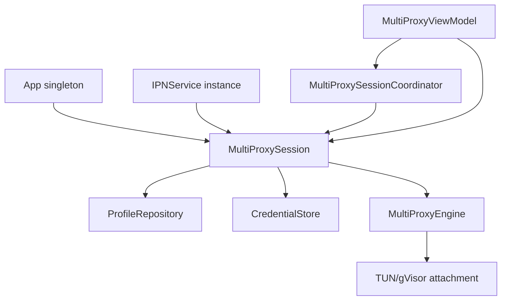
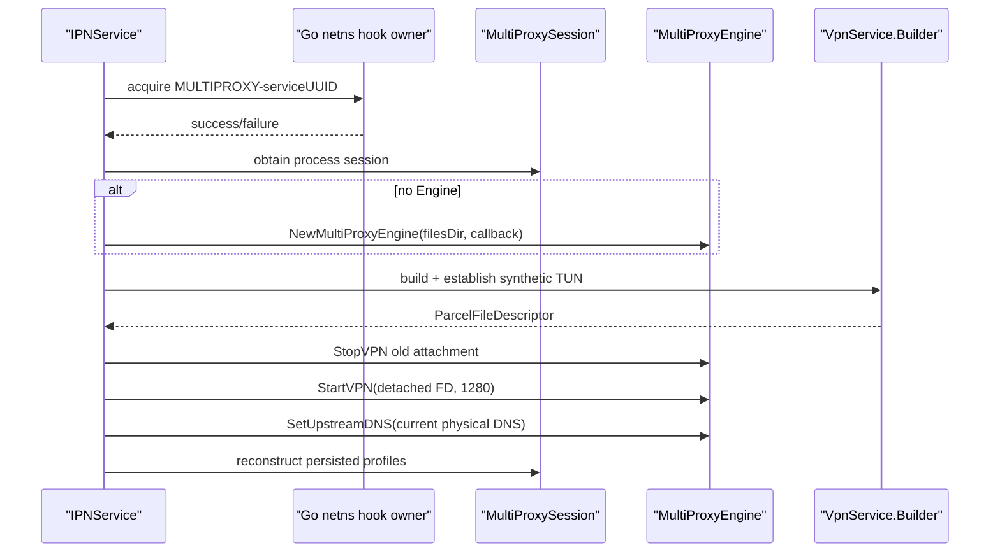
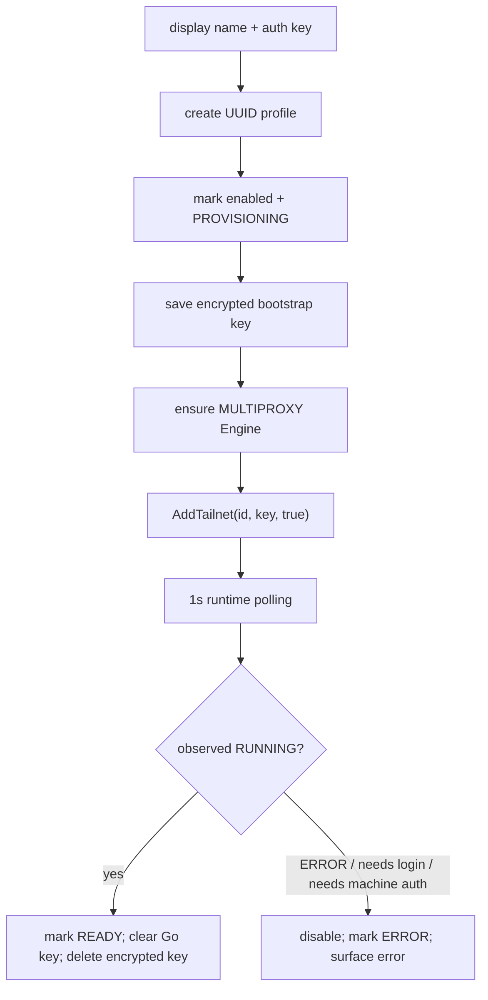
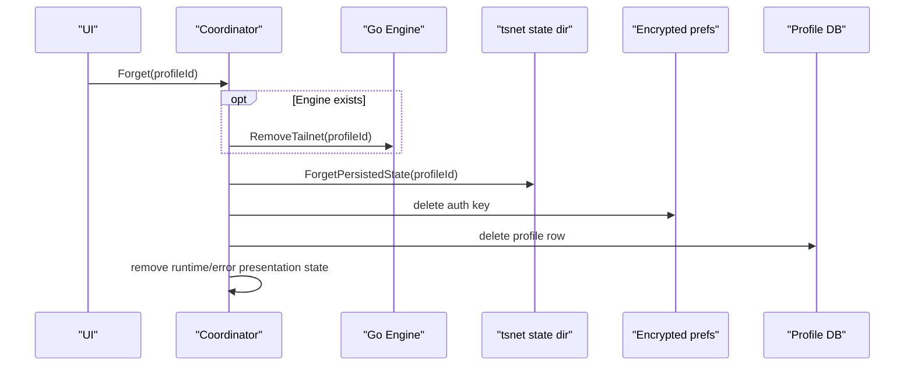

**Multi-Tailnet Proxy — Android, Profiles, Provisioning, and UI**

**Document status:** current-source manual for the Android half of `main`.

**Scope:** `App`, `IPNService`, `NetworkChangeCallback`, `MultiProxySession`, `MultiProxySessionCoordinator`, persistent profile storage, encrypted bootstrap credentials, ViewModel state, Compose UI, and STANDARD/MULTIPROXY arbitration.

## 1. The Android side is not just a UI wrapper

The Go engine can route synthetic targets, but Android decides whether that engine exists, whether it owns the one permitted VPN interface, which applications feed it, which physical network Tailscale sockets escape through, which profiles should survive process death, and when temporary credentials may be deleted.

The Android layer therefore has four distinct jobs:

```text
OS integration
    VpnService, foreground service, routes, app inclusion

persistent product configuration
    profile database + desired enabled state

runtime orchestration
    create Engine, add/enable/disable Tailnets, rebuild TUN

presentation
    Compose UI + observed state + peer snapshots
```

> **Mental model**
>
> Go is the runtime packet engine. Android is the durable product/lifecycle authority around it.

## 2. Object lifetime map



The important lifetime differences are:

| Object | Lifetime idea |
|---|---|
| SQLite profile rows | survive process death until user forgets profile |
| encrypted bootstrap key | temporary; intended to disappear after successful provisioning |
| `App` / `MultiProxySession` | process lifetime |
| `IPNService` | Android service-instance lifetime |
| `MultiProxyEngine` | current MULTIPROXY runtime lifetime |
| gVisor/TUN attachment | can be shorter than Engine lifetime |
| `tsnet.Server` | enabled Tailnet runtime lifetime |
| ViewModel | UI navigation/lifecycle scope |

Most lifecycle bugs come from treating two rows in that table as the same lifetime.

## 3. `App` owns the process-scoped session

`App` exposes:

```kotlin
val multiProxySession by lazy { MultiProxySession(this) }
val applicationScope = CoroutineScope(SupervisorJob() + Dispatchers.Default)
```

The session is lazy because ordinary STANDARD Tailscale operation should not need to eagerly initialize multiproxy persistence/runtime objects.

The application scope is used by the coordinator for long-running state observation and profile operations that should not die merely because one Compose screen leaves the navigation stack.

## 4. Normal Tailscale and MULTIPROXY coexist in one process

The upstream Android Tailscale application still has its normal `Application`, `LocalBackend`, `wgengine`, normal `VpnService.Builder` path, local API, notifications, Taildrop, MDM settings, and newer upstream facilities such as local proxy listener/control-proxy/public-DoH integration.

MULTIPROXY is an additional operating mode, not a replacement backend used by every app feature.

That distinction explains why `IPNService` still contains both:

```text
newBuilder()             normal STANDARD Tailscale Builder facade
rebuildMultiProxyTun...  custom synthetic-only MULTIPROXY Builder
```

and why the process-global Tailscale Android network hooks need explicit ownership.

## 5. Runtime mode model

Android models actual VPN ownership as:

```kotlin
enum class VpnRuntimeMode {
    STOPPED,
    STANDARD,
    MULTIPROXY
}
```

This is separate from SharedPreferences:

```text
selectedMode   which mode should be restored
wantRunning    whether any mode should be restored
activeMode     what this IPNService currently owns
```

A persisted preference cannot safely be treated as proof that a TUN or Go backend is alive.

## 6. Serialized mode transition

`transitionTo(targetMode)` uses `transitionMutex.withLock`.

Conceptually:

```text
lock transition
    |
    v
if current == target: return
    |
    v
tear down current mode completely
    |
    v
activeMode = STOPPED
    |
    v
start requested mode
    |
    +-- success -> publish target activeMode
    `-- failure -> remain STOPPED
```

This establishes a strict one-owner rule for Android VPN resources.

## 7. STANDARD teardown is a completion barrier

For STANDARD mode, Kotlin does not merely send a disconnect request and continue.

`Libtailscale.serviceDisconnect(this)` waits on the Go acknowledgement path. The Go backend acknowledges only after its matching service has:

```text
devices.Down()
CloseTUNs()
ReleaseAndroidNetworkHooks("STANDARD-" + service.ID)
cleared vpnService.service
```

That means a subsequent MULTIPROXY startup does not race an unfinished STANDARD hook release.

## 8. STANDARD startup is also acknowledged

`Libtailscale.requestVPN(this)` returns a Boolean.

The Go backend acquires the `STANDARD-<service ID>` hook owner, calls `DebugRebind`, associates the service, and performs any immediately required TUN update before returning success.

If hook acquisition or the initial TUN update fails, Kotlin leaves `activeMode=STOPPED` and clears desired normal Tailscale running state.

> **Careful**
>
> Sending to an unbuffered Go channel would only prove that a receiver accepted the message. The explicit ACK is what turns the call into a lifecycle completion boundary.

## 9. Starting MULTIPROXY

`startMultiProxyVPNLocked()` performs this order:



The Engine is created before Tailnets are reconstructed, and Android hooks are acquired before any reconstructed `tsnet.Server` is started.

## 10. MULTIPROXY Builder configuration

The custom Builder mirrors important normal-app policy while narrowing routes.

It configures:

```text
AF_INET allowed
AF_INET6 allowed
setMetered(false) on Android Q+
setUnderlyingNetworks(null)
existing MDM or user selected allowed/disallowed app rules
fd9b:8d7c:6a5e::1/120 interface address
fd9b:8d7c:6a5e::/48 route
fd9b:8d7c:6a5e::3 DNS server
MTU 1280
```

It intentionally does not install default routes.

### 10.1 App selection precedence

The Builder chooses package policy in this order:

```text
MDM included packages if non-empty
else MDM excluded packages if non-empty
else user's normal selected package policy
```

If using a disallowed list, built-in disallowed packages are appended.

This preserves existing Android policy expectations instead of making MULTIPROXY silently ignore enterprise/user split-tunnel configuration.

## 11. TUN re-establishment

`rebuildMultiProxyTunLocked` first calls:

```text
engine.stopVPN()
```

then clears the old Kotlin PFD references and establishes a new Android TUN.

After `detachFd`, it calls:

```text
engine.startVPN(rawFd, 1280)
```

The Engine object is not necessarily recreated just because the TUN attachment is.

This is the Android expression of:

```text
Engine lifetime != TUN lifetime
```

## 12. Stopping MULTIPROXY

A full mode stop is stronger than a TUN rebuild:

```text
engine.stopVPN()
engine.close()
engine = null
clear active descriptor bookkeeping
release MULTIPROXY-serviceUUID hooks
```

`Engine.Close` then stops all embedded Tailnet runtimes and callback dispatch internally.

## 13. Service actions

`IPNService.onStartCommand` recognizes explicit actions:

```text
ACTION_START_VPN
ACTION_STOP_VPN
ACTION_RESTART_VPN
ACTION_START_FOREGROUND_ONLY
ACTION_START_MULTIPROXY
ACTION_STOP_MULTIPROXY
```

The start actions persist both selected mode and `wantRunning=true`.

Stop persists `wantRunning=false` and transitions to STOPPED.

## 14. Service recreation

When Android invokes the service with the generic `android.net.VpnService` action or null intent, the service reads:

```text
wantRunning
selectedMode
```

If not wanted, it remains stopped.

If MULTIPROXY was selected, it restores MULTIPROXY. Otherwise it restores STANDARD using the normal Tailscale status/notification path.

This is why persisted selected mode is necessary even though runtime `activeMode` exists: `activeMode` cannot survive process death.

## 15. Restart semantics

`ACTION_RESTART_VPN` holds the same transition mutex and restarts the mode that was actually active.

For MULTIPROXY:

```text
stop full multiproxy runtime
start fresh multiproxy runtime
```

For STANDARD:

```text
clear WantRunning
wait synchronous Go disconnect
set WantRunning
request VPN and wait success ACK
```

The explicit teardown-before-start discipline keeps hook/TUN ownership deterministic.

## 16. Android VPN revocation

`onRevoke()` means Android has revoked VPN authorization.

The service therefore:

```text
wantRunning=false
setVpnPrepared(false)
transition STOPPED
close service
update VPN status false
```

Clearing `vpnPrepared` matters because a future connection must go through `VpnService.prepare()` authorization again.

## 17. Physical/non-VPN network monitoring

`NetworkChangeCallback` registers a `NetworkRequest` requiring:

```text
NET_CAPABILITY_INTERNET
NET_CAPABILITY_NOT_VPN
```

The `NOT_VPN` filter is a recursion boundary. The process must learn about the network underneath the VPN, not select its own VPN as the underlay for Tailscale transport sockets or forwarded DNS.

## 18. Tracking all candidate networks

The callback keeps:

```text
activeNetworks: Network -> NetworkInfo(capabilities, LinkProperties)
```

and updates it on:

```text
onAvailable
onCapabilitiesChanged
onLinkPropertiesChanged
onLost
```

Each event can recompute the preferred underlay.

This is more robust than caching only the last callback network: losing one network does not erase a still-valid other network.

## 19. Choosing the underlay

`pickDefaultNetwork()` first considers candidate networks that have:

```text
INTERNET
NOT_VPN
at least one DNS server
```

`pickNonMetered()` prefers a candidate with `NET_CAPABILITY_NOT_METERED`; otherwise the first candidate is used.

If no DNS-bearing candidate exists, it falls back to any INTERNET + NOT_VPN network because having an underlay is still better than selecting nothing.

The resulting cached fields are:

```text
cachedDefaultNetwork
cachedDefaultNetworkInfo
cachedDefaultInterfaceName
```

## 20. One DNS endpoint for MULTIPROXY

The ordinary Tailscale Android DNS model consumes the full Android DNS list.

MULTIPROXY currently has a simpler Go API: one upstream endpoint.

Therefore the Android extension selects:

```kotlin
info.linkProps.dnsServers.firstOrNull()?.hostAddress
```

and sends only changes to `IPNService.onUnderlyingDnsChanged`.

No available network clears the resolver with an empty string.

## 21. Gateway and normal Tailscale notifications remain intact

The multiproxy DNS extension is inserted into the existing `maybeUpdateDNSConfig` path rather than replacing it.

The callback still builds the normal Tailscale DNS/search-domain configuration, identifies the default gateway, and invokes:

```text
Libtailscale.onGatewayChanged(...)
Libtailscale.onDNSConfigChanged(interfaceName)
```

MULTIPROXY therefore reuses the established Android underlay observer instead of maintaining a second competing network callback.

## 22. `MultiProxySession`

A session currently contains:

```text
engine: MultiProxyEngine?
activeFd: Int
activePfd: ParcelFileDescriptor?
profileRepository
credentialStore
```

`onUnderlyingDnsChanged` simply forwards the new resolver into a live Engine if one exists.

`MultiProxySession` also owns the persisted-profile reconstruction helper used when `IPNService` starts MULTIPROXY.

## 23. Profile database schema

`TailnetDatabaseHelper` creates SQLite database:

```text
multiproxy_profiles.db
```

with table:

```text
profiles
    id                  TEXT PRIMARY KEY
    display_name        TEXT NOT NULL
    enabled             INTEGER NOT NULL
    provisioning_state  TEXT NOT NULL
    created_at          INTEGER NOT NULL
    updated_at          INTEGER NOT NULL
```

Database version is currently `1`.

## 24. `TailnetProfile`

The Kotlin data model is:

```text
id
    immutable UUID

displayName
    mutable human label

enabled
    desired runtime state

provisioningState
    UNPROVISIONED
    PROVISIONING
    READY
    ERROR

createdAt / updatedAt
```

A `RuntimeState` enum also exists with `NOT_LOADED`, `STARTING`, `RUNNING`, `STOPPED`, and `ERROR`, but the current coordinator/UI path uses normalized runtime strings rather than that enum.

## 25. Why profile UUID matters

`ProfileRepository.createProfile` uses `UUID.randomUUID().toString()` once.

That ID is then used as:

```text
SQLite primary key
credential-store key suffix
Go Tailnet identifier / UpstreamID
state-directory hash input
qualified DNS namespace hash input
TargetKey namespace
```

Changing a display name therefore cannot move persistent identity.

## 26. Repository state flow

`ProfileRepository` exposes:

```kotlin
StateFlow<List<TailnetProfile>>
```

and refreshes it after create/update/delete.

The ViewModel collects this StateFlow rather than repeatedly querying SQLite itself.

Database reads/writes for CRUD operations are performed on `Dispatchers.IO`, although repository construction performs its initial `refreshProfiles()` synchronously.

## 27. Creating a profile

Repository creation itself produces:

```text
new UUID
user displayName
enabled=false
provisioningState=UNPROVISIONED
createdAt=now
updatedAt=now
```

The coordinator immediately advances that profile into actual provisioning when the user adds a Tailnet with an auth key.

## 28. Credential store

`CredentialStore` does not have its own plaintext file/database.

It receives the application's encrypted SharedPreferences and stores:

```text
auth_key_<profile UUID> -> auth key
```

The underlying `App.getEncryptedPrefs()` uses AndroidX Security:

```text
MasterKey AES256_GCM
EncryptedSharedPreferences
pref-key encryption AES256_SIV
pref-value encryption AES256_GCM
```

This keeps the bootstrap secret separate from ordinary SQLite metadata.

## 29. Provisioning through the coordinator

`MultiProxySessionCoordinator.provision` is serialized by `mutationMutex`.



If `AddTailnet` reports an existing registration, the coordinator tries to enable that existing runtime rather than creating a duplicate profile identity in Go.

## 30. What counts as successful provisioning

The coordinator polls `GetTailnetStatesJSON()` every second.

When a profile is `PROVISIONING` and observed state normalizes to `RUNNING`, it performs one serialized completion transition:

```text
provisioningState = READY
enabled = true
Go runtime AuthKey = ""
encrypted auth key deleted
last error cleared
```

The design treats successful running state as evidence that `tsnet` has persisted sufficient node identity to restart later without the bootstrap key.

## 31. Provisioning failure

While `PROVISIONING`, these observed states are treated as failure:

```text
ERROR
NEEDS_LOGIN
NEEDS_MACHINE_AUTH
```

`failProvisioning` attempts to disable the live runtime, then stores:

```text
provisioningState = ERROR
enabled = false
```

and exposes the message through `lastErrors`.

> **Current behavior**
>
> `NeedsMachineAuth` is not modeled as a long-lived recoverable waiting state in this UI yet; it is collapsed into provisioning failure.

## 32. Ensuring MULTIPROXY exists for a UI mutation

Interactive enable/provision operations may be invoked while the Engine is absent.

`ensureMultiProxyEngine` sends `ACTION_START_MULTIPROXY`, then polls `session.engine` up to 50 times at 100 ms intervals.

This provides an approximate five-second startup wait.

> **Careful**
>
> `session.engine != null` is not a formal completion acknowledgement for the entire service/TUN startup. `IPNService` assigns the Engine before TUN establishment and reconstruction finish. This is a current synchronization seam recorded in the validation document.

## 33. Enabling an existing profile

Coordinator logic:

```text
load persisted profile
ensure Engine
try SetTailnetEnabled(id, true)
    |
    +-- if Go says not found:
            load encrypted bootstrap key if still present, else empty
            AddTailnet(id, key, true)
    |
    v
on success, persist enabled=true
```

The database desired state is changed only after the runtime mutation succeeds.

## 34. Disabling an existing profile

If an Engine exists, the coordinator calls:

```text
SetTailnetEnabled(id, false)
```

A Go `not found` error is tolerated because the desired result is already no live runtime.

Then it persists `enabled=false`.

The profile row and `tsnet` state directory remain.

## 35. Rename

Rename only performs:

```text
profile.copy(displayName = newName)
```

through the repository.

There is no Go Tailnet removal/re-add, no new UUID, no state-directory rename, and no synthetic identity recomputation.

This is the correct separation between human presentation and machine identity.

## 36. Forget

The coordinator's destructive Forget operation is serialized and ordered:



If Go reports the runtime is already absent, the coordinator still continues to disk/credential/database deletion.

## 37. Why Forget uses `RemoveTailnet` rather than only Go `ForgetTailnet`

`RemoveTailnet` already implements the canonical live cleanup:

```text
cancel/wait watcher
close tsnet
clear subnet ownership
clear exit ownership
clear peer/DNS snapshot
remove runtime registration
```

Then the separate state helper deletes disk state even if the Engine is absent.

This decomposition makes Android's destructive operation explicit and robust to runtime absence.

## 38. Startup reconstruction

When `IPNService` has successfully attached MULTIPROXY's TUN, it calls:

```text
session.reconstructEngine(scope)
```

That launches a coroutine, reads the current repository StateFlow value, and for every profile calls:

```text
engine.addTailnet(profile.id, savedAuthKeyOrEmpty, profile.enabled)
```

A provisioned READY profile should normally have no saved bootstrap key, so its existing deterministic `tsnet` state directory is expected to resume identity.

Errors are logged per profile and do not abort the loop for the remaining profiles.

## 39. Desired state versus observed state

For each UI card, three state dimensions matter:

```text
Desired:
    profile.enabled

Provisioning:
    UNPROVISIONED / PROVISIONING / READY / ERROR

Runtime observed:
    NOT_LOADED / STARTING / RUNNING / STOPPED / ...
```

Example:

```text
Work
Desired: Enabled
Provisioning: READY
Runtime: STARTING
```

is coherent during reconnection.

A previous implementation conflated these concepts; the current ViewModel combines them separately.

## 40. Runtime polling

`MultiProxySessionCoordinator.bind(session)` starts one application-scope job for the bound session.

Every second:

```text
engine.getTailnetStatesJSON()
        |
        v
JSON decode
        |
        v
profile ID -> normalized observed state
        |
        v
runtimeStates StateFlow
```

Binding the same session again while the poll job is alive is a no-op. Binding another session cancels the previous job.

## 41. Error flow

The coordinator keeps:

```text
lastErrors: StateFlow<Map<profileId, message>>
```

Runtime/profile mutations place meaningful errors there, and successful operations clear them.

This is deliberately UI-visible state rather than only Logcat output.

## 42. `MultiProxyViewModel`

The ViewModel takes no direct SQL or Go routing responsibility.

After `setSession`, it:

1. binds the coordinator;
2. combines profile repository state + runtime state + errors;
3. produces `TailnetProfileUiState`;
4. starts a separate peer-snapshot poll every two seconds.

Operations delegate to coordinator methods.

```text
View button
    -> ViewModel method
        -> Coordinator serialized mutation
            -> Repository and/or Go Engine
```

## 43. Runtime default shown before first observation

If the runtime-state map has no entry yet, ViewModel shows:

```text
enabled profile  -> NOT_LOADED
disabled profile -> STOPPED
```

This avoids falsely claiming a persisted enabled profile is already running before the live Engine reports it.

## 44. Peer presentation polling

Every two seconds the ViewModel requests:

```text
engine?.getTargetsJSONV2() ?: "[]"
```

and decodes it into:

```text
MultiProxyPeer
    tailnetId
    hostname
    currentIpv4
    currentIpv6
    syntheticDnsName
    syntheticIpv6
    kind
```

This is an authoritative current snapshot, not accumulation of `OnPeerDiscovered` callbacks.

## 45. Why peer callbacks are not the UI database

Go's event queue is bounded and may drop observational events if full. A peer can also disappear later.

If the UI merely appended every callback forever, it would eventually show stale peers.

Polling the current target snapshot solves that semantic problem even though it introduces a periodic read.

## 46. Navigation integration

`MainActivity` adds a `multiProxy` Compose destination to the existing settings navigation graph.

When entered, it obtains a `MultiProxyViewModel`, attaches the application session, and renders `MultiProxyView`.

This means the screen participates in the normal app navigation rather than existing as a separate test Activity.

## 47. UI layout

The current screen has:

- top bar and Back action;
- Start Multi-Tailnet and Stop controls;
- empty state;
- one card per profile;
- desired/provisioning/runtime/error fields;
- enable/disable button;
- rename dialog;
- destructive Forget action;
- Add button/dialog;
- discovered-peer section.

The goal is functional administration, not final product polish.

## 48. Add-profile dialog

The dialog requires both:

```text
Display Name
Auth Key
```

The key field uses `PasswordVisualTransformation`.

On submit, trimmed values are passed to the ViewModel/coordinator.

The key is not later displayed back to the user.

## 49. Forget confirmation

The dialog explicitly tells the user that Forget removes local Tailnet identity and saved state, and recommends Disable when identity should be preserved.

This wording reflects a real storage distinction, not just UI caution.

## 50. Peer information shown

For each active target the UI shows:

```text
hostname
profile/Tailnet ID
synthetic DNS name
synthetic IPv6
current native Tailnet IPv4 if present
current native Tailnet IPv6 if present
```

The distinction between synthetic and native address is now visible in the UI itself.

## 51. Process-global hook ownership from Android's perspective

Before MULTIPROXY starts any `tsnet.Server`, `IPNService` requests:

```text
MULTIPROXY-<random service UUID>
```

The hook callbacks point back at that exact Android service and application context.

The service UUID changes for every service instance, which prevents an old instance from accidentally releasing a newer instance's exact token.

## 52. `VpnService.protect` and `Network.bindSocket`

These solve related but different Android problems.

`protect(fd)` tells Android not to route that socket through the VPN.

Binding to the chosen `Network` makes the socket use the selected physical/logical underlay object.

For Tailscale's own sockets, both behaviors matter as networks transition.

## 53. `setUnderlyingNetworks(null)`

The Builder currently calls `setUnderlyingNetworks(null)` in both relevant construction paths.

This does not replace explicit socket binding. It leaves Android to treat underlying-network association according to platform behavior while Tailscale's process sockets use its own selected `Network` through the bind hook.

## 54. Current database migration policy

`TailnetDatabaseHelper.onUpgrade` currently does:

```text
DROP TABLE profiles
CREATE TABLE profiles
```

This is destructive schema migration behavior.

For a prototype at database version 1 it keeps code small, but any schema version change in a user-preserving release needs real migrations.

## 55. Current initial repository load

`ProfileRepository` calls `refreshProfiles()` during construction.

Unlike CRUD methods, this initial refresh is not wrapped in `withContext(Dispatchers.IO)` because constructors cannot suspend.

That means the first lazy creation of `MultiProxySession/ProfileRepository` performs a synchronous SQLite read on the caller thread.

The database is small today, but this is a real implementation detail worth knowing when diagnosing UI/service startup latency.

## 56. Current Engine-ready wait is not transactional

`ensureMultiProxyEngine` observes only:

```text
session.engine != null
```

Yet `IPNService.startMultiProxyVPNLocked` assigns `session.engine` before `rebuildMultiProxyTunLocked` completes.

So there is a small window where interactive coordinator code can see a non-null Engine while service startup is still attaching the TUN.

The Go Engine can support Tailnet registration without a TUN, so this does not automatically corrupt runtime state, but a later TUN startup failure can close that Engine after an interactive operation began.

A future explicit service-ready signal would give stronger lifecycle semantics.

## 57. Current reconstruction path and coordinator path are separate

Interactive mutations use `MultiProxySessionCoordinator` and its mutation mutex.

Startup reconstruction uses `MultiProxySession.reconstructEngine`, which directly loops through profiles and calls Go.

This means reconstruction is not currently serialized by the coordinator's `mutationMutex`.

The Go Tailnet lifecycle lock protects Engine integrity, but Android desired-state races during startup deserve explicit E2E/concurrency testing.

## 58. Tests currently on the Android side

Current multiproxy-specific JVM tests include:

### 58.1 DNS selection rule

`DnsSelectionTest` checks first-DNS selection for multiple IPv4 addresses, IPv6 addresses, and empty list.

The test validates the rule through a test helper rather than invoking private production `NetworkChangeCallback` logic directly.

### 58.2 Peer JSON schema

`MultiProxyPeerJsonTest` decodes the V2 schema and asserts the distinction among:

```text
currentIpv4
currentIpv6
syntheticDnsName
syntheticIpv6
```

There are currently no comparable JVM tests in this tree for ProfileRepository CRUD, coordinator provisioning transitions, or destructive Forget orchestration.

## 59. Failure cases by Android subsystem

| Symptom | Likely subsystem |
|---|---|
| Start button times out waiting for Engine | service intent/foreground/VPN permission/start failure |
| Profile remains PROVISIONING | runtime poll never sees RUNNING or terminal mapped state |
| Profile READY but cannot route peer | Go target snapshot/data path, not profile DB |
| Rename changes reachability | bug: display name should never affect identity |
| Re-enable says not found | reconstruction/runtime registration absent; coordinator should AddTailnet fallback |
| Forget leaves profile after restart | repository deletion failed |
| Forget removes profile but identity returns | state-directory deletion failed |
| Works on Wi-Fi but not after cell handover | NetworkChangeCallback/protect/bind/TUN lifecycle |
| UI peer disappeared only after 2s | expected snapshot polling latency |
| UI runtime changes within ~1s | expected coordinator polling latency |

## 60. Responsibility boundary to preserve

Do not let future UI code bypass the coordinator and directly mutate Go runtime while also writing SQLite.

The intended direction is:

```text
UI intent
    |
    v
ViewModel
    |
    v
MultiProxySessionCoordinator
    |              |
    v              v
ProfileRepository  MultiProxyEngine
```

This keeps desired state and live runtime updates inside one product-level orchestration boundary.

## 61. Bottom line

The Android architecture now has a genuine persistent/product layer rather than only a TUN proof of concept.

A profile has a durable immutable UUID. The auth key is a temporary encrypted bootstrap secret. The Go Engine is reconstructed from persisted profiles. A coordinator serializes interactive profile mutations and observes actual `tsnet` runtime state. The UI shows desired, provisioning, and observed state separately. Forget has explicit destructive disk semantics. STANDARD and MULTIPROXY contend for one tokenized Android networking boundary.

The main remaining Android work is therefore no longer "invent profile storage." It is validation and tightening of the seams between service readiness, reconstruction, coordinator serialization, Android network transitions, and real-device lifecycle behavior.