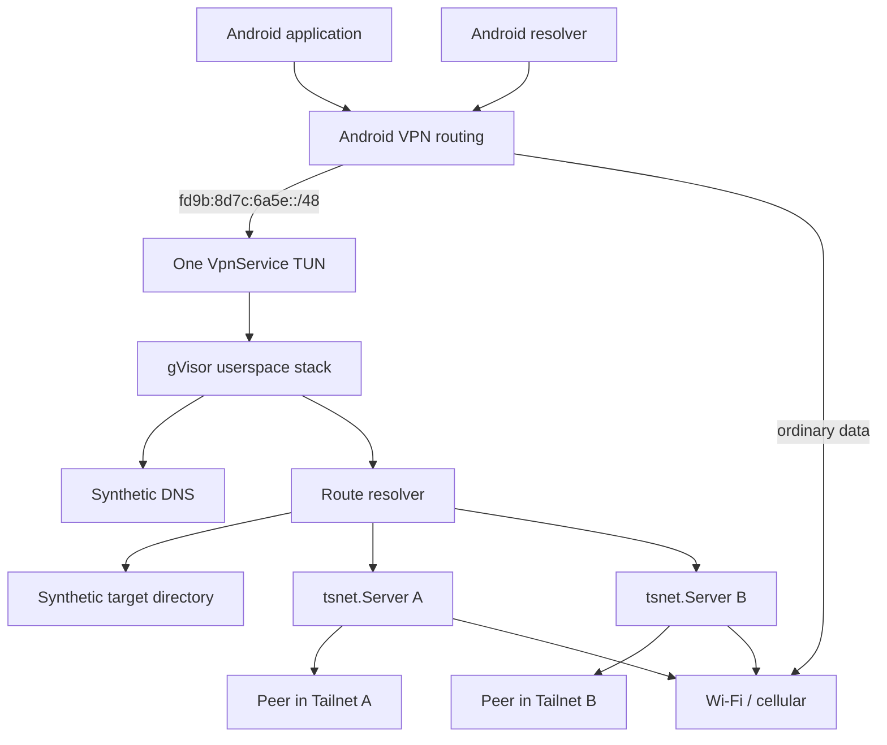
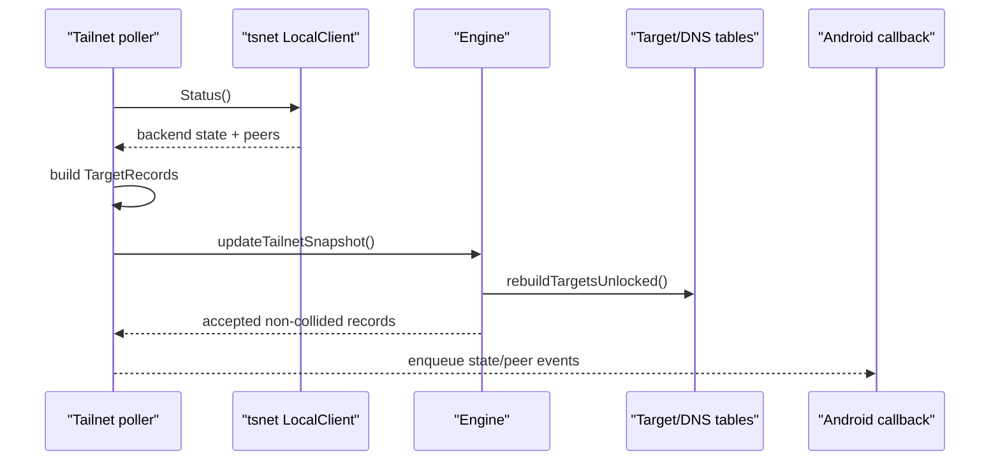
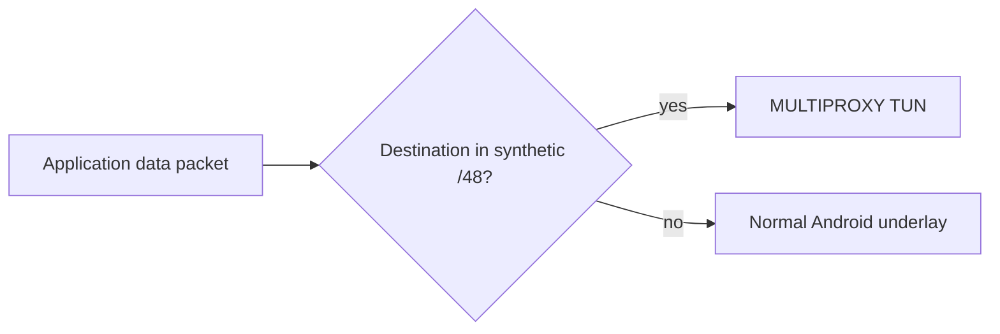
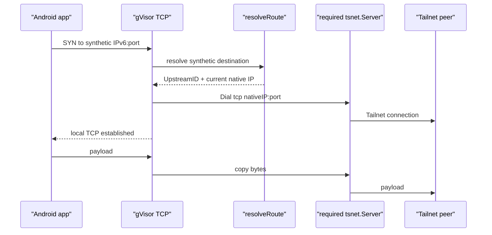
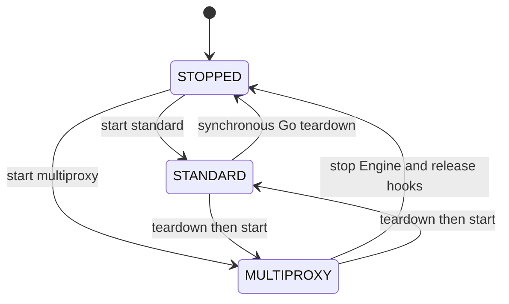
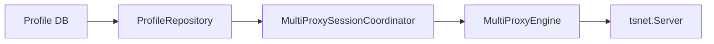
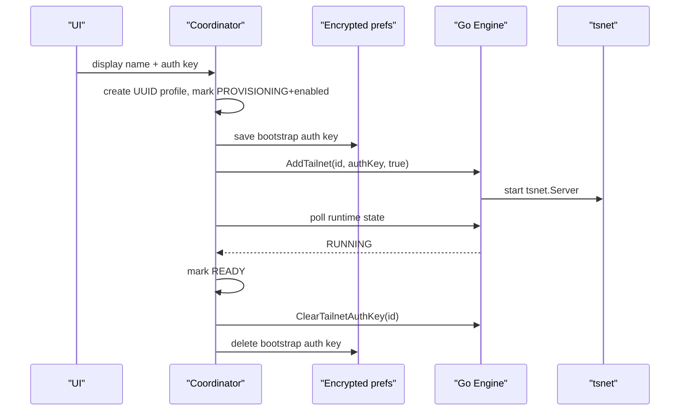
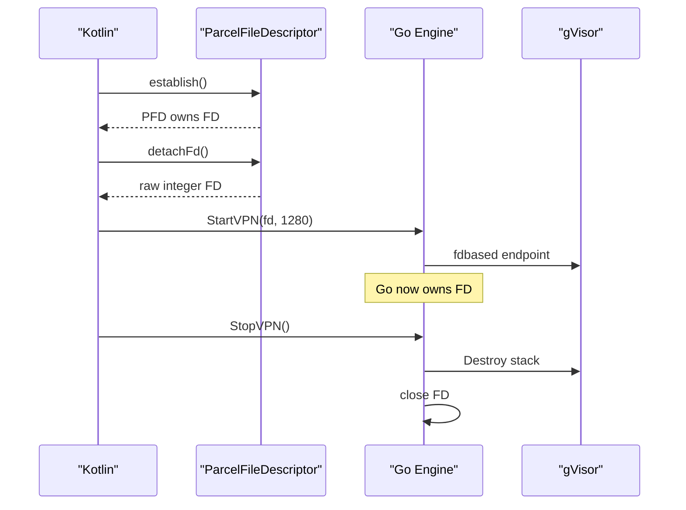

**Multi-Tailnet Proxy for Android — Current Architecture**

**Document status:** canonical architecture reference for the current `main` implementation.

**Audience:** Android, Go, networking, and systems engineers; reviewers who need the whole system model before following individual functions.

**Source discipline:** this document describes what the current branch does. Future directions and known gaps are called out explicitly. If code and prose disagree, re-read the live source and correct the prose.

## 1. The problem the architecture actually solves

The product requirement is unusual but precise:

> One Android device should be able to reach peers in several independent Tailnets at the same time, even when those Tailnets contain overlapping native Tailscale addresses or hostnames.

Android itself does not give the application one VPN interface per Tailnet. `VpnService` exposes one OS-visible VPN boundary. More importantly, a native Tailscale IP stops being globally meaningful once several independent Tailnets coexist inside the same process.

Suppose two Tailnets both contain a peer at `100.80.10.20`:

```text
Tailnet A                         Tailnet B
---------                         ---------
work-nas                          home-nas
100.80.10.20                      100.80.10.20
```

The IP alone cannot answer:

```text
which 100.80.10.20?
```

The missing information is the Tailnet namespace.

The multiproxy design therefore gives Android a second, synthetic identity space. Applications connect to a deterministic synthetic IPv6 address. That address identifies both the Tailnet and the peer. The engine then translates that stable identity into the peer's current native Tailscale locator and opens a new connection through the required `tsnet.Server`.

> **Mental model**
>
> The synthetic IPv6 address is not the peer's real Tailscale address and it is not a NAT allocation counter. It is a stable routing key for `Tailnet + stable peer identity`.

## 2. The architecture in one picture



There is one Android TUN. The multiplicity exists behind the TUN as independent embedded Tailscale runtimes.

## 3. Responsibility boundaries

The system is easier to reason about when each layer is named precisely.

| Layer | Main component | Responsibility |
|---|---|---|
| Android capture | `VpnService.Builder` + Android kernel | Decides which application packets enter the TUN |
| Android service ownership | `IPNService` | Owns mode transition, foreground-service state, Builder creation, TUN attachment |
| Packet-to-socket translation | gVisor | Parses IP and terminates TCP/UDP in userspace |
| Stable destination identity | `TargetKey` | Defines the Tailnet-qualified peer identity |
| Current reachability | `TargetRecord` | Stores current native IPv4/IPv6 locator for the stable identity |
| Exact synthetic routing | `Engine.targets` + `resolveRoute` | Maps synthetic IPv6 to one required Tailnet and current locator |
| Tailnet connectivity | `tsnet.Server` | Owns one independent Tailnet's control/data-plane state and `Dial` |
| Underlay escape | Android `netns` protect/bind hooks | Keeps Tailscale's own sockets from recursing into the VPN |
| Persistent desired state | Android profile DB | Records which profiles exist and whether they are desired enabled |
| Bootstrap secret | encrypted Android preferences | Temporarily stores auth key during provisioning |
| Runtime observation | `GetTailnetStatesJSON` + coordinator | Reports what the live `tsnet` runtime is actually doing |
| Peer presentation | `GetTargetsJSONV2` + ViewModel | Exposes authoritative current target snapshots to Android UI |

> **Careful**
>
> Android routing, gVisor routing, and `resolveRoute` are three different decisions. Saying "the VPN routes it" hides the failure boundary.

## 4. The canonical identity model

### 4.1 `UpstreamID`

Every Android profile receives an immutable UUID when it is created. That UUID crosses into Go as the `UpstreamID` / Tailnet identifier.

The display name is deliberately not identity.

```text
profile.id          = 2b7...e91      immutable
profile.displayName = Work           mutable
```

Renaming `Work` to `Company` must not move the Tailnet to a different namespace.

### 4.2 `TargetKey`

A Tailscale peer becomes a canonical target through:

```go
type TargetKey struct {
    NamespaceID UpstreamID
    Kind        TargetKind
    StableID    string
}
```

For current peer targets:

```text
NamespaceID = immutable profile UUID / UpstreamID
Kind        = tailscale-node
StableID    = Tailscale StableNodeID
```

The canonical serialization is:

```text
NamespaceID + NUL + Kind + NUL + StableID
```

The NUL delimiters prevent ambiguous concatenation boundaries.

### 4.3 Deterministic synthetic IPv6

`TargetKey.SyntheticIPv6()` computes SHA-256 over that canonical identity and places 80 digest bits behind the fixed `/48`:

```text
fd9b:8d7c:6a5e::/48
```

Conceptually:

```text
48-bit fixed prefix                    80 hash-derived bits
<-----------------><---------------------------------------------->
fd9b:8d7c:6a5e:....:....:....:....:....
```

The function is deterministic. There is no persistent peer-address allocator database.

Same identity:

```text
same profile ID
same StableNodeID
        |
        v
same synthetic IPv6
```

Different Tailnet namespace:

```text
same StableNodeID
+ different profile ID
        |
        v
different synthetic IPv6
```

That second property is what makes overlapping native address spaces tractable.

## 5. Reserved control space

The first `/120` of the synthetic `/48` is reserved:

```text
fd9b:8d7c:6a5e::/120       control space
fd9b:8d7c:6a5e::1          VPN interface address
fd9b:8d7c:6a5e::3          synthetic DNS address
```

The generator checks every candidate and retries deterministically if the address lands in the reserved control range.

This means peer identity can never accidentally become the local DNS endpoint or interface address.

There is no active synthetic IPv4 peer namespace. Native Tailnet IPv4 is exported separately as `currentIpv4` in the V2 peer snapshot.

## 6. Identity and locator are deliberately separate

`TargetRecord` carries both stable identity and current reachability:

```go
type TargetRecord struct {
    Key              TargetKey
    SyntheticIPv6    netip.Addr
    Hostname         string
    CurrentIPv4      netip.Addr
    CurrentIPv6      netip.Addr
    RequiredUpstream UpstreamID
}
```

The stable half is:

```text
Key
SyntheticIPv6
RequiredUpstream
```

The mutable locator half is:

```text
CurrentIPv4
CurrentIPv6
```

A peer can change its native IP without changing synthetic identity:

```text
time 1
synthetic X -> Tailnet Work / StableNodeID 42 -> 100.70.0.4

later
synthetic X -> Tailnet Work / StableNodeID 42 -> 100.70.0.91
```

`resolveRoute` prefers current IPv4 when valid and otherwise uses current IPv6.

> **Under the hood**
>
> This is why the target table is a live reachability snapshot rather than an allocation ledger. The hash defines identity; the status poll tells the engine where that identity is reachable now.

## 7. Tailnet snapshots

Each Tailnet has an authoritative current snapshot:

```text
tailnetSnapshots[UpstreamID] -> []TargetRecord
```

The poller performs an immediate status read and then repeats every ten seconds.



Snapshot replacement naturally handles peer disappearance:

```text
old: A B C
new: A C D

B -> no longer routable
D -> becomes routable
A/C -> retain deterministic synthetic identities
```

No synthetic address needs to be freed or reused.

## 8. Collision behavior

SHA-256 truncation to 80 bits makes accidental collision extremely unlikely, but correctness does not rely on probability.

When rebuilding global targets, if two different `TargetKey` values map to the same synthetic IPv6, the address is marked collided and removed.

```text
Target A ----\
              +--> same synthetic IPv6 --> neither target routable
Target B ----/
```

Silent last-writer-wins behavior would be dangerous because traffic intended for one identity could be redirected to another identity.

The routing layer uses the same fail-closed philosophy: if a destination is inside the synthetic `/48` but there is no exact active target, lookup stops. It does not fall through to a Tailnet subnet or exit route.

## 9. Android capture model

MULTIPROXY currently captures only the synthetic IPv6 `/48`.

The Builder uses values exported by Go rather than duplicating literals in Kotlin:

```text
address: fd9b:8d7c:6a5e::1/120
route:   fd9b:8d7c:6a5e::/48
DNS:     fd9b:8d7c:6a5e::3
MTU:     1280
```

It also applies the same application inclusion/exclusion logic used by the normal service, including MDM package lists.

The Builder does not install `0.0.0.0/0` or `::/0` for MULTIPROXY.



Therefore ordinary non-synthetic application data bypasses the multiproxy userspace stack.

DNS is a special case: VPN-eligible applications are configured to use the synthetic DNS endpoint, so ordinary hostname queries can enter the TUN and be forwarded to underlying DNS even though the resulting public TCP/UDP data bypasses it.

## 10. Why gVisor is in the middle

The Android TUN gives Go raw IP packets. `tsnet.Server.Dial` works at connection/socket level. gVisor bridges those abstractions.

`StartVPN` creates a userspace stack containing:

```text
IPv4 protocol support
IPv6 protocol support
TCP protocol support
UDP protocol support
one fdbased NIC attached to the Android TUN
synthetic /48 route to that NIC
TCP forwarder
UDP forwarder
```

The gVisor stack is not the Tailnet policy engine. Its job is to terminate transport flows and hand a usable endpoint to the multiproxy forwarding code.

> **Mental model**
>
> gVisor answers "what TCP/UDP flow is this packet part of?" `resolveRoute` answers "which Tailnet must this flow use?"

## 11. TCP is a two-leg connection proxy

A synthetic TCP connection is not kernel DNAT of a packet stream.

```text
leg 1
Android app <-> gVisor TCP endpoint

leg 2
selected tsnet.Server <-> real Tailnet peer
```

The engine terminates leg 1, looks up the synthetic target, dials leg 2, then copies bytes in both directions.



Initial upstream dial is bounded by a ten-second context. The copy path uses half-close behavior where the concrete connection supports it.

## 12. UDP now has an explicit association lifetime

UDP follows the same route decision but creates connected UDP endpoints on both sides.

The current hardening adds:

```text
60 second idle timeout
activity refreshes both deadlines
first terminal error closes both sides
both pump goroutines are awaited
```

This is still much simpler than a general UDP NAT/multiplexer. That is intentional: each gVisor forwarder request becomes one bounded association to one selected upstream.

Synthetic DNS UDP is intercepted before ordinary peer route resolution.

## 13. DNS architecture

### 13.1 Synthetic names

The engine builds names from active target snapshots.

For an active peer, the tables contain:

```text
reported FQDN
short first-label name
Tailnet-qualified proxy name
```

Qualified names use the lower-cased first hostname label plus a 128-bit hash of immutable `UpstreamID`:

```text
server.<32-hex-profile-hash>.proxy.
```

The hash is namespacing, not secrecy.

### 13.2 Ambiguous short names

If two active Tailnets expose the same short name, a short-name query is ambiguous and returns `NXDOMAIN` rather than a random target.

Qualified names remain individually usable.

### 13.3 Record-type behavior

Current synthetic peer identity is IPv6-only:

```text
known synthetic name + AAAA -> synthetic IPv6 answer
known synthetic name + A    -> authoritative NODATA
known synthetic name + other unsupported RR -> authoritative NODATA
```

The important security/property boundary is that a recognized internal name is not forwarded to external DNS merely because the application asked an unsupported RR type.

### 13.4 UDP and TCP DNS

The synthetic DNS endpoint is handled on both transport protocols:

```text
UDP :53 -> ServeDNSUDP
TCP :53 -> ServeDNSTCP
```

TCP uses standard two-byte DNS message framing, `io.ReadFull`, and a full-write helper to handle short writes.

For ordinary external names, the current selected underlay DNS server is used. UDP forwarding retries over TCP if exchange fails or the returned DNS message has `TC=1`.

## 14. Underlying Android network selection

`NetworkChangeCallback` intentionally tracks non-VPN physical networks with:

```text
NET_CAPABILITY_INTERNET
NET_CAPABILITY_NOT_VPN
```

It keeps a map of active `Network` objects and their capabilities/link properties, then chooses a usable underlying network rather than trusting the VPN as Android's process default.

Selection prefers networks with DNS and then prefers non-metered where possible. If no candidate has DNS, it can still choose an Internet/non-VPN network and rely on normal fallback behavior.

The selected network supplies:

```text
cached Android Network
interface name
DNS list for normal Tailscale DNS config
first DNS server for MULTIPROXY upstream DNS
default gateway information
```

Only the first DNS server is currently passed into MULTIPROXY because `SetUpstreamDNS` models one resolver endpoint.

## 15. Protect and bind hooks

Tailscale's own control, DERP, STUN, and direct transport sockets are process sockets created beneath `tsnet`/Tailscale networking code. They must not be recaptured by the Android VPN.

The process-global `netns` Android hooks provide two escape mechanisms:

```text
VpnService.protect(fd)
    prevents the socket from using the VPN route

Network.bindSocket(fd)
    binds the socket to the selected underlying Android Network
```

STANDARD and MULTIPROXY share those process-global hooks, so ownership is tokenized:

```text
STANDARD-<IPNService UUID>
MULTIPROXY-<IPNService UUID>
```

A stale service instance cannot release hooks owned by a newer token.

STANDARD startup/teardown crosses the Go boundary with completion acknowledgements so Kotlin does not claim a mode transition completed before Go has acquired or released shared resources.

## 16. STANDARD and MULTIPROXY are mutually exclusive modes

`IPNService` tracks actual runtime ownership separately from the persisted selected mode.

```text
VpnRuntimeMode.STOPPED
VpnRuntimeMode.STANDARD
VpnRuntimeMode.MULTIPROXY
```

Transitions are serialized with a coroutine `Mutex`.



The persisted `selectedMode` answers what should be restored on service recreation. `activeMode` answers who actually owns runtime resources now. `wantRunning` answers whether Android should restart a mode at all.

Those are separate dimensions.

## 17. Engine lifetime is not TUN lifetime

`MultiProxySession` owns:

```text
engine
active raw FD
active ParcelFileDescriptor reference
profile repository
credential store
```

Go's `Engine` owns Tailnet runtime state and target snapshots. The gVisor stack/TUN attachment is a child of that Engine.

`StopVPN` destroys only the gVisor stack and closes the owned raw FD. `Close` tears down the entire Engine and Tailnets.

Therefore the intended TUN replacement flow is:

```text
existing Engine
    |
    v
StopVPN()
    |
    v
Builder.establish()
    |
    v
detachFd()
    |
    v
StartVPN(newFd)
```

without necessarily reconstructing Tailnet identity.

## 18. Persistent profile model

Android stores profile metadata in `multiproxy_profiles.db` through `SQLiteOpenHelper` and `ProfileRepository`.

The model is:

```text
TailnetProfile
    id                  immutable UUID
    displayName         user-facing mutable label
    enabled             desired runtime state
    provisioningState   UNPROVISIONED / PROVISIONING / READY / ERROR
    createdAt
    updatedAt
```

The database is desired configuration truth. It is not the same thing as live Go runtime state.



The immutable profile ID is also the namespace key used by Go, state-directory hashing, synthetic target identity, and qualified DNS names. A rename only changes `displayName`.

## 19. Bootstrap credential lifecycle

Auth keys are stored separately from ordinary metadata in the application's encrypted `SharedPreferences`.

The key name is derived from immutable profile ID:

```text
auth_key_<profileId>
```

Provisioning currently follows this model:



A `RUNNING` backend is used as the signal that durable `tsnet` node state exists and the reusable bootstrap key can be retired.

Future reconstruction normally passes an empty key and relies on the deterministic state directory.

## 20. Per-profile state directory

Go derives the `tsnet` state directory from immutable identifier hash:

```text
<dataDir>/state-<32-hex-hash(profileId)>
```

The path is not based on mutable display name and does not accept an arbitrary user path.

Disable preserves the directory.

Forget deletes it with `os.RemoveAll` through `ForgetPersistedState` after live runtime cleanup.

This distinction is user-visible in the Compose confirmation dialog: disable preserves local identity; forget removes local Tailnet identity and saved state.

## 21. Runtime observation and coordination

The current Android coordinator is `MultiProxySessionCoordinator`.

It serializes profile/runtime mutations with its own `mutationMutex` and exposes two `StateFlow`s:

```text
runtimeStates: profile ID -> observed state
lastErrors:    profile ID -> latest UI-visible error
```

It polls `GetTailnetStatesJSON()` every second. Go snapshots runtime pointers under `Engine.mu`, then performs potentially blocking `LocalClient().Status()` calls after releasing the mutex.

Observed states are normalized for Android:

```text
RUNNING
STARTING
STOPPED
NEEDS_LOGIN
NEEDS_MACHINE_AUTH
ERROR
```

This state is separate from the profile's `enabled` bit and from `provisioningState`.

> **Careful**
>
> `RuntimeState` also exists as a Kotlin enum in the profile package, but the current coordinator/UI observation path uses normalized strings. Document the code as it exists rather than assuming that enum is authoritative.

## 22. Peer snapshot API

Go callbacks still exist, but the current UI does not reconstruct authoritative peer state from callback history.

`GetTargetsJSONV2()` exports the current target table with explicit field meanings:

```json
{
  "tailnetId": "profile-uuid",
  "hostname": "server.example.ts.net.",
  "currentIpv4": "100.64.0.10",
  "currentIpv6": "fd7a:...",
  "syntheticDnsName": "server.<profile-hash>.proxy.",
  "syntheticIpv6": "fd9b:8d7c:6a5e:...",
  "kind": "tailscale-node"
}
```

The ViewModel polls this every two seconds for presentation.

The V2 schema fixes an earlier ambiguity: native/current addresses and synthetic addresses are named separately.

## 23. Current UI surface

`MultiProxyView` is integrated into Settings through `MainActivity` navigation.

It currently allows:

```text
start MULTIPROXY
stop MULTIPROXY
add Tailnet with display name + auth key
observe desired/provisioning/runtime state
enable/disable
rename
forget with destructive confirmation
list discovered peers
show Tailnet ID
show synthetic DNS name
show synthetic IPv6
show current Tailnet IPv4/IPv6 locators
```

The UI is a control surface over profile/session machinery; it is not itself the source of network truth.

## 24. Enable, disable, remove, and forget semantics

These operations are intentionally different.

### 24.1 Enable

```text
profile enabled=true
ensure MULTIPROXY Engine exists
if registered: SetTailnetEnabled(true)
if missing: AddTailnet(id, saved bootstrap key or empty, true)
start tsnet.Server
start immediate+periodic status watcher
```

### 24.2 Disable

```text
SetTailnetEnabled(false)
cancel watcher
wait for watcher
close tsnet.Server
remove Tailnet snapshot
rebuild target/DNS tables
keep Go registration
keep Android profile
keep state directory
profile enabled=false
```

### 24.3 Remove runtime

`RemoveTailnet` removes the Go registration, routes, exit selection, and target snapshot but preserves disk state.

### 24.4 Forget profile

The Android coordinator composes:

```text
RemoveTailnet if live
ForgetPersistedState
Delete encrypted auth key
Delete profile row
Clear observed runtime/error state
```

The destructive UI confirmation exists because forgetting and disabling are not aliases.

## 25. Reconstruction after service/process recreation

`App` owns a lazy `MultiProxySession`, so repository/credential access is application-scoped.

When MULTIPROXY starts, `IPNService` creates an Engine if needed, establishes the TUN, sets current upstream DNS, then calls `MultiProxySession.reconstructEngine()`.

The reconstruction loop reads persisted profiles and calls:

```text
AddTailnet(profile.id, storedAuthKeyOrEmpty, profile.enabled)
```

For previously provisioned profiles, the auth key should normally already have been retired. The deterministic `tsnet` state directory is expected to carry identity across reconstruction.

This reconstruction path is simpler than the coordinator's interactive provisioning path; its current limitations are tracked in `validation_and_gaps.md` rather than hidden here.

## 26. Internal subnet and exit routing

Go still includes:

```text
AcceptSubnet
RemoveSubnet
SetExitNode
```

and `resolveRoute` has precedence:

```text
1. exact active synthetic target
2. longest-prefix matching subnet
3. configured exit Tailnet
```

Exact-prefix ownership conflicts are rejected when routes are added.

However, current Android MULTIPROXY Builder captures only the synthetic `/48`. Therefore ordinary subnet or default-route traffic never reaches this routing layer in the current Android product path.

> **Repo connection**
>
> The Go mechanism exists. The Android exposure does not. Do not document this as a working Android exit-node/subnet feature.

## 27. Event delivery versus snapshots

The Engine has a bounded event channel with one dispatcher goroutine. Producers enqueue state and peer-discovered events without blocking; a full queue drops the event.

That is acceptable because events are observational.

Authoritative current UI state instead comes from explicit snapshots:

```text
runtime: GetTailnetStatesJSON every 1 second
peers:   GetTargetsJSONV2 every 2 seconds
```

The Go Tailnet status watcher itself rebuilds routing/DNS state immediately and every 10 seconds.

This gives three different clocks with three different jobs. They should not be conflated.

## 28. FD ownership

`VpnService.Builder.establish()` returns a `ParcelFileDescriptor`. Kotlin calls `detachFd()`, transferring responsibility for the raw descriptor to Go.



`StartVPN` also closes the supplied descriptor on initialization failure or if a VPN stack is already running. Kotlin must not independently close a successfully transferred raw FD.

## 29. Failure-oriented mental model

A failed synthetic connection should be decomposed into planes.

```text
Plane A: Android capture
    Did the app's packet enter fd9b:.../48 TUN?

Plane B: userspace transport and target lookup
    Did gVisor create the flow?
    Did resolveRoute find the synthetic target?

Plane C: Tailnet egress
    Is the required Tailnet active?
    Did tsnet.Dial reach the current locator?
```

Typical symptoms:

| Symptom | First place to inspect |
|---|---|
| No multiproxy flow log | Builder route, app inclusion, TUN state |
| `reject (no route)` | stale synthetic address, missing snapshot, disabled Tailnet |
| Correct UpstreamID but dial failure | tsnet connectivity, ACL, remote service |
| Synthetic IP works but hostname fails | DNS table/query path |
| Public data appears in multiproxy flow logs | Android capture became too broad |
| Failure only after Wi-Fi/cellular transition | underlying `Network`, bind/protect, DNS update, TUN lifecycle |
| UI says desired Enabled but runtime says STOPPED/ERROR | coordinator + Go runtime state |

## 30. Architectural invariants to preserve

1. Exactly one Android VPN mode owns the TUN at a time.
2. Profile UUID is immutable machine identity; display name is presentation.
3. `TargetKey` is deterministic and Tailnet-qualified.
4. Current Tailscale IP is a locator, not identity.
5. Synthetic exact matches never get overridden by broader routing policy.
6. Unknown addresses inside the synthetic `/48` fail closed.
7. Synthetic collisions fail closed.
8. Disable removes live reachability but preserves persistent identity.
9. Forget removes only the state derived from that profile's immutable ID.
10. Tailscale underlay sockets remain outside the VPN recursion path.
11. Detached FD ownership transfers exactly once.
12. TUN reattachment does not inherently imply Tailnet re-enrollment.
13. Events are observations; profile DB and snapshot APIs hold authoritative current state for their respective domains.
14. Known synthetic DNS names never leak upstream due to unsupported RR types.
15. Ordinary non-synthetic data remains outside MULTIPROXY in synthetic-only mode.
16. One Tailnet failure should not conceptually require all Tailnets to be destroyed.
17. Future generic upstream policy must not override `RequiredUpstream` for an exact synthetic target.

## 31. What this architecture is not

It is not:

- several simultaneous Android VPN interfaces;
- kernel NAT across overlapping Tailnet addresses;
- a merged Tailscale control plane;
- a generic full-tunnel proxy policy engine yet;
- a synthetic IPv4 allocator anymore;
- a promise that every internal Go route API is exposed through Android capture.

It is a userspace namespace translation layer in front of multiple independent Tailscale nodes.

## 32. Bottom line

The core design can be compressed to three separations:

```text
stable target identity
        !=
current native locator
        !=
current runtime/lifecycle state
```

Android sees one synthetic namespace. gVisor turns packets into transport endpoints. The target directory turns a synthetic address into one stable peer identity. `resolveRoute` produces one required Tailnet and current destination. The selected `tsnet.Server` creates the real Tailnet-side connection. Android's profile and lifecycle layer persists the configuration and rebuilds the runtime when needed.

That separation is the reason overlapping Tailnet address spaces can coexist without ambiguity, and it is the property future changes should protect first.