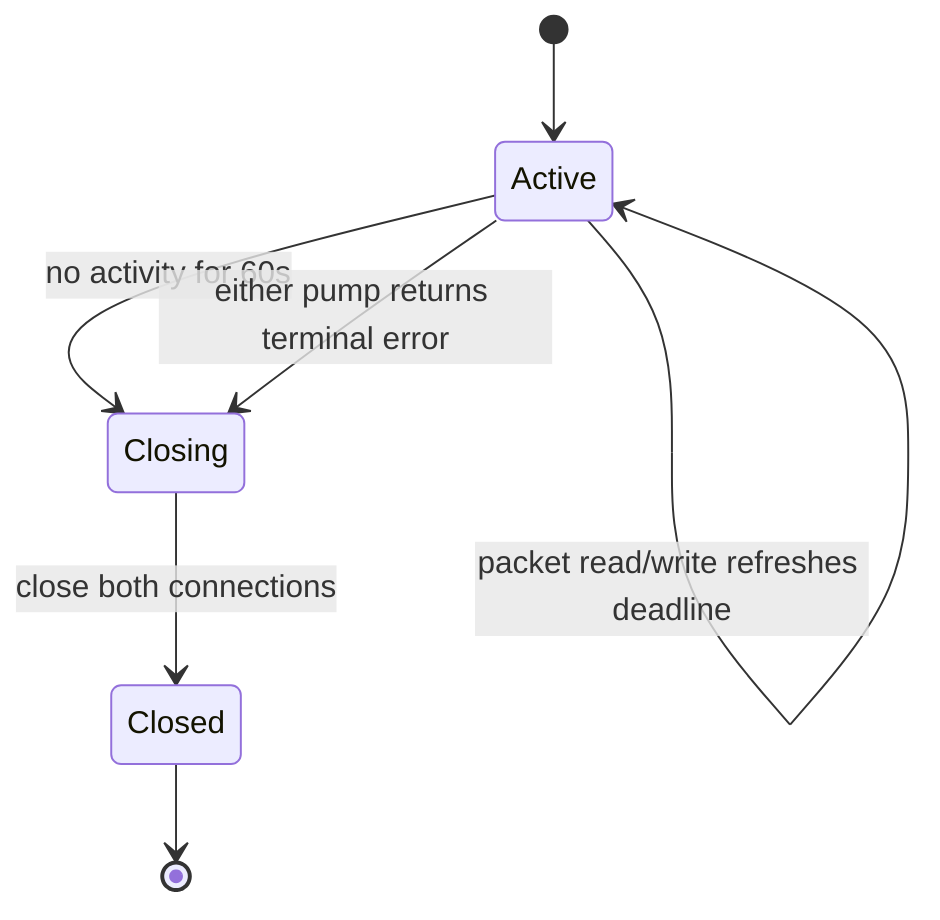

**Multi-Tailnet Proxy — Go Backend Internals**

**Document status:** code-grounded implementation manual for the current `main` branch.

**Scope:** `libtailscale/multiproxy`, the root `libtailscale` facade, the shared Android protect/bind hooks, and the internal state/concurrency mechanics that make several `tsnet.Server` instances usable behind one Android TUN.

## 1. What the Go backend is doing

The multiproxy backend is a userspace transport proxy with a Tailnet-qualified synthetic destination namespace.

It does not create several kernel interfaces. It does not merge Tailnets. It does not NAT one native Tailscale address space into another.

The central transformation is:

```text
Android packet addressed to synthetic IPv6
        |
        v
gVisor reconstructs TCP/UDP flow
        |
        v
Engine resolves synthetic identity
        |
        +--> required UpstreamID
        +--> peer's current native Tailscale IP
        |
        v
selected tsnet.Server.Dial(...)
        |
        v
copy transport payload between both legs
```

> **Mental model**
>
> The backend behaves like a small connection switchboard. The synthetic address is the switchboard extension number. `TargetRecord` tells it which Tailnet line and current peer address correspond to that extension.

## 2. File map

The Go implementation is intentionally split by responsibility.

| File | Primary responsibility |
|---|---|
| `types.go` | stable identities, synthetic addressing constants, generic upstream and route types |
| `api.go` | Engine construction, Tailnet configuration/runtime lifecycle, status polling, legacy exports |
| `dns.go` | snapshot reconciliation, collision handling, synthetic DNS over UDP/TCP, upstream forwarding |
| `nat_router.go` | route selection, TCP forwarding, UDP forwarding and association lifetime |
| `tun_interceptor.go` | Android TUN FD ownership and gVisor stack construction |
| `runtime_state.go` | observed Tailnet runtime snapshot and bootstrap-key retirement helper |
| `state_path.go` | deterministic persisted-state paths and offline state deletion |
| `targets_export.go` | canonical V2 peer snapshot exported to Android |
| `multiproxy_facade.go` | Gomobile-safe API surface in root `libtailscale` package |

The facade is important because `gomobile bind` binds the root `libtailscale` package. The internal multiproxy package stays ordinary Go code.

## 3. Engine state at a glance

`Engine` contains several classes of state that deliberately use different locks.

```text
Engine
|
|-- mu -------------------------- general control/runtime state
|   |-- state
|   |-- tailnets
|   |-- subnets
|   |-- exitNodeTailnet
|   |-- callback
|   |-- upstreamDNS
|   `-- flowCounter is atomic instead
|
|-- tailnetLifecycleMu ---------- serializes multi-step Tailnet lifecycle operations
|
|-- vpnMu ----------------------- gVisor stack + owned TUN FD
|   |-- vpnStack
|   `-- vpnFD
|
|-- targetMutex ----------------- peer snapshots / exact targets / DNS tables
|   |-- tailnetSnapshots
|   |-- targets
|   |-- dnsTable
|   `-- baseDnsTable
|
`-- events + eventsWg ----------- async Go -> Kotlin observation delivery
```

This is not one giant lock because packet lookup and peer snapshots should not need to hold the same lock as a potentially blocking Tailnet shutdown.

At the same time, Tailnet lifecycle operations are intentionally serialized rather than made aggressively parallel.

## 4. `EngineState`

The engine has three states:

```text
StateOpen
StateClosing
StateClosed
```

Most mutating public methods reject or ignore work once the Engine is no longer open.

`Close()` first changes the state to `StateClosing`, which prevents new work from being published while shutdown proceeds. Only after Tailnets, VPN stack, event dispatcher, and callback references are torn down does it publish `StateClosed`.

> **Careful**
>
> The Engine's lifecycle state is not a Tailnet backend state like `Running` or `NeedsLogin`. Those belong to each embedded `tsnet.Server`.

## 5. Stable target identity

### 5.1 `UpstreamID`

`UpstreamID` is an opaque string. Android currently supplies an immutable profile UUID.

It is not a Tailnet display name, DNS suffix, account email, or current control-plane name.

### 5.2 `TargetKind`

The current implementation defines:

```text
tailscale-node
```

as the target kind. Including a kind in identity allows future target classes to coexist without accidentally sharing the same hash domain.

### 5.3 `StableID`

For a Tailscale peer, `StableID` comes from `ipnstate.PeerStatus.ID`, which corresponds to the Tailscale stable node identity.

This is the peer-side stable part of the key.

### 5.4 Canonical hash input

The hash input is:

```text
namespace + 0x00 + kind + 0x00 + stableID
```

The separators make the serialization unambiguous.

Without separators:

```text
ab + c
```

and:

```text
a + bc
```

would have the same concatenated byte representation.

## 6. Synthetic IPv6 generation

The fixed prefix is:

```text
fd9b:8d7c:6a5e::/48
```

The algorithm:

1. serializes `TargetKey` canonically;
2. computes SHA-256;
3. copies the fixed six prefix bytes into the IPv6 address;
4. copies the first ten hash bytes into the remaining 80 bits;
5. rejects the candidate if it lands in the control `/120`;
6. appends a deterministic retry byte and hashes again until outside control space.

The result has two important properties:

```text
same TargetKey -> same synthetic IPv6
```

and:

```text
different Tailnet namespace -> independently hashed address
```

The second property remains true even if both Tailnets expose a peer with the same native Tailscale IP or same stable peer ID string.

## 7. Why there is no peer-address allocator database

An allocator would need durable answers for:

- which addresses are free;
- whether an old address may be reused;
- what happens after process death;
- whether discovery order changes assignments;
- how to repair partially committed state;
- whether a returning peer gets the same allocation.

The hash model removes those allocation semantics.

The live tables still exist, but they answer a different question:

> Which deterministic targets are reachable right now?

## 8. `TargetRecord`: identity plus locator

A target record contains:

```text
Key
SyntheticIPv6
Hostname
CurrentIPv4
CurrentIPv6
RequiredUpstream
```

The current locator can change while `Key` and `SyntheticIPv6` remain unchanged.

Routing chooses current IPv4 when valid, otherwise current IPv6.

If neither is valid, the identity remains well-defined but there is no usable route.

## 9. Tailnet configuration and runtime

`TailnetConfig` stores:

```text
Identifier
AuthKey
HashID
StateDir
```

`TailnetRuntime` adds live fields:

```text
Srv      *tsnet.Server
Cancel   context.CancelFunc
Wg       *sync.WaitGroup
Enabled  bool
```

The separation is useful because a registered Tailnet can exist while disabled and have no live `tsnet.Server`.

## 10. Stable per-profile hash

`getStableHash(identifier)` computes SHA-256 and retains 16 bytes, encoded as 32 hex characters.

This hash is used for:

```text
state directory suffix
local tsnet hostname suffix
qualified synthetic DNS namespace
```

It is different from the 80 hash bits used for peer synthetic IPv6.

The hash is not intended to protect profile identity as a secret. It creates deterministic filesystem/name-safe namespacing.

## 11. Registering a Tailnet: `AddTailnet`

`AddTailnet(identifier, authKey, enabled)` holds `tailnetLifecycleMu` for the complete registration operation.

The flow is:

```mermaid
flowchart TB
    call["AddTailnet(id, key, enabled)"]
    state{"Engine open?"}
    duplicate{"ID already registered?"}
    hash["derive stable hash"]
    dir["create state directory mode 0700"]
    register["insert disabled TailnetRuntime"]
    enable{"enabled requested?"}
    start["setTailnetEnabledLocked(true)"]
    done["return"]

    call --> state
    state -->|"no"| done
    state -->|"yes"| duplicate
    duplicate -->|"yes: error"| done
    duplicate -->|"no"| hash
    hash --> dir
    dir --> register
    register --> enable
    enable -->|"yes"| start
    enable -->|"no"| done
    start --> done
```

The runtime is inserted with `Enabled=false` before optional startup.

That lets the same API support reconstruction of disabled persisted profiles without creating a `tsnet.Server`.

## 12. State-directory construction

Current code derives:

```text
<dataDir>/state-<stableHash(profileId)>
```

and creates it with mode `0700`.

A separate helper, `StateDirForIdentifier`, expresses the same deterministic path. `ForgetPersistedState` removes exactly that directory.

> **Repo connection**
>
> Android passes `app.filesDir.absolutePath` as `dataDir`, and profile IDs are generated UUIDs. Mutable display text never participates in the deletion path.

## 13. Enabling a Tailnet

`SetTailnetEnabled` holds the lifecycle lock and calls `setTailnetEnabledLocked`.

The enable flow is:

```text
lookup registered TailnetRuntime
        |
        v
construct tsnet.Server
    Dir      = deterministic state dir
    AuthKey  = runtime bootstrap key, possibly empty after provisioning
    Hostname = mp-<stableHash>
        |
        v
LocalClient()
        |
        +-- failure -> close server, emit ERROR, return error
        |
        v
Enabled = true
create watcher context
create watcher WaitGroup
        |
        v
enqueue STARTING
launch pollTailnetStatus
```

Calling `LocalClient()` forces the embedded server far enough into startup that immediate construction failures are surfaced.

The backend can still later report states such as `NeedsLogin` or `NeedsMachineAuth`; Android's coordinator interprets those during provisioning.

## 14. Disabling a Tailnet

Disable preserves configuration and disk identity but removes live reachability.

The sequence is deliberately ordered:

1. under `Engine.mu`, capture and clear `Cancel`, `Wg`, and `Srv` references and set `Enabled=false`;
2. release `Engine.mu`;
3. cancel the watcher;
4. wait for its WaitGroup;
5. close the `tsnet.Server`;
6. delete the Tailnet's current snapshot under `targetMutex`;
7. rebuild the global target/DNS tables;
8. emit `STOPPED`.

The blocking `Wait` and `Close` happen without holding `Engine.mu`.

> **Under the hood**
>
> This avoids making packet-route readers wait behind an arbitrary watcher shutdown while also ensuring the server is no longer published as active before shutdown begins.

## 15. `activeTailnetServer`

Packet routing never reads `rt.Enabled` and `rt.Srv` unsafely.

`activeTailnetServer(id)` takes `Engine.mu.RLock` and snapshots:

```text
runtime exists
runtime Enabled
runtime Srv != nil
```

Only then does it return the server pointer.

All exact-target, subnet, and exit-node routing paths use this synchronized accessor.

## 16. Removing a Tailnet runtime

`RemoveTailnet` is stronger than disable but intentionally weaker than forget.

It:

- removes the runtime registration from `Engine.tailnets`;
- cancels/waits/closes the active runtime if needed;
- removes configured subnet entries owned by that Tailnet;
- clears the exit selection if that Tailnet owned it;
- removes the peer snapshot;
- rebuilds target/DNS tables;
- emits `REMOVED`.

It does **not** delete the persisted `tsnet` state directory.

That makes it suitable as the live-runtime half of Android's destructive Forget operation.

## 17. Forgetting persisted state

There are two Go facilities:

- `Engine.ForgetTailnet`, which removes a live registration and disk state;
- `ForgetPersistedState`, which deletes the deterministic state directory even if no Engine is live.

The current Android coordinator uses:

```text
RemoveTailnet
+
ForgetMultiProxyPersistedState
```

because it wants full canonical runtime cleanup first, followed by explicit disk deletion.

This also works when the Engine is absent: disk deletion is not dependent on a live Go runtime.

## 18. Closing the whole Engine

`Close` holds `tailnetLifecycleMu`, moves the Engine to `StateClosing`, snapshots Tailnet IDs, and calls `StopVPN`.

Then it removes each Tailnet and shuts down its watcher/server.

Finally:

```text
close(events)
wait event dispatcher
callback = nil
state = StateClosed
```

The callback reference is cleared only after the event dispatcher exits, preventing callback delivery from racing with the final reference removal.

## 19. Event dispatcher

The Engine creates:

```text
events chan engineEvent, capacity 1024
```

and one dispatcher goroutine.

Producers use non-blocking `select` sends. If the queue is full, an observational event is dropped instead of blocking a control or status path.

The dispatcher snapshots the callback under `Engine.mu` and invokes it after releasing the lock.

This design deliberately means:

> callbacks are not an authoritative durable event log.

The Android UI therefore uses explicit runtime/peer snapshot APIs for current truth.

## 20. Polling Tailnet status

Every enabled Tailnet gets one watcher goroutine.

The watcher:

1. gets a `LocalClient`;
2. immediately calls `Status(ctx)`;
3. converts peers to `TargetRecord`s;
4. atomically replaces that Tailnet's snapshot;
5. emits presentation callbacks for accepted targets;
6. starts a 10-second ticker;
7. repeats until context cancellation.

The immediate first poll matters. A newly enabled Tailnet does not need to wait a full ticker interval before peers become routable.

## 21. Building peer snapshots

Each `PeerStatus` with non-empty stable ID becomes:

```text
TargetKey.NamespaceID = Tailnet UpstreamID
TargetKey.Kind        = tailscale-node
TargetKey.StableID    = peer.ID
SyntheticIPv6         = TargetKey.SyntheticIPv6()
Hostname              = peer.DNSName
RequiredUpstream      = Tailnet UpstreamID
CurrentIPv4/IPv6      = peer.TailscaleIPs
```

A status refresh creates a complete new slice. It does not incrementally mutate each peer in place.

That makes disappearance simple: anything absent from the new snapshot disappears from the rebuilt global table.

## 22. Snapshot replacement and global rebuild

`updateTailnetSnapshot` locks `targetMutex`, replaces one Tailnet slice, and invokes `rebuildTargetsUnlocked`.

Global rebuild creates fresh maps rather than trying to mutate old maps in place:

```text
targets      = new map
collided     = new map
dnsTable     = new map
baseDnsTable = new map
```

This reduces stale-entry edge cases.

## 23. Synthetic collision handling

For every candidate target:

```text
if address already marked collided:
    ignore

else if address unused:
    install

else if same address but different TargetKey:
    mark collided
    delete existing winner
```

The result is deterministic fail-closed behavior independent of Go map iteration order.

After rebuilding, `updateTailnetSnapshot` reports only records that survived collision handling and still map back to their exact `TargetKey`.

## 24. DNS table construction

For every accepted target with a hostname, the engine creates names from lower-cased host data.

Example input:

```text
server.example.ts.net.
```

produces:

```text
server.example.ts.net.                   reported FQDN
server.                                  short/base name
server.<profile-hash>.proxy.             qualified synthetic name
```

The qualified name uses the first hostname label, matching `GetTargetsJSONV2`.

`baseDnsTable` exists separately because short names can become ambiguous across Tailnets.

## 25. DNS ambiguity

If a lookup finds more than one synthetic address for a name, `handleDNSMsg` returns `NXDOMAIN`.

This intentionally makes:

```text
server.
```

unusable when multiple Tailnets expose `server`, while:

```text
server.<hash-A>.proxy.
server.<hash-B>.proxy.
```

remain unique.

The engine does not choose based on Tailnet insertion order.

## 26. Internal DNS record semantics

For a recognized synthetic name:

| Query | Result |
|---|---|
| AAAA | synthetic IPv6 answer |
| A | authoritative NOERROR with no answer (NODATA) |
| HTTPS/SVCB/TXT/etc. | authoritative NODATA |

This is intentional leakage prevention.

If the name is known to the internal namespace, the request is considered internally answered even when the requested RR type is unsupported. It is not forwarded to physical DNS.

## 27. External DNS forwarding

If no synthetic name matched, Go reads `upstreamDNS` and uses `miekg/dns.Client`.

The transport used by the incoming request is preserved initially:

```text
local UDP query -> upstream UDP
local TCP query -> upstream TCP
```

For UDP, the implementation retries with TCP when:

```text
exchange returns error
OR
response.Truncated == true
```

If no upstream is configured or both exchange attempts fail, the engine returns `SERVFAIL`.

## 28. DNS over UDP

`ServeDNSUDP` owns one connected userspace UDP endpoint supplied by gVisor.

It repeatedly:

```text
Read datagram
Unpack dns.Msg
handleDNSMsg(..., "udp")
Pack reply
Write reply
```

The endpoint closes when the routine exits.

## 29. DNS over TCP

DNS-over-TCP is not just DNS bytes on a stream. Each message has a two-byte big-endian length prefix.

The implementation handles that explicitly:

```text
read exactly 2 bytes
parse message length
read exactly message length bytes
unpack request
handleDNSMsg(..., "tcp")
pack response
write 2-byte length
write entire response
repeat
```

`io.ReadFull` prevents partial stream reads from being mistaken for complete frames.

`writeFull` loops through short writes until the entire frame is sent or an error occurs.

Hardening tests exercise the short-write helper.

## 30. Route resolution precedence

`resolveRoute` follows:

```text
1. exact synthetic target
2. fail closed if destination is inside synthetic /48 but unknown
3. longest-prefix matching configured subnet
4. configured exit Tailnet
5. no route
```

The synthetic-prefix guard between steps 1 and 3 is crucial.

Without it, a stale synthetic address could accidentally fall through to a broader Tailnet subnet or exit route and reach an unrelated destination.

## 31. Exact target routing

For an exact target:

1. copy the `TargetRecord` under `targetMutex.RLock`;
2. select current IPv4 if valid, otherwise current IPv6;
3. reject if neither locator is valid;
4. call `activeTailnetServer(RequiredUpstream)`;
5. return `RouteDecision` containing a `tsnetUpstream` and destination string.

The destination Tailnet is not chosen by general policy. `RequiredUpstream` is part of the target record.

## 32. Subnet routes

`AcceptSubnet` parses and masks a prefix.

If the exact prefix already exists:

```text
same Tailnet owner -> idempotent success
different owner    -> error
```

`resolveRoute` scans configured subnets and chooses the matching prefix with the greatest prefix length.

That is longest-prefix match.

> **Careful**
>
> Current Android MULTIPROXY capture installs only the synthetic `/48`. An internal Go subnet route therefore does not mean Android is currently sending that subnet's traffic into this Engine.

## 33. Exit Tailnet

`SetExitNode` stores an optional Tailnet identifier.

It is consulted only after exact-target and subnet matching fail.

Again, the current Android Builder does not install default routes, so this mechanism is not currently exposed as a complete Android MULTIPROXY exit-node feature.

## 34. `Upstream` abstraction

The forwarding code depends on:

```go
type Upstream interface {
    Dial(ctx context.Context, network, address string) (net.Conn, error)
}
```

Current Tailnet routing wraps a `*tsnet.Server` in `tsnetUpstream`.

This seam allows a future transport to provide the same connection-level Dial behavior without rewriting TCP/UDP bridging.

It does **not** mean arbitrary upstream policy is implemented today.

## 35. TCP forwarder entry

gVisor's TCP forwarder calls `handleTCPConnection`.

The handler:

1. allocates a flow ID atomically;
2. creates the gVisor endpoint;
3. completes the forwarder request;
4. parses the local destination as `netip.Addr`;
5. intercepts synthetic DNS address port 53 as DNS-over-TCP;
6. otherwise calls `resolveRoute`;
7. closes the endpoint if no route;
8. constructs a native destination address/port;
9. launches the actual upstream Dial/copy path in a goroutine.

## 36. TCP dial address formatting

IPv4 destination:

```text
100.70.0.4:443
```

IPv6 destination:

```text
[fd7a:...]:443
```

The bracket distinction is required because colons are part of an IPv6 literal.

## 37. TCP dial timeout

The upstream Dial is created with:

```text
context.WithTimeout(..., 10 seconds)
```

This bounds connection establishment.

The timeout does not automatically terminate an already-established long-lived TCP session; after Dial succeeds, session lifetime is governed by the two connections and copy termination.

## 38. TCP byte bridge

After successful Dial:

```text
gonet TCP connection <-> upstream net.Conn
```

Two goroutines run `io.Copy` in opposite directions.

When app-to-upstream copying finishes, the code calls upstream `CloseWrite` if the connection exposes that capability.

When upstream-to-app copying finishes, the gVisor connection's read side is closed.

The parent waits for both directions before logging the flow closed.

This is transport proxying, not packet rewriting.

## 39. UDP forwarder entry

The UDP forwarder first parses the synthetic destination.

If the destination is:

```text
fd9b:8d7c:6a5e::3:53
```

it creates a gVisor UDP endpoint and launches the local DNS server.

Otherwise it performs ordinary route resolution, constructs the gVisor UDP connection, and starts the Tailnet-side association.

## 40. UDP association setup

The upstream UDP Dial also uses a ten-second establishment context.

Once connected:

```text
gVisor UDP conn <-> tsnet UDP conn
```

is passed to `runUDPAssociation` with a 60-second idle timeout.

## 41. UDP activity lifetime

`runUDPAssociation` sets the same future deadline on both connections.

Every successful read and write calls `touch()`, which extends both deadlines.

That gives the whole association one shared notion of recent activity.



The first terminating pump result causes both connections to close, unblocking the opposite pump. The parent waits for the second pump before returning.

Tests cover idle expiry, repeated activity refreshing lifetime, and one-side close terminating both pumps.

## 42. TUN ownership and `StartVPN`

`StartVPN(fd int32, mtu int32)` explicitly assumes ownership of the raw descriptor.

It validates:

```text
fd >= 0
1280 <= mtu <= 65535
Engine is open
no existing vpnStack
```

On failures after ownership is passed in, it closes the FD.

Then it creates a gVisor `stack.Stack` with IPv4, IPv6, TCP, and UDP protocol factories.

## 43. `fdbased` NIC

The Android raw TUN FD becomes a gVisor link endpoint through `fdbased.New`.

Current options include:

```text
FDs: one Android TUN descriptor
MTU: supplied value
EthernetHeader: false
```

There is no Ethernet header because Android's TUN exposes IP packets.

The code creates NIC ID 1 and enables promiscuous mode.

### 43.1 Stack construction is split from FD/link-endpoint creation

`newVPNStack()` builds the bare `stack.Stack` (network/transport protocol
factories only). `attachNIC()` and `bindVPNStackLocked()` then wire a
`stack.LinkEndpoint` into it, register the permanent synthetic DNS address,
add the `/48` route, and install the TCP/UDP forwarders.

`StartVPN` calls this shared path with the production `fdbased` endpoint.
Host tests (`dataplane_test.go`, package `multiproxy`) call the same
`bindVPNStackLocked` directly with an in-memory `channel.Endpoint`
(`gvisor.dev/gvisor/pkg/tcpip/link/channel`) instead of a real TUN fd. This
means the dataplane test suite exercises the actual production
stack-construction and forwarder-wiring code, not a parallel reimplementation
of it, at the cost of one indirection (`bindVPNStackLocked` taking a
`stack.LinkEndpoint` rather than being inlined into `StartVPN`).

### 43.2 Why promiscuous mode is enabled but spoofing is not (CURRENT CODE)

**Before:** an earlier revision of `StartVPN` additionally called
`s.SetSpoofing(nicID, true)` immediately after enabling promiscuous mode,
with the stated rationale that "the router binds reply sockets to synthetic
destinations [and] spoofing permits those per-target binds without assigning
every synthetic peer address." In practice this made spoofing a *global*,
permanent property of the NIC for the whole lifetime of the VPN stack.

**Why that was wrong:** global spoofing lets gVisor emit outbound packets
(replies) from *any* source address, not just registered ones, without
per-address bookkeeping. Real Android devices observed the installed app
panicking when DNS traffic arrived while global spoofing was enabled — the
permissive write path let the stack construct a reply in a state the rest of
the engine (in particular the DNS UDP/TCP handlers, which assumed a
registered, single local address) did not expect. Spoofing was also strictly
more permissive than the feature needed: multiproxy only ever needs to reply
*as* a small, dynamic set of synthetic addresses that are known in advance
(the destination of the current flow), not as arbitrary addresses.

**New:** global spoofing is removed entirely. The NIC stays in promiscuous
*receive* mode (`SetPromiscuousMode`, unchanged) — this only affects which
inbound packets the NIC accepts, and is required because we deliberately
don't (and can't, ahead of time) register every synthetic peer address the
NIC might ever see traffic for. Every local (destination) address a flow
needs to answer *from* must now be explicitly registered on the NIC via
`AddProtocolAddress` before its TCP/UDP endpoint is created, and removed via
`RemoveAddress` once nothing needs it. See §43.3.

This mirrors the pattern already used by the pinned Tailscale core netstack
at `wgengine/netstack/netstack.go` (`addSubnetAddress`/`removeSubnetAddress`
around `connsOpenBySubnetIP`), which registers subnet-routed addresses
per-connection instead of enabling spoofing — multiproxy previously
diverged from that pattern; it no longer does.

### 43.3 Dynamic per-flow address registration (CURRENT CODE)

Two kinds of local addresses exist on the VPN NIC:

```text
permanent   SyntheticIPv6DNS (fd9b:8d7c:6a5e::3)
            SyntheticIPv6Interface (fd9b:8d7c:6a5e::1)
               both registered once, in attachNIC, never refcounted
               or removed while the stack is up

dynamic     every synthetic peer/subnet destination a flow answers from
               registered on first concurrent use, removed when the
               last concurrent flow using it finishes
```

See §43.5 for why `SyntheticIPv6Interface` (not just `SyntheticIPv6DNS`)
must be permanently registered — its absence was a real, severe crash on
real devices that no host test caught.

`Engine.acquireDynamicAddr(addr)` / `Engine.releaseDynamicAddr(addr)`
(`tun_interceptor.go`) implement the dynamic half under `vpnMu`, backed by
`Engine.addrRefCount map[netip.Addr]int`:

```text
acquireDynamicAddr(addr):
    if addr already has a positive refcount: refcount++; return
    else: AddProtocolAddress(nicID, addr); refcount[addr] = 1

releaseDynamicAddr(addr):
    refcount[addr]--
    if refcount[addr] == 0: RemoveAddress(nicID, addr); delete from map
```

`handleTCPConnection` and `handleUDPConnection` (`nat_router.go`) call
`acquireDynamicAddr` for the flow's target address *before* asking gVisor to
create the TCP/UDP endpoint (gVisor needs the source address registered to
send the SYN-ACK / first reply, since spoofing is off), and call
`releaseDynamicAddr` on every subsequent path — endpoint-creation failure,
upstream dial failure, and normal/erroring pump-goroutine exit — so a flow
that never completes can't leak a registered address. The permanently
registered `SyntheticIPv6DNS` bypasses this bookkeeping entirely; DNS flows
never call acquire/release.

`StopVPN` destroys the whole stack (which implicitly drops every NIC
address) and then sets `addrRefCount = nil`, so any in-flight
`releaseDynamicAddr` call racing with shutdown becomes a safe no-op rather
than operating on a destroyed stack.

### 43.4 Panic containment and DNS deadlines (CURRENT CODE)

Every TCP/UDP forwarder callback and every DNS serve loop
(`handleTCPConnection`, `handleUDPConnection`, `ServeDNSUDP`, `ServeDNSTCP`)
now starts with `defer recoverAndLog("<label>")`. A panic in one flow's
packet handling is caught, logged with a bounded (4KB) stack trace, and the
goroutine unwinds normally — it does not take down the whole process, and it
does not skip the paired `releaseDynamicAddr`/connection-close deferred
calls ahead of it in the same goroutine, since Go runs deferred calls in the
same goroutine on panic unwind.

`ServeDNSUDP`/`ServeDNSTCP` also now set a bounded read/write deadline
(`dnsIdleTimeout`, 30s) on every iteration instead of blocking on `Read`
forever, so a stalled or abusive DNS peer can't pin the association (and its
goroutine) open indefinitely.

**Why:** none of this changes what a *correct* flow does; it bounds what a
misbehaving or unlucky one can do, which matters once promiscuous-without-
spoofing means every flow's local address is on the hot path for correctness
rather than an implementation detail.

### 43.5 `SyntheticIPv6Interface` must also be permanently registered (CURRENT CODE)

**Before:** §43.2/§43.3 covered `SyntheticIPv6DNS` as the one permanent
address, on the reasoning that every other local address is either dynamic
(a flow's destination) or not owned by this NIC at all. That reasoning
missed one case: Android's `VpnService.Builder` assigns
`SyntheticIPv6Interface` (`fd9b:8d7c:6a5e::1`) as the TUN's own interface
address at the OS level (`IPNService.kt`'s `b.addAddress` call) — this
address is neither a DNS destination nor a per-flow dynamic destination,
but it is still an address the NIC must answer to (NDP neighbor
solicitation for it, ICMPv6 addressed to it).

**Why it was a real bug, not a theoretical gap:** promiscuous-mode-without-
spoofing (§43.2) means the NIC accepts any *inbound* packet but can only
correctly *answer* for locally-registered addresses. With
`SyntheticIPv6Interface` unregistered, the first real Android-generated
packet addressed to the TUN's own IP after the VPN stack bound to the FD
had no registered endpoint to be handled against inside gVisor. This
manifested as an unrecoverable `SIGSEGV`→`SIGABRT` crash 40-300ms after
`[VPN] gVisor stack successfully bound to TUN FD <n>`, on real devices,
essentially every time Multi-Tailnet mode was started. It never reproduced
in the `dataplane_test.go` host suite (`channel.Endpoint` has no real
kernel TUN and never generates this traffic) or in a standalone
`GOOS=android` binary driven directly via `syscall.Socketpair` instead of a
real `VpnService` TUN. Full investigation, everything ruled out first, and
the build-system bug that hid several rebuild attempts of this exact fix
are in `validation_and_gaps.md` §39.

**New:** `attachNIC` registers `SyntheticIPv6Interface` permanently,
identically to how `SyntheticIPv6DNS` is already registered, before the
route is added:

```go
ifaceAddr := tcpip.ProtocolAddress{
    AddressWithPrefix: tcpip.AddrFromSlice(SyntheticIPv6Interface.AsSlice()).WithPrefix(),
    Protocol:          ipv6.ProtocolNumber,
}
if err := s.AddProtocolAddress(vpnNICID, ifaceAddr, stack.AddressProperties{}); err != nil {
    return fmt.Errorf("failed to register synthetic interface address: %s", err)
}
```

Confirmed on-device: 8 consecutive Start Multi-Tailnet attempts with zero
crashes (previously ~4-5 out of 5 crashed), and both configured upstreams
reaching `Runtime: RUNNING` simultaneously with peer discovery populated.

## 44. gVisor route table

The userspace stack installs one route for:

```text
fd9b:8d7c:6a5e::/48
```

to NIC 1.

This matches the current Android Builder capture route.

The presence of IPv4 protocol support in gVisor does not imply current synthetic IPv4 capture.

## 45. Forwarder registration

`StartVPN` registers:

```text
TCP -> tcp.NewForwarder(... handleTCPConnection)
UDP -> udp.NewForwarder(... handleUDPConnection)
```

Once this succeeds, the stack and FD are published under `vpnMu` as the active TUN attachment.

## 46. `StopVPN`

`StopVPN` is protected by `vpnMu`.

It:

```text
Destroy() gVisor stack if present
set vpnStack=nil
clear addrRefCount (see §43.3)
close vpnFD if >=0
set vpnFD=-1
```

Destroying the gVisor stack tears down its NIC and every endpoint spun up
from it, which is what actually unblocks any TCP/UDP/DNS goroutines still
pumping data on associations that were active at shutdown — they observe an
I/O error on the now-dead endpoint/connection and return, running their
deferred `releaseDynamicAddr`/close calls (safe no-ops by then, since
`addrRefCount` is already cleared and the stack already destroyed).

It does not remove Tailnets or erase target snapshots by itself.

This is the mechanical basis for separating TUN lifetime from Engine lifetime.

## 47. Runtime-state snapshot API

`GetTailnetStatesJSON()` is designed not to hold `Engine.mu` while making potentially blocking calls.

It first snapshots for every Tailnet:

```text
ID
Enabled
*tsnet.Server
```

under `RLock`, then releases the lock.

Only afterward does it call `LocalClient()` and `Status()` with a two-second timeout.

Observed mapping:

```text
disabled or nil server -> STOPPED
LocalClient failure    -> ERROR
Status timeout/error   -> STARTING
empty BackendState     -> STARTING
otherwise              -> BackendState
```

The exported list is sorted by Tailnet ID for stable presentation/testing.

## 48. Clearing bootstrap keys in Go

`ClearTailnetAuthKey` sets:

```text
rt.Config.AuthKey = ""
```

for an already registered runtime.

Android calls this after it observes `RUNNING` during first provisioning and then deletes the encrypted bootstrap key.

This avoids retaining a reusable enrollment credential longer than needed once `tsnet` has durable node state.

## 49. V2 target export

`GetTargetsJSONV2()` snapshots current accepted targets under `targetMutex` and exports clearly named fields:

```text
tailnetId
hostname
currentIpv4
currentIpv6
syntheticDnsName
syntheticIpv6
kind
```

Invalid current native addresses are encoded as empty strings rather than the textual `invalid IP` representation.

The list is sorted by:

```text
Tailnet ID
hostname
synthetic IPv6
```

for stable output.

## 50. Why V2 exists beside legacy export

The legacy `GetTargetsJSON` remains in the facade for compatibility.

V2 fixes presentation semantics by:

- explicitly naming native/current addresses;
- generating qualified DNS names through the same first-label rule as the DNS table;
- producing deterministic sorted output;
- avoiding invalid-address strings.

New Android UI uses V2.

## 51. Gomobile facade

The root facade currently exposes the major Engine operations as methods on `MultiProxyEngine`:

```text
StartVPN
StopVPN
AddTailnet(identifier, authKey, enabled)
RemoveTailnet
SetTailnetEnabled
SetUpstreamDNS
GetTargetsJSON
GetTargetsJSONV2
GetTailnetStatesJSON
ClearTailnetAuthKey
ForgetTailnet
Close
```

Root functions expose:

```text
NewMultiProxyEngine
MultiProxySyntheticIPv6Prefix
MultiProxySyntheticInterfaceAddress
MultiProxySyntheticDNSAddress
AcquireMultiProxyNetworkHooks
ReleaseMultiProxyNetworkHooks
ForgetMultiProxyPersistedState
```

Kotlin therefore does not need to know internal Go package types such as `TargetKey` or `TailnetRuntime`.

## 52. Callback ABI

`MultiProxyCallback` still has:

```text
OnPeerDiscovered(hostname, syntheticIPv4, syntheticIPv6, tailnetID)
```

The synthetic IPv4 parameter is compatibility residue. Current status polling emits an empty value there.

The canonical peer snapshot is V2 and has no synthetic IPv4 field.

## 53. Shared Android network hooks

The root Tailscale backend and multiproxy live in one process and use Tailscale's process-global Android `netns` hooks.

`AcquireAndroidNetworkHooks(token, service, appCtx)` installs:

```text
AndroidProtectFunc -> service.Protect(fd)
AndroidBindToNetworkFunc -> appCtx.BindSocketToNetwork(fd)
```

It refuses acquisition if another different token owns the hooks.

`ReleaseAndroidNetworkHooks(token)` clears them only if the exact token matches.

## 54. STANDARD hook owner

The normal backend uses:

```text
STANDARD-<IPNService.ID>
```

and waits for an explicit request acknowledgement before Kotlin marks STANDARD active.

On disconnect, the backend:

```text
devices.Down()
CloseTUNs()
ReleaseAndroidNetworkHooks(exact token)
clear vpnService.service
acknowledge disconnect
```

This completion ordering is important for switching to MULTIPROXY without racing hook ownership.

## 55. MULTIPROXY hook owner

`IPNService` uses:

```text
MULTIPROXY-<same service instance ID>
```

before creating or starting its Engine/TUN path.

The two modes therefore contend for the same explicit process-global ownership primitive rather than independently overwriting callbacks.

## 56. Why `DebugRebind` is used in STANDARD

After STANDARD acquires hooks, the normal Tailscale backend calls `DebugRebind()`.

Existing underlay sockets may have been created before the Android VPN became active or before the new protect/bind callbacks were installed. Rebinding forces Tailscale networking to recreate/rebind sockets under the current Android network hooks.

MULTIPROXY starts its `tsnet.Server` runtimes only after it owns those hooks, so its initial runtime creation follows a different sequence.

## 57. Concurrency map

The main synchronization rules are:

| Resource | Synchronization |
|---|---|
| Engine state / Tailnet map / config / upstream DNS | `Engine.mu` |
| Add/enable/disable/remove/close Tailnet multi-step operations | `tailnetLifecycleMu` |
| target snapshots / exact target map / DNS tables | `targetMutex` |
| gVisor stack and TUN FD | `vpnMu` |
| flow IDs | atomic increment |
| callback event queue | channel + dispatcher WaitGroup |
| process-global Android hook owner | root `hookMu` |

Potentially blocking Tailnet watcher waits/status calls are intentionally performed outside the main data-plane locks where the code has an explicit snapshot handoff.

## 58. Lock ordering and code-reading rule

When changing this package, ask for every operation:

```text
Which shared object am I reading?
Which lock publishes it?
Do I retain a pointer after releasing that lock?
Can another lifecycle operation close that object concurrently?
Am I about to block while holding a lock used by packet paths?
```

The accepted route accessor and lifecycle mutex exist because previous versions had exactly these kinds of races.

## 59. Tests as executable documentation

Current Go tests cover several key invariants.

Examples include:

- same `TargetKey` gives same synthetic IPv6;
- different namespace changes synthetic IPv6;
- snapshot replacement removes disappeared peers;
- a peer address change keeps synthetic identity;
- returning stable peer gets same synthetic identity;
- disabling removes targets while retaining registration;
- two Tailnets can route peers sharing the same native IPv4 through different upstreams;
- forced synthetic collision fails closed;
- short-name ambiguity and qualified DNS behavior;
- synthetic A request returns authoritative NODATA;
- concurrent enable/disable stabilization;
- race-sensitive route/lifecycle behavior;
- DNS TCP full-write behavior;
- UDP idle expiry and activity refresh.

These tests prove local invariants. They are not substitutes for Android packet-path E2E.

## 60. Known implementation seams

The current package intentionally retains some growth seams:

### 60.1 Generic `Upstream`

Future transports can potentially provide `Dial` without modifying connection bridging.

### 60.2 Subnet/exit routing

The internal route model already supports them, while Android synthetic-only capture does not yet expose them.

### 60.3 Snapshot APIs

The UI now consumes snapshots, leaving callbacks useful for logging/event notification rather than durable state replication.

### 60.4 Persistent profile logic outside Go

Go owns runtime mechanics and `tsnet` state directories. Android owns the durable product profile model.

This division is deliberate.

## 61. Debugging the backend by layer

When a connection fails after entering the TUN:

### 61.1 gVisor entry

Look for a TCP/UDP forwarder invocation.

If absent, inspect the TUN/stack route before `tsnet`.

### 61.2 Synthetic target lookup

If flow log says no route:

- is the synthetic address in `targets`?
- is its Tailnet snapshot present?
- was the Tailnet disabled?
- did a collision remove it?
- is this a stale cached address?

### 61.3 Active runtime

If target exists but route still fails:

- is `rt.Enabled` true?
- is `rt.Srv` non-nil?
- what does `GetTailnetStatesJSON` report?

### 61.4 Upstream Dial

If route decision exists but dial fails:

- does the current native locator still make sense?
- is Tailnet backend actually connected?
- is ACL/service reachability correct?
- are Android protect/bind hooks active?

## 62. Things this backend deliberately does not claim

The current Go backend does not itself prove:

- that Android captured the expected app's packet;
- that strict Android Private DNS will use the synthetic resolver;
- that Always-On/lockdown semantics match synthetic-only bypass expectations;
- that two live external Tailnets work concurrently on a physical phone;
- that current internal subnet/exit APIs are reachable from Android capture;
- that a future generic proxy upstream can safely reuse Tailscale-specific `netns` assumptions without its own socket controller.

Those belong to Android integration and E2E validation.

## 62.5. TCP dial retry and per-flow path visibility (CURRENT CODE, 2026-08-25)

**BEFORE.** `handleTCPConnection` dialed the upstream exactly once
(`decision.Upstream.Dial(ctx, "tcp", dialAddr)`); a transient dial failure
(e.g. a momentary DERP hiccup at exactly the wrong instant) failed the whole
flow with no retry. There was also no way to tell, short of manual
`LocalClient` queries, whether a given flow's destination was reached
directly or via DERP relay - throughput problems could only be explained by
inference (see `validation_and_gaps.md` §40-41).

**WHY.** A dial retry is safe specifically because nothing has been
exchanged with the real destination yet at dial time - unlike a mid-transfer
stall, which cannot be transparently recovered without breaking whatever
session state the two real endpoints already believe they have (see
`validation_and_gaps.md` §41 for the comparison research - firestack's own
retry logic, `intra/dialers/retrier.go`, has this same scope limit). Path
visibility exists so a slow flow can be diagnosed as relay-path instability
from a log line instead of guessed at.

**NEW.**

- `types.go`: `Upstream` interface gained
  `PeerPathInfo(ctx context.Context, destIP string) string`, returning one
  of `"direct"`, `"derp:<region>"`, `"no-path"`, or `"unknown"`.
- `api.go`: `tsnetUpstream.PeerPathInfo` implements it via
  `srv.LocalClient().Status(ctx)`, matching `destIP` against
  `st.Peer[*].TailscaleIPs` and reading `CurAddr`/`Relay`.
- `nat_router.go`: the TCP dial in `handleTCPConnection`'s pump goroutine now
  retries up to `tcpDialMaxAttempts` (3) with `tcpDialRetryDelay` (300ms)
  between attempts, all within the existing 10s dial `ctx`. The
  successful-dial log line now reports `path=...`.

Confirmed on-device: `[flow-7] TCP upstream dial peer-beta
100.64.10.11:7000 success (path=derp:den)` for a `loadpeer` flow, and
`path=direct` for a different peer in the same capture - proving the
instrumentation correctly distinguishes the two cases live.

## 62.6. Real-IP routing with cross-tailnet ambiguity resolution (CURRENT CODE, 2026-08-25)

**BEFORE.** `resolveRoute` only ever routed two kinds of destination: an
exact synthetic-IPv6 match (peer discovered via the synthetic DNS layer), or
an address covered by an explicit `AcceptSubnet`/exit-node route. Any other
destination - specifically, a peer's *real* Tailscale IP handed to an app
directly rather than resolved through our synthetic DNS - fell into the
"inside synthetic prefix, no record" or generic no-match paths and was
rejected outright, even though it was a genuine, reachable tailnet resource.
This broke anything that hands out raw real IPs instead of hostnames (e.g. a
TURN/STUN server's ICE config, almost always a literal `IP:port`) - see
`validation_and_gaps.md` for the Nextcloud Talk investigation that surfaced
this. There was also no route for real Tailscale CGNAT/ULA space installed
on the Android VPN at all (`IPNService.kt`'s `rebuildMultiProxyTunLocked`
only ever calls `addRoute` for our own synthetic `/48`); this change is
scoped to the Go-side routing table, since real Tailscale IP traffic already
reaches gVisor via the Android app's normal route to the TUN once it's
inside the synthetic-prefix-shaped default the OS gives this VPN.

> **CORRECTION (2026-08-26).** The last clause above is wrong. Real
> Tailscale IP traffic did *not* reach gVisor: with no route covering
> `100.64.0.0/10` or the Tailscale ULA range, the OS sent those packets out
> the underlying network instead of into the TUN, so nothing in this section
> was ever exercised at runtime. The routing logic described below is
> correct as written and was left unchanged; only the claim that it was
> already reachable was false. See §62.10 for the fix and the device
> verification.

**WHY.** Real Tailscale address space (the CGNAT `100.64.0.0/10` range and
Tailscale's IPv6 ULA range) is drawn from the same shared pool for every
tailnet - it isn't configurable per-tailnet, and Tailscale doesn't expose a
way to avoid overlap. That's the entire reason the synthetic `/48` scheme
exists in the first place. So the same real IP can legitimately identify two
different peers on two different simultaneously-active upstreams, and there
is no way to disambiguate from the address alone. Failing closed on that
ambiguity (the old behavior, inherited by default) is safe but means real-IP
destinations are always unreachable, even when only one upstream actually
has a peer at that address (the common case) or when an app is fine with
best-effort resolution. The design choice made here: resolve real-IP
destinations best-effort, deterministically, and make any actual ambiguity
visible to the user, rather than either silently guessing wrong or leaving
it permanently unreachable.

**NEW.**

- `api.go`: `Engine.realIPIndex map[netip.Addr][]TargetRecord` - a
  cross-upstream index (unlike `e.targets`, which is synthetic-IP-keyed and
  collision-*discarding*) mapping a peer's real `CurrentIPv4`/`CurrentIPv6`
  to every `TargetRecord` from any upstream that currently reports a peer at
  that address. Built alongside `e.targets` in `rebuildTargetsUnlocked`
  (`dns.go`); a >1-length entry is expected and legitimate, not a bug.
- `EngineCallback` gained `OnAddressCrossover(ip, candidateTailnetIDsCSV,
  chosenTailnetID string)`, dispatched through the existing
  `engineEvent`/`e.events` async pipeline (`engineEventKind` now
  discriminates `eventPeerDiscovered` / `eventTailnetStateChange` /
  `eventAddressCrossover` instead of the old single `isPeerDiscovered`
  bool). `multiproxy_facade.go`'s Kotlin-facing `MultiProxyCallback` mirrors
  the same method, so the AAR was rebuilt (`make libtailscale`) for this
  change to reach Kotlin at all - it's a new interface method, not just a
  Go-internal change.
- `nat_router.go`: `resolveRoute` gained a new branch, inserted after the
  existing in-namespace fail-closed check (unchanged - a stale/unknown
  *synthetic* address still fails closed exactly as before) and before the
  subnet-route loop. `resolveRealIPRoute` looks up `targetIP` in
  `realIPIndex`; on a single candidate it's an unambiguous route; on
  multiple, candidates are sorted by `UpstreamID` and the lowest wins
  (deterministic and stable across repeated lookups of the same address),
  with `enqueueAddressCrossover` firing so the pick is visible rather than
  silent.
- Kotlin side: `MultiProxySessionCoordinator` gained an accumulating
  `addressCrossovers: StateFlow<List<AddressCrossover>>` (capped at the last
  50, since this is a growing log rather than the single-latest-per-id shape
  `lastErrors` already used), fed from `IPNService.kt`'s
  `onAddressCrossover` callback override and logged via `TSLog.w`.
  `MultiProxyViewModel`/`MultiProxyView.kt` surface it as a dismissable-by-
  scrolling warning card on the Upstreams screen, above the profile list,
  so a wrong-tailnet pick is something the user can actually see instead of
  only being inferable from logcat.

Tests: `lib_test.go` -
`TestRealIPRoutingUnambiguous`/`TestRealIPRoutingCrossoverResolvesAndLogs`/
`TestRealIPRoutingUnaffectedInsideSyntheticNamespace` cover the new branch
directly, including that the crossover callback fires exactly once per
ambiguous resolution and that repeated lookups of the same ambiguous address
stay stable. Full `go test ./libtailscale/multiproxy/...` still green
(151s), confirming this doesn't regress the existing fail-closed guarantees
for stale synthetic addresses or the collision-discarding behavior of the
synthetic table itself.

## 62.7. Non-tailnet DNS fallback for Multi-Tailnet mode, and DoH support (CURRENT CODE, 2026-08-25)

**BEFORE.** Multi-Tailnet mode's DNS server (`dns.go`) forwarded any name not
found in the synthetic peer table to `e.upstreamDNS`, a plain `host:port`
resolver set exclusively from `NetworkChangeCallback.currentUnderlyingDnsServer()`
- the Android network's own DNS server. The app's actual "public DoH
resolver" setting (`DNSSettingsViewModel`/`PublicDoHProviders`, prefs
`publicDoHURL`/`publicDoHOverrideExitNode`/`publicDoHRouteThroughTailscale`)
only ever reached the Standard-mode backend, via `Libtailscale.applyDNSSettings()`
-> `control_doh.go`'s `dns.HookModifyConfig` hook into `b.sys.DNSManager`
(the regular `LocalBackend`'s real DNS subsystem). Multi-Tailnet's DNS
server is a from-scratch implementation with no link to that subsystem at
all, so selecting a DoH provider silently did nothing in Multi-Tailnet mode:
`SetUpstreamDNS` would reject a `https://...` URL outright (it only parsed
`host[:port]` via `net.SplitHostPort`/`net.ParseIP`), leaving `upstreamDNS`
unchanged (usually empty), which made `handleDNSMsg` return `ServFail` for
every non-tailnet name.

**WHY.** The two DNS implementations (Standard mode's real `dns.Manager` vs.
Multi-Tailnet's homegrown `miekg/dns`-based server) were never unified, so a
setting that only one of them reads is an easy silent gap - this is the same
class of bug as the real-IP routing gap in §62.6, just in the DNS path
instead of the dataplane path.

**NEW.**

- `dns.go`: added `exchangeDoH(resolverURL string, req *dns.Msg) (*dns.Msg, error)`,
  a minimal RFC 8484 (POST, `application/dns-message`) DoH client using a
  package-level `dohHTTPClient` (5s timeout). `handleDNSMsg`'s forwarding
  branch now checks for an `https://` prefix on `e.upstreamDNS` and uses
  this instead of the existing plain `dns.Client.Exchange` path.
- `api.go`: `SetUpstreamDNS` now accepts either form - a plain
  `host[:port]` (unchanged behavior) or a full `https://` URL, stored
  verbatim after a light scheme/host sanity check (malformed URLs are
  ignored rather than silently clearing the existing resolver).
- Android side: `MultiProxySession.applyUpstreamDNS()` (`IPNService.kt`)
  recomputes the fallback on every relevant trigger - VPN (re)build,
  underlying-network DNS change (`onUnderlyingDnsChanged`), and DNS
  settings changes (`MultiProxySessionCoordinator.refreshUpstreamDNS()`,
  called from `DNSSettingsViewModel.applyPublicDoHSettings()` alongside the
  existing `Libtailscale.applyDNSSettings()` call) - preferring the
  selected public DoH URL when non-empty, else the underlying network's own
  DNS server as before.
- `PublicDoHProviders` (`PublicDoHProvider.kt`) gained a LibreDNS entry
  (Standard + Ads-blocking endpoints), alongside the existing Cloudflare,
  Google, Quad9, Mullvad, Wikimedia, Control D, and CIRA lists.
- Tests: `dataplane_test.go`'s `TestDNSPacketLevelUnknownNameForwardsViaDoH`
  (an `httptest.NewTLSServer` implementing RFC 8484, `dohHTTPClient` swapped
  to `srv.Client()` for the test's duration) and `lib_test.go`'s
  `TestSetUpstreamDNSAcceptsDoHURL` (accepts a valid DoH URL, rejects a
  malformed one without clobbering the existing value, still accepts a
  plain resolver afterward). Full `go test ./libtailscale/multiproxy/...`
  green.

**Not yet done - future work the user explicitly flagged.** Selectable DNS
*routing*, not just selectable DNS *resolver*: today's DoH request always
goes out the phone's normal (non-VPN) network path, same as any other
non-tailnet-non-synthetic destination (Multi-Tailnet's VPN only captures the
synthetic `/48` plus resolved real Tailscale IPs per §62.6, so this is
already consistent with the rest of the dataplane, not a special case). The
`publicDoHRouteThroughTailscale` preference exists and is read by
Standard-mode's `applyAndroidDNSRouteSetting`, but Multi-Tailnet mode has no
equivalent yet. Three routing options were named as wanted eventually: (1)
via a plain HTTP proxy, (2) via one of the connected tailnets' exit nodes,
(3) via some other future upstream type. None of these have a natural
plug-in point yet - the closest existing shape is `Upstream.Dial` (`types.go`),
which every dataplane flow already goes through; making the DoH HTTP client
dial through a specific `Upstream` (by calling `Upstream.Dial(ctx, "tcp",
doHHostPort)` instead of using the default `http.Transport`, then wrapping
that `net.Conn` for TLS) is the shape a future "route DoH through tailnet
X's exit node" option would take, and wouldn't require inventing a new kind
of upstream. A true pluggable "upstream type" (HTTP proxy as a first-class
alternative to a `tsnet.Server`-backed `Upstream`, for DNS or otherwise)
would need `Upstream` implementations beyond `tsnetUpstream` and a way to
select one for a given purpose (DNS vs. general dataplane routing) rather
than the current one-routing-table-for-everything design in `resolveRoute` -
this is a larger design question, not scoped or attempted here.

## 62.8. DNS bootstrap deadlock, VPN self-capture, and DoH HTTP/2 (CURRENT CODE, 2026-08-26)

**BEFORE.** §62.7 added DoH support, but DNS in Multi-Tailnet mode still did
not work on a real device: every non-tailnet name failed, typically with
`context deadline exceeded`. Three independent bugs were stacked on top of
each other, and each one masked the next.

1. `dohHTTPClient` was a bare `&http.Client{}` using Go's default dialer.
   That dialer is not protected by `VpnService.protect()`, so the DoH
   request was captured by our own VPN.
2. The non-DoH path had the same flaw: `handleDNSMsg`'s plain branch used a
   bare `dns.Client` whose dialer was equally unprotected. Fixing only the
   DoH path made "Tailnet default" fail in exactly the same way.
3. Once both were protected, DoH still failed - but only for providers
   addressed by hostname. This was the real root cause, below.

**WHY (the bootstrap deadlock).** The VPN installs our own synthetic DNS
server as the device resolver. So resolving a DoH server's hostname (say
`cloudflare-dns.com`) sends that query *into our own resolver*, which has no
record for it, so it tries to forward it - by making the very DoH request
that is already waiting on this lookup. The query can only complete after
itself.

This is why the symptom was so confusing in testing: "Tailnet default"
always worked (it forwards to a plain `host:port`, nothing to resolve), and
every DoH provider always failed, regardless of which toggles were flipped.
It was isolated decisively by pointing DoH at `https://1.1.1.1/dns-query` -
an IP literal, nothing to resolve - which loaded pages instantly.

**NEW.**

- `dns.go`: `netnsDialer = netns.NewDialer(log.Printf, netmon.NewStatic())`
  now backs the DoH transport, and `plainDNSDialer` (a `net.Dialer` passed
  through `netns.FromDialer`) backs the plain path via `c.Dialer`. Both go
  through Tailscale's Android protect callback, which is process-global but
  applied per-dialer through `.Control` - so it must be wired into every
  dialer we construct, not assumed.
- `dns.go`: a bootstrap resolver that never consults our own DNS server.
  `bootstrapResolve` tries, in order: a 5-minute cache
  (`bootstrapCacheTTL`), core Tailscale's known-IP table for well-known
  providers (`publicdns.DoHIPsOfBase`), and finally a direct query against
  the underlying network's own resolver (`bootstrapQuery`). The last step is
  what makes *custom* DoH endpoints work - providers not in the known-IP
  table, e.g. LibreDNS and CIRA.
- `dialUpstreamDNS` is the transport's `DialContext`: it forces IPv4
  (`tcp`/`tcp6` -> `tcp4`), passes IP literals straight through, and
  otherwise resolves via `bootstrapResolve` and tries each address in turn.
- `api.go`: `SetBootstrapDNS(dns string)` (rejects the synthetic DNS address
  itself, which would reintroduce the loop), plus `SetUpstreamDNS` now feeds
  `setBootstrapDoHBase`/`setBootstrapPlainDNS`. `IPNService.applyUpstreamDNS()`
  always pushes the underlying resolver as bootstrap, *even when a DoH URL
  wins*, because that is precisely the case that needs it.
- `ForceAttemptHTTP2: true` on the DoH transport. Setting a custom
  `DialContext` silently disables `net/http`'s automatic HTTP/2 negotiation.
  Mullvad serves HTTP/2 only and answers an HTTP/1.1 request with a raw
  SETTINGS frame, which surfaced as
  `malformed HTTP response "\x00\x00\x06\x04..."`.

**A discarded fix, recorded so it isn't retried.** `d.FallbackDelay = -1`
was briefly added intending to prefer IPv4. It does the opposite - a
negative value *disables* the Happy Eyeballs IPv4 fallback. The correct fix
is rewriting the network string, which is what `dialUpstreamDNS` does.

Tests: `dns_bootstrap_test.go` (5 tests). Device verification is recorded in
`validation_and_gaps.md` §49.

## 62.9. Synthetic IPv4 addressing (CURRENT CODE, 2026-08-26)

**BEFORE.** Peers were only ever given a synthetic IPv6 address, and the DNS
server answered `A` queries with NODATA. Any app that asks for an `A` record
and stops - which is a great deal of software, whether by hardcoding
`AF_INET`, parsing with `inet_addr`, or simply not implementing v6 - saw the
tailnet as unreachable even though the peer resolved perfectly over v6.

**WHY the pool is `198.18.0.0/15`.** Real Tailscale addresses cannot be used
for the same reason §62.6 explains: one shared pool across all tailnets, so
they cannot disambiguate peers while several upstreams are active. The
synthetic v4 range therefore has to be something that will not be mistaken
for anything else on the device - not a LAN (`10/8`, `172.16/12`,
`192.168/16`), not real Tailscale space (`100.64.0.0/10`), and not something
a peer might legitimately advertise as a subnet route. `198.18.0.0/15` is
the RFC 2544 benchmarking range: routable-looking but reserved.

Note the v4 pool is ~131k addresses against a 128-bit v6 space, so unlike
`TargetKey.SyntheticIPv6()` (hash, collisions vanishingly unlikely) the v4
allocator must actually handle collisions.

**NEW.**

- `synthetic_v4.go`: `assignSyntheticIPv4(keys, prior)`. Re-seats existing
  assignments *before* placing new peers, so a joining peer can never
  displace an established one - displacement would silently redirect a live
  connection to a different machine. Linear-probes on collision. Fails
  closed and logs on pool exhaustion rather than issuing a duplicate.
- `types.go`: `SyntheticIPv4Prefix` / `SyntheticIPv4ControlPrefix` (`/24`,
  reserved) / `SyntheticIPv4Interface` (`198.18.0.1`) / `SyntheticIPv4DNS`
  (`198.18.0.3`).
- `api.go`: `syntheticV4` (addr -> record) and `syntheticV4ByKey` (the
  reverse, held across rebuilds so a peer's address doesn't move while apps
  hold connections to it), plus `dnsTableV4`/`baseDnsTableV4`.
- `dns.go`: `rebuildTargetsUnlocked` assigns v4 over the same key set that
  survived synthetic-v6 collision handling, so both families always describe
  the same peers. `handleDNSMsg` answers `TypeA` with the synthetic v4
  address, and returns NODATA (never NXDOMAIN) when a known peer has no v4
  slot - NXDOMAIN would tell the client the *name* doesn't exist.
- `tun_interceptor.go`: `attachNIC` registers the v4 interface address, the
  v4 DNS address, and a route for the pool (mask `\xff\xfe\x00\x00`). All
  three are required: without them an `A` answer resolves but never
  connects, because the stack has no local v4 address to answer from.
- `nat_router.go`: `resolveRoute` falls back to `e.syntheticV4`, and the
  in-namespace fail-closed guard now covers both pools. `isSyntheticDNSAddr`
  accepts either family, since a v4-only client sends queries to the v4
  resolver address.
- `IPNService.kt`: `b.addAddress(ifaceAddrV4, 32)`, `b.addRoute(...)`, and
  `b.addDnsServer(dnsAddrV4)`. The v4 resolver is listed *second* so
  v6-capable clients keep using the v6 one and their behavior is unchanged.

Tests: `synthetic_v4_test.go` (4), `dns_v4_test.go` (2). Two pre-existing
tests asserting the old NODATA-for-A contract were updated and renamed
(`TestDNSPacketLevelANodata` -> `TestDNSPacketLevelASyntheticAddress`,
`TestSyntheticDNSNoDataForIPv4` -> `TestSyntheticDNSAnswersBothFamilies`),
since that behavior change is the point of this work.

## 62.10. Real Tailscale routes on the TUN, and a pre-emptive conflict list (CURRENT CODE, 2026-08-26)

**BEFORE - and a correction to §62.6.** §62.6 built `realIPIndex`,
`resolveRealIPRoute`, the deterministic tie-break, and the crossover
callback, then stated that this change was "scoped to the Go-side routing
table, since real Tailscale IP traffic already reaches gVisor via the
Android app's normal route to the TUN".

**That claim was wrong, and it made all of §62.6 dead code in practice.**
`rebuildMultiProxyTunLocked` only ever called `addRoute` for the synthetic
prefixes. The OS therefore never handed us a single packet destined for real
Tailscale space - it went out the underlying network, where nothing answers.
`resolveRealIPRoute` was correct and simply never called.

**WHY it matters.** This is the SIP/TURN case. Those protocols carry literal
peer addresses in their payloads (SDP bodies, ICE candidates), so the app
dials an address it was handed rather than a name we could have answered
with a synthetic address. §62.6 reasoned about that correctly; the routing
to make it reachable was just missing.

**NEW.**

- `types.go`: `RealTailscaleIPv4Prefix` / `RealTailscaleIPv6Prefix`, taken
  from `tsaddr.CGNATRange()` and `tsaddr.TailscaleULARange()` rather than
  written out literally, so they cannot drift from what upstream nodes
  actually assign. Plus `IsRealTailscaleAddr`.
- `multiproxy_facade.go`: `MultiProxyRealTailscaleIPv4Prefix()` /
  `...IPv6Prefix()`.
- `IPNService.kt`: `rebuildMultiProxyTunLocked` now adds both real prefixes
  as routes, each in its own `try`/`catch` - a rejected route must not take
  the whole session down, since the synthetic prefixes the common path
  depends on are already installed by that point.
- `real_ip.go` (new): the deterministic choice is now one function,
  `chooseRealIPCandidate`, shared by `resolveRealIPRoute` and the export
  below, so what the user is shown as the winning tailnet is *by
  construction* the decision the dataplane makes. It skips claimants whose
  upstream is inactive rather than picking one and failing, so a conflict
  between one live and one stopped tailnet resolves cleanly.
- `real_ip.go`: `GetAddressConflictsJSON()`, computed from the netmaps
  rather than from observed traffic. The §62.6 `OnAddressCrossover` events
  only fire once something has already dialled an ambiguous address, which
  means a user could be one connection away from silently reaching the wrong
  machine with no way to know. The UI now lists conflicts up front, with
  peer hostnames and which upstream wins; observed crossovers are shown
  separately, for addresses that have since stopped conflicting.

No gVisor route is needed for these prefixes. The route table is consulted
for the *reply* destination, which is always the app's own TUN address
(`198.18.0.1` or `fd9b:8d7c:6a5e::1`) and already covered by the synthetic
routes. Inbound packets to a dynamically-registered local address are
delivered regardless (§43.2, §43.3).

Tests: `real_ip_test.go` (7), including that the real ranges are disjoint
from both synthetic pools - if they ever overlapped, `resolveRoute`'s
in-namespace fail-closed branch would swallow real peer addresses before
they reached the index. Device verification: `validation_and_gaps.md` §49.

## 63. Bottom line

The Go backend is organized around a narrow chain of authority:

```text
TargetKey
    defines stable identity
        |
TargetRecord
    adds current reachability
        |
resolveRoute
    selects exactly one required upstream
        |
tsnet.Server
    owns that Tailnet's connectivity
        |
gVisor bridge
    carries transport bytes between Android and Tailnet legs
```

Everything around that chain — lifecycle mutexes, snapshots, collision rejection, state directories, DNS tables, FD ownership, and hook arbitration — exists to keep those identities and lifetimes from becoming confused under concurrency, Android restarts, peer churn, and multiple independent Tailnets.