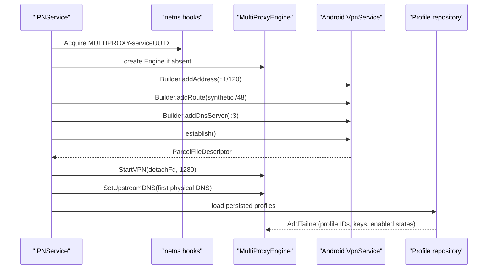
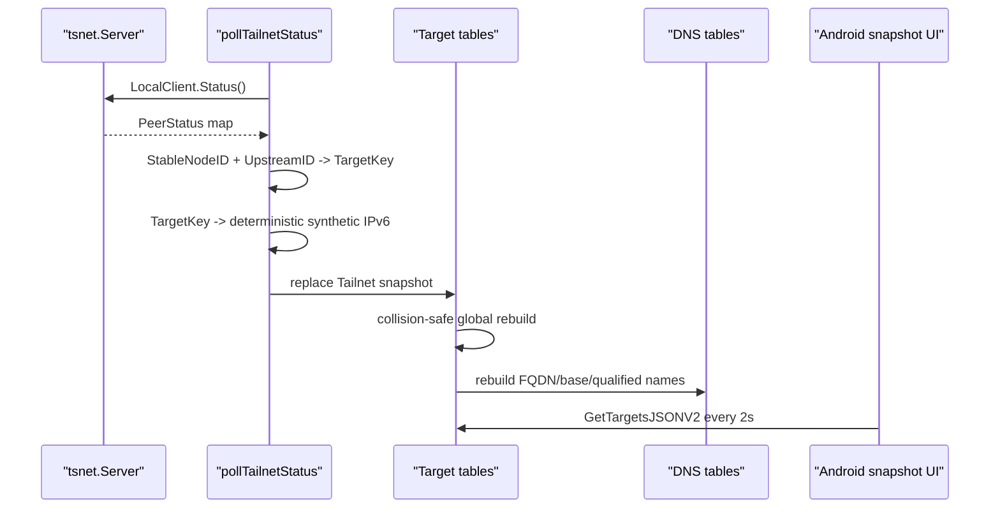
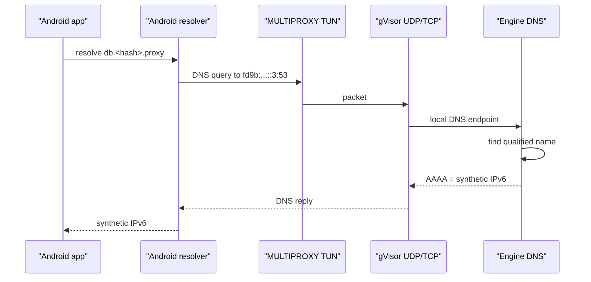
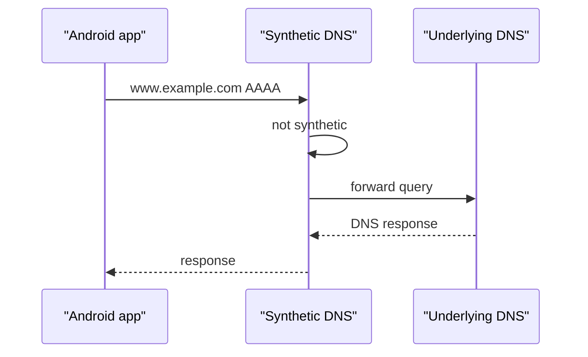
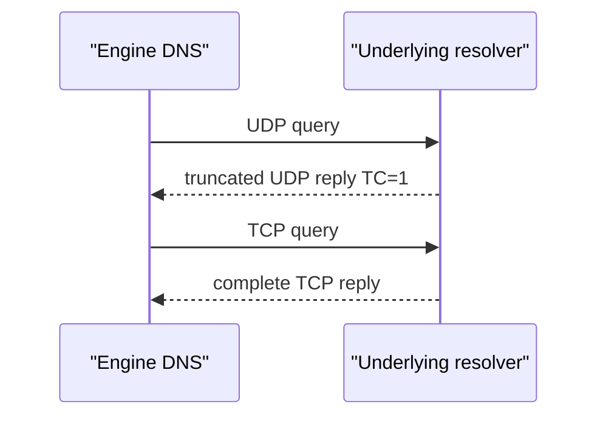
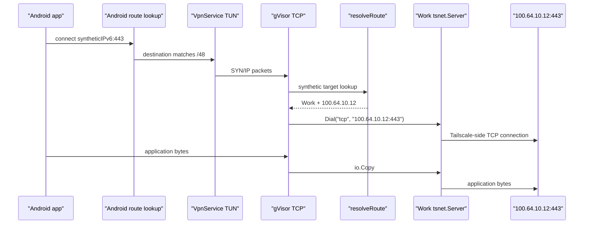
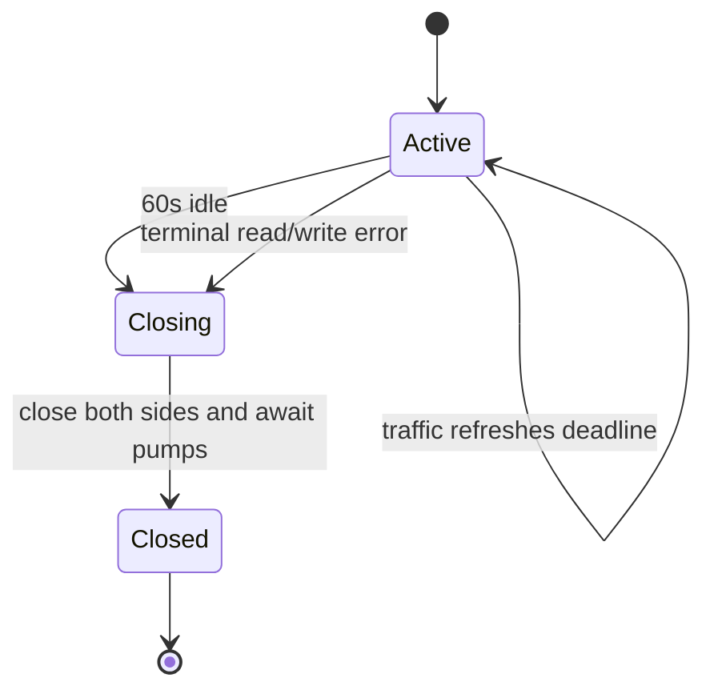
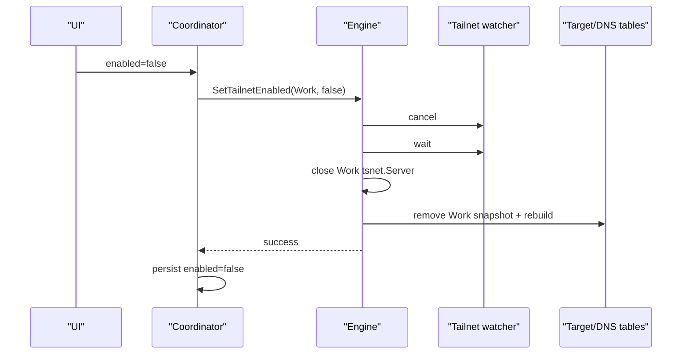
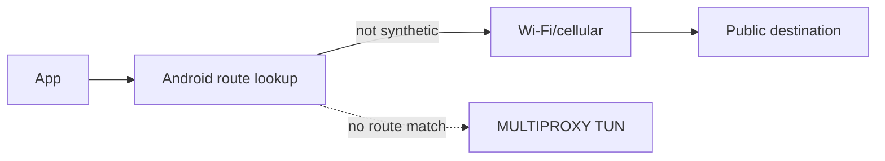

**Multi-Tailnet Proxy — Packet Paths, DNS, and Transport Flows**

**Document status:** end-to-end flow manual for the current `main` implementation.

**Purpose:** follow actual traffic through Android, TUN, gVisor, synthetic identity lookup, `tsnet`, DNS, and the physical underlay. This document is organized by flows rather than objects.

## 1. The debugging rule: always name the plane

A connection from an Android app to a Tailnet peer crosses several routing systems.

```text
Android application
    |
    v
Android VPN eligibility + route lookup
    |
    v
TUN
    |
    v
gVisor userspace transport
    |
    v
synthetic target lookup
    |
    v
required tsnet.Server
    |
    v
Tailscale path
    |
    v
remote peer socket
```

If a connection fails, "the VPN failed" is not a useful diagnosis.

The first task is to establish where the flow stopped.

## 2. The three routing planes

### 2.1 Plane A — Android capture

Android decides whether the application and destination belong to this VPN.

Inputs include:

```text
allowed/disallowed application list
VpnService route fd9b:8d7c:6a5e::/48
VPN service state
Android resolver configuration
```

A packet outside the synthetic `/48` is not captured by MULTIPROXY's current data route.

### 2.2 Plane B — gVisor and synthetic route resolution

Once the packet enters the TUN, gVisor turns it into TCP or UDP flow semantics.

The multiproxy engine then determines:

```text
is this local synthetic DNS?
else is this an active exact synthetic peer?
else is it an internal subnet/exit candidate?
else reject
```

### 2.3 Plane C — selected Tailnet egress

A successful route decision gives one `tsnet.Server` and one current native destination.

That embedded Tailnet runtime then has to connect through Tailscale to the remote peer.

Failure here can be caused by Tailnet authentication, ACLs, peer reachability, DERP/direct-path behavior, service availability, or Android underlay socket handling.

## 3. Flow zero: creating the environment before any packet exists

Before an app can send a synthetic packet, MULTIPROXY startup does:



Only after the target Tailnet is enabled and its peer snapshot has arrived does an exact synthetic peer route exist.

## 4. Flow one: peer discovery becomes a route

The packet path begins with control/state observation long before the app opens a socket.



The route does not come from the UI. The UI merely exposes what the Engine already considers active.

## 5. Example target

Assume persisted profile:

```text
profile ID: 4db9...aa12
name:       Work
```

and Tailscale peer:

```text
DNS name:      db.prod.example.ts.net.
StableNodeID:  nABC123
Current IPv4:  100.64.10.12
```

The engine computes:

```text
TargetKey
    NamespaceID = 4db9...aa12
    Kind        = tailscale-node
    StableID    = nABC123

SyntheticIPv6
    = deterministic fd9b:8d7c:6a5e:... address
```

The target record stores both synthetic identity and `100.64.10.12` current locator.

## 6. Flow two: synthetic DNS AAAA

Suppose the UI exposes:

```text
db.<profile-hash>.proxy.
```

An Android app resolves that name.



The DNS answer is not the peer's native `100.x` address. It is the stable Tailnet-qualified route key.

## 7. Why the qualified name is stable across rename

Qualified DNS currently uses:

```text
first label of peer hostname
+
hash(profile UUID)
+
.proxy.
```

The profile's display name is not included.

So:

```text
Work -> Company
```

changes UI presentation but does not change:

```text
profile UUID
profile hash
qualified synthetic peer name
synthetic peer IPv6
```

## 8. Flow three: short synthetic DNS name

The engine also tracks the first-label short name:

```text
db.
```

If exactly one active synthetic target owns `db.`, AAAA lookup can resolve it.

If two active Tailnets expose `db.`, the engine returns `NXDOMAIN`.

```text
Tailnet Work: db.
Tailnet Home: db.

query db.
    -> ambiguous
    -> NXDOMAIN

query db.<work-hash>.proxy.
    -> Work synthetic IPv6
```

This prevents hidden Tailnet-selection policy from being encoded in Go map iteration order.

## 9. Flow four: known internal name queried as A

Synthetic peers are IPv6-only from Android's perspective.

If the resolver asks:

```text
A db.<hash>.proxy.
```

instead of AAAA, the engine returns:

```text
RCODE = NOERROR
answers = 0
authoritative = true
```

This is NODATA.

It does not return the peer's current native Tailscale IPv4.

That native IPv4 is a private implementation locator, not the synthetic identity advertised to applications.

## 10. Flow five: known internal name queried as HTTPS/SVCB/TXT

Modern resolvers may ask several RR types before or alongside A/AAAA.

For any recognized synthetic name where the record type is not AAAA, current behavior is authoritative NODATA.

That has an important privacy/correctness consequence:

```text
recognized synthetic name
+
unsupported RR type
        |
        v
answer internally
```

not:

```text
forward private .proxy name to ISP/corporate DNS
```

## 11. Flow six: ordinary external DNS

MULTIPROXY also receives ordinary DNS questions from VPN-eligible apps because Android is configured to use the synthetic resolver.

Example:

```text
www.example.com AAAA
```

is not found in synthetic tables.

The Engine forwards it to the first DNS server on the currently selected physical/non-VPN Android `Network`.



The subsequent application TCP connection to the returned public IP does **not** enter MULTIPROXY because no default data route exists.

## 12. DNS mediation versus data bypass

This is a subtle but important distinction.

Current synthetic-only mode means:

```text
ordinary DNS
    may pass through local MULTIPROXY DNS

ordinary public TCP/UDP data
    bypasses MULTIPROXY TUN
```

Therefore the statement:

> ordinary Internet traffic is completely untouched

is too broad.

The accurate statement is:

> ordinary non-synthetic application data bypasses the multiproxy datapath; DNS for eligible apps is locally mediated and may be forwarded upstream.

## 13. Flow seven: UDP DNS response is truncated

The upstream DNS client first uses UDP for a local UDP query.

If the result has the DNS truncated flag:

```text
TC=1
```

the Engine retries the same request over TCP.



The code also retries TCP if the UDP exchange itself returns an error.

## 14. Flow eight: application uses DNS-over-TCP directly

A TCP connection to:

```text
fd9b:8d7c:6a5e::3:53
```

is intercepted in `handleTCPConnection` before normal synthetic peer routing.

`ServeDNSTCP` then implements DNS stream framing:

```text
2-byte big-endian length
DNS message bytes
2-byte big-endian length
next DNS message
...
```

It supports multiple messages on the same connection until EOF/error.

## 15. Why `io.ReadFull` matters for DNS TCP

TCP is a byte stream. One `Read` does not promise to return the whole two-byte prefix or whole DNS message.

The correct logic is:

```text
ReadFull(2 bytes)
ReadFull(length bytes)
```

Without it, legal TCP segmentation could be misinterpreted as malformed DNS.

Similarly, `writeFull` loops until all response bytes have been written, because a stream `Write` can legally return a short write.

## 16. Flow nine: synthetic TCP to a peer

After DNS, the app connects to the synthetic IPv6 on port 443.



There are two independent TCP connections joined by byte copies.

## 17. What the remote peer sees

The remote peer does not see an IPv6 connection originating from `fd9b:8d7c:6a5e::...`.

That address exists only in the Android-side synthetic namespace.

The Tailnet-side leg is created by the selected `tsnet.Server` to the peer's current native Tailnet address.

This is why it is better to think "connection proxy" rather than "NAT translation."

## 18. TCP connection establishment failure

The selected upstream Dial has a ten-second timeout.

Possible outcomes:

```text
synthetic route absent
    -> reject before dial

Tailnet runtime disabled
    -> reject before dial

Dial timeout / ACL / peer down / service closed
    -> gVisor endpoint eventually closes

Dial succeeds
    -> payload bridge starts
```

The flow log includes flow ID, synthetic destination, selected UpstreamID, native destination, and dial success/failure.

## 19. TCP half-close

Two `io.Copy` goroutines bridge the streams.

App-to-peer completion attempts `CloseWrite()` on the upstream if supported.

Peer-to-app completion invokes `gonetConn.CloseRead()`.

The parent waits for both copy directions.

This lets protocols that intentionally half-close a direction behave more naturally than immediately closing both sockets when one copy returns.

## 20. Flow ten: synthetic UDP to a peer

UDP begins with the same synthetic route decision.

Example:

```text
app -> syntheticIPv6:9999
```

becomes:

```text
gVisor connected UDP endpoint
        |
resolveRoute
        |
required tsnet.Server.Dial("udp", nativeIP:9999)
        |
runUDPAssociation
```

The current association is connection-like from Go's perspective even though UDP itself has no handshake.

## 21. UDP association lifetime

The association has a 60-second idle timeout.

Both sides receive the same deadline. Any successful read or write refreshes both deadlines.



This prevents idle per-flow goroutines and sockets from remaining indefinitely.

## 22. Why both UDP pumps are closed together

There are two loops:

```text
app/gVisor -> tsnet UDP

tsnet UDP -> app/gVisor
```

If one exits and the other is left blocked forever, every dead association leaks a goroutine.

Current code takes the first pump result, closes both connections, then waits for the opposite pump to return.

## 23. Flow eleven: two Tailnets with the same native IPv4

This is the central overlap case.

```text
Tailnet Work
Stable peer A
CurrentIPv4 = 100.1.2.3
SyntheticIPv6 = fd9b:...:AAAA

Tailnet Home
Stable peer B
CurrentIPv4 = 100.1.2.3
SyntheticIPv6 = fd9b:...:BBBB
```

The app connects to AAAA or BBBB, not directly to `100.1.2.3`.

Route decisions are:

```text
AAAA -> RequiredUpstream Work -> Dial Work/100.1.2.3
BBBB -> RequiredUpstream Home -> Dial Home/100.1.2.3
```

The shared native locator never acts as the unique key.

Go tests explicitly exercise this selection invariant.

## 24. Flow twelve: peer native address changes

Suppose Work peer A changes:

```text
100.1.2.3 -> 100.9.8.7
```

The next status snapshot rebuild creates the same `TargetKey`, therefore the same synthetic IPv6, but updates `CurrentIPv4`.

New flows use the new native locator.

An application holding the synthetic address does not need a new identity allocation.

## 25. Flow thirteen: peer disappears

The next authoritative Tailnet snapshot simply omits it.

Global target rebuild removes the exact synthetic mapping and its DNS names.

A later packet to the now-stale synthetic IPv6 hits:

```text
inside synthetic /48
but no exact target
        |
        v
fail closed
```

It does not become an exit-node or subnet request.

## 26. Flow fourteen: peer returns

If the same profile namespace and Tailscale StableNodeID return, `SyntheticIPv6()` computes the same address again.

This stability is mathematical rather than dependent on remembering the old mapping in a database.

## 27. Flow fifteen: forced synthetic collision

If two different keys somehow produce one synthetic address, target rebuild deletes that address from active routes.

The effect is:

```text
A collides with B
        |
        v
neither route is installed
        |
        v
DNS tables are rebuilt only from surviving targets
```

The system sacrifices availability for identity correctness.

## 28. Flow sixteen: disable one Tailnet

User presses Disable for Work.



Home remains registered/running.

Work's synthetic destinations become unavailable, but its profile and state directory remain.

## 29. Flow seventeen: re-enable one Tailnet

The same profile ID is used.

If the runtime registration is still present, the Engine creates a new `tsnet.Server` using the same deterministic state directory.

The peer's same StableNodeID therefore recreates the same synthetic IPv6.

No old auth key should be necessary after successful first provisioning if persisted `tsnet` state remains valid.

## 30. Flow eighteen: app/process service reconstruction

After process/service recreation, persisted profile rows exist but Go runtime objects do not.

MULTIPROXY startup:

```text
create Engine
attach TUN
load profiles
for each profile:
    authKey = encrypted saved key or empty
    AddTailnet(profile.id, authKey, profile.enabled)
```

READY profiles normally use empty auth keys and deterministic state directories.

A disabled profile is registered without a live `tsnet.Server`.

## 31. Flow nineteen: rename

Rename changes only SQLite `display_name`.

No packet-path object changes.

```text
profile UUID      same
state dir         same
UpstreamID        same
TargetKey         same
synthetic IPv6    same
qualified hash    same
```

This is a useful test of whether identity and presentation are still correctly separated.

## 32. Flow twenty: Forget

Forget is destructive local identity deletion.

The current product flow:

```text
remove live Tailnet runtime if present
        |
delete persisted tsnet state directory
        |
delete encrypted bootstrap key if any
        |
delete SQLite profile row
        |
clear runtime/error UI state
```

If the user later adds that Tailnet again, a new profile UUID is created and synthetic identities can therefore change even if the remote Tailnet peers are the same.

## 33. Flow twenty-one: ordinary Internet data

An allowed application connects to a public IPv4/IPv6 returned by DNS.

That destination is outside:

```text
fd9b:8d7c:6a5e::/48
```

Android does not route the data packet into the MULTIPROXY TUN.



This is how synthetic-only mode avoids becoming an accidental full tunnel.

## 34. Flow twenty-two: Tailscale's own transport sockets

The embedded `tsnet.Server` itself needs ordinary outbound sockets for control, DERP, STUN, and direct encrypted transport.

Those process sockets must not enter the same TUN they support.

```text
tsnet creates socket
    |
    v
Tailscale netns Android hooks
    |
    +--> VpnService.protect(fd)
    |
    `--> selected Android Network.bindSocket(fd)
    |
    v
physical Wi-Fi/cellular
```

This is a recursion boundary.

## 35. Why underlay binding matters during network changes

Android may have both Wi-Fi and cellular network objects at once. The VPN is itself another Android `Network`.

The app tracks only INTERNET + NOT_VPN candidates, chooses a physical underlay, and binds Tailscale sockets accordingly.

When Wi-Fi disappears:

```text
activeNetworks remove Wi-Fi
recompute default
select cellular if usable
update first DNS
normal Tailscale gets DNS/gateway network-change notification
future/rebound sockets bind to cellular
```

A live device E2E test is still needed to prove all `tsnet` connections recover correctly under these transitions.

## 36. Flow twenty-three: physical DNS changes

On `LinkProperties` change:

1. network candidate state is updated;
2. best physical underlay is recomputed;
3. first DNS IP is compared to `currentDnsServerStr`;
4. changed value is delivered through static `IPNService.onUnderlyingDnsChanged`;
5. live `MultiProxySession.engine` receives `SetUpstreamDNS`;
6. Go validates and normalizes the address to port 53.

No live Engine means the update is simply absent; MULTIPROXY startup reads `currentUnderlyingDnsServer()` and initializes it then.

## 37. `SetUpstreamDNS` normalization

Examples:

```text
8.8.8.8
    -> 8.8.8.8:53

2001:4860:4860::8888
    -> [2001:4860:4860::8888]:53
```

An already host:port-formatted endpoint retains the supplied port if the host parses as an IP.

The synthetic DNS address itself is rejected to prevent self-recursion.

A scoped IPv6 resolver string such as a link-local address carrying `%wlan0` is not accepted by `net.ParseIP` in this current path; that is a device-observation gap to track.

## 38. Flow twenty-four: unknown synthetic address

An app may cache a synthetic IPv6 after the peer has disappeared or Tailnet has been disabled.

The packet still matches Android's `/48` and therefore enters the TUN.

But `resolveRoute` finds no exact target and sees that the IP belongs to `SyntheticIPv6Prefix`.

Result:

```text
reject
```

This explicit containment check prevents stale synthetic traffic from leaking into broader route classes.

## 39. Flow twenty-five: internal subnet route

The Go Engine can be configured with:

```text
AcceptSubnet(10.20.0.0/16, Tailnet A)
AcceptSubnet(10.20.30.0/24, Tailnet B)
```

For a captured `10.20.30.7`, internal `resolveRoute` would choose Tailnet B because `/24` is more specific.

However, the current Android MULTIPROXY Builder does not add `10.20.0.0/16` or `10.20.30.0/24` routes.

So on a real phone today the packet is not expected to enter this TUN merely because Go has a subnet entry.

This is an internal capability, not a current product flow.

## 40. Flow twenty-six: internal exit Tailnet

Similarly, Go can store an exit Tailnet and would use it for a captured destination after exact/subnet matching fails.

But Android does not currently install default routes for MULTIPROXY.

Therefore ordinary Internet traffic bypasses before `resolveRoute` gets a chance to choose that exit Tailnet.

## 41. Application inclusion/exclusion

Even a synthetic destination is captured only for applications eligible for the VPN according to Builder policy.

Current MULTIPROXY Builder preserves:

```text
MDM include list
MDM exclude list
user selected package mode
built-in disallowed packages
```

Thus this path can exist:

```text
App A allowed -> synthetic address -> TUN -> works
App B excluded -> same synthetic address -> not delivered through VPN
```

The second app does not automatically gain another way to reach the private synthetic address.

## 42. DNS and application eligibility

`VpnService.Builder.addDnsServer` affects the VPN routing/resolver environment for eligible applications. An excluded application's DNS behavior follows Android's non-VPN path rather than using MULTIPROXY's synthetic resolver.

This matters when reproducing "name works in one app but not another" reports.

## 43. Private DNS boundary

Android Private DNS can change whether application DNS queries follow the local resolver path the application expects.

The repository's current multiproxy DNS code provides UDP/TCP port-53 service. It does not implement a private DNS DoT endpoint for the synthetic namespace.

Strict Private DNS therefore remains an Android E2E compatibility item rather than something the Go DNS server itself solves.

Do not confuse this with the upstream Tailscale application's public-DoH functionality: that is a separate normal-client feature and does not magically make `.proxy.` synthetic names available through arbitrary Android strict Private DNS.

## 44. Always-On and lockdown boundary

Synthetic-only capture has a deliberate route model: ordinary application data is outside the TUN.

Android Always-On can restart the service, which is compatible with the persisted mode/profile reconstruction model.

Android lockdown / "Block connections without VPN" is a different semantic constraint: it may block the ordinary bypass that synthetic-only mode intentionally relies on.

The correct response is to test and document that platform behavior, not silently install default routes and change the product's routing model.

## 45. Packet path checklist: synthetic TCP

When synthetic TCP fails, inspect in this order:

### Android

```text
Is MULTIPROXY actually active?
Is this app included?
Does the Builder contain the synthetic /48 route?
Did establish()/StartVPN succeed?
```

### gVisor

```text
Did TCP forwarder fire?
Did destination parse correctly?
Was it accidentally the DNS endpoint?
```

### Target directory

```text
Does GetTargetsJSONV2 show this synthetic IPv6?
Is it under the expected profile ID?
Does it have a current native IP?
```

### Runtime

```text
Does GetTailnetStatesJSON show the profile RUNNING?
Is the Tailnet enabled?
```

### Tailnet egress

```text
Did the flow log show the right UpstreamID?
What native address/port was dialed?
Did Dial succeed?
Is the remote service listening/allowed?
```

## 46. Packet path checklist: synthetic DNS

When a name fails:

```text
Does peer snapshot contain hostname?
What exact syntheticDnsName does V2 export?
Is the query AAAA or another RR type?
Is short name ambiguous?
Did query reach fd9b:...::3?
UDP or TCP?
Is Android Private DNS changing the path?
```

If direct synthetic IPv6 works while qualified name does not, the data path is probably fine and DNS should be isolated first.

## 47. Packet path checklist: external DNS

When public websites fail to resolve but synthetic peers work:

```text
Does NetworkChangeCallback have a non-VPN default Network?
What is currentUnderlyingDnsServer()?
Did SetUpstreamDNS accept the address?
Is it a scoped IPv6 address unsupported by current parser?
Does upstream UDP work?
Does TCP fallback work?
```

## 48. Packet path checklist: Wi-Fi/cellular transition

Record separately:

```text
selected Android Network before/after
interface name before/after
DNS server before/after
whether TUN was rebuilt
Tailnet runtime state before/after
whether new flow Dial succeeds
```

Do not begin by deleting/recreating profiles. Profile identity should survive ordinary underlay movement.

## 48.1. Flow twenty-seven: VIP service resolution (added 2026-08-30)

An app queries `web.example.ts.net` (a Tailscale VIP Service's MagicDNS
name, not a peer's own hostname).

```text
app queries "web.example.ts.net"
        |
        v
same handleDNSMsg entry point as any other name -
looked up in dnsTable, which now also holds one
entry per svc:-prefixed TargetRecord (see
backend_internals.md §62.11, §81)
        |
        v
match found -> answered with the service's synthetic
address, exactly like a peer hostname would be
        |
        v
app connects to the synthetic address
        |
        v
resolveRoute finds RequiredUpstream from the
TargetRecord (TargetKindVIPService) -> same tsnet.Server
dial path a peer connection would use
```

Before this was added, this whole flow dead-ended at the first step: the
name was never in `dnsTable` at all (no `TargetRecord` for it existed), so
the query fell through to the generic non-tailnet forwarding path and, for a
`*.ts.net` name with no public DNS record, failed. See
`backend_internals.md` §62.11 for how a VIP service's *real* virtual IP also
participates in the cross-tailnet real-IP conflict machinery (§62.6/§62.10)
the moment it becomes a `TargetRecord` - no separate flow for that, since it
reuses "Flow: real-IP crossover" (§62.6) unchanged.

## 49. What is proven by local tests

Current tests support these flow assumptions:

- same TargetKey remains same synthetic address;
- native peer IP can change without changing synthetic identity;
- disappeared peers leave the target map;
- overlapping native IPv4 across two Tailnets resolves to distinct upstreams;
- forced synthetic collisions fail closed;
- ambiguous DNS and qualified DNS semantics work;
- A query to known synthetic peer is authoritative NODATA;
- UDP idle lifetime expires and activity refreshes it;
- DNS TCP short-write helper completes full frames.

These are strong local properties, but they do not prove Android actually delivered packets or that a physical Tailnet connection completed.

## 50. Bottom line

For every real flow, preserve this chain:

```text
Android decides capture
        |
gVisor determines transport flow
        |
synthetic directory determines logical peer
        |
RequiredUpstream determines Tailnet
        |
current locator determines Dial destination
        |
tsnet provides real Tailnet connectivity
```

DNS is the naming layer that lets applications obtain the synthetic identity. It is not the route authority. Native Tailscale addresses are current locators. They are not the Android-visible unique namespace. Ordinary non-synthetic data bypasses before this chain, while Tailscale's own sockets escape it through explicit Android protect/bind hooks.

That is the complete packet-path model to use when testing, debugging, or extending the current implementation.